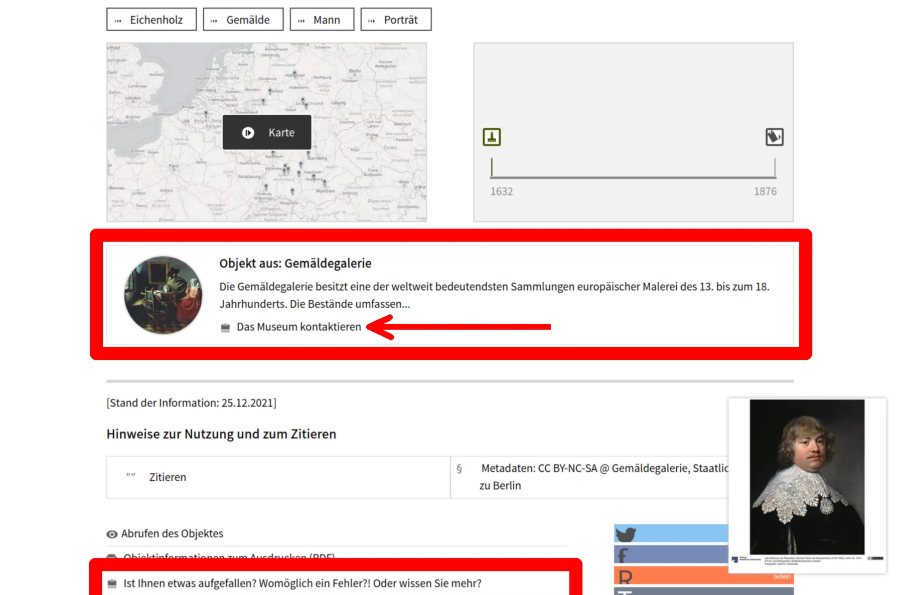
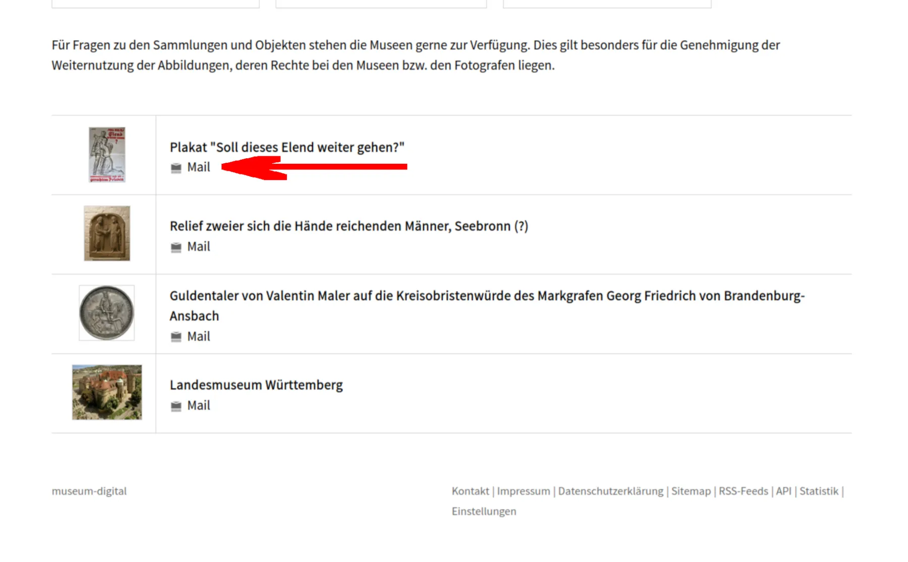
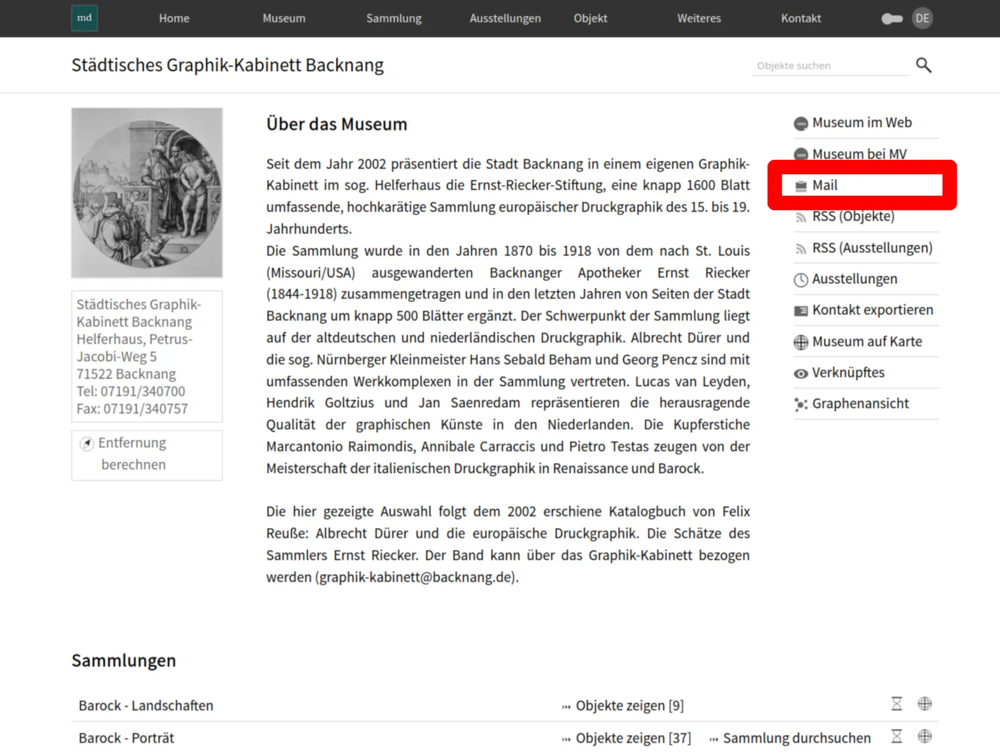
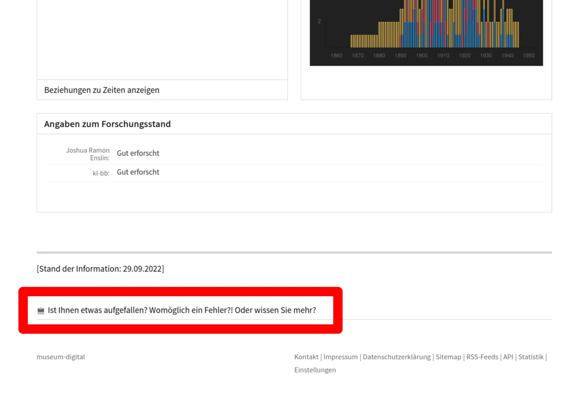
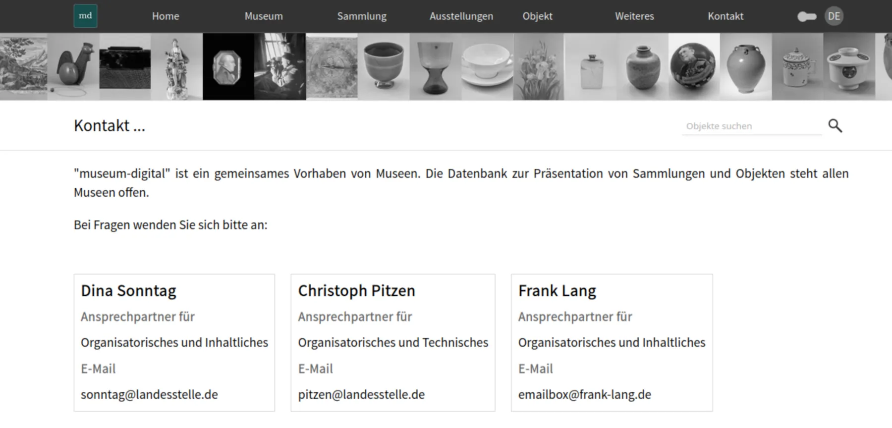

# Kontaktdaten für Fragen ermitteln

Hat man eine Frage oder einen Hinweis zu einem Objekt, das über die Ausgabe von museum-digital präsentiert wird, stellt sich die Frage, wen man am besten kontaktieren sollte. Auch bei Anmerkungen zur API, zur Rechteklärung oder zur Plattform allgemein gilt es, einen Kontakt herauszufinden.

Als Plattform, die vielen Museen ermöglicht, ihre Objekte _gemeinsam_ zu veröffentlichen, sind dies zwangsläufig die Kontaktadressen von verschiedenen Personen und Institutionen. Technische Fragen sollten ans Technik-Team gestellt werden, Fragen und Anmerkungen zu den kontrollierten Vokabularen können an die entsprechende Redaktion gesendet werden und Fragen und Anmerkungen zu einzelnen Objekten kann zwangsläufig das Museum, in dem sich das Objekt befindet, am besten beantworten.

Deshalb finden sich auf vielen Seiten der Ausgabe von museum-digital Links, um direkt mit den richtigen Ansprechpartnern Kontakt aufzunehmen.

## Die Kontaktadresse für Fragen und Anmerkungen zu einem Objekt finden

Museen, die ihre Objekte mit museum-digital veröffentlichen haben die volle Kontrolle über ihre Datensätze. Und offensichtlich kennt sich niemand so gut mit den Objekten aus, wie die Mitarbeiter des Museums selbst (oder, falls das nicht der Fall sein sollte, ist niemand besser als das Museum selbst geeignet, die entsprechenden Experten zu finden). Anfragen zu einzelnen Objekten sollten also immer direkt an das Museum gestellt werden.

Museen können in musdb Mailadressen für Rückfragen auf allgemeiner Museumsebene und auf der Ebene einzelner Sammlungen einstellen. Die jeweils spezifischere Angabe (also der Kontakt zur Sammlung eines Objektes wenn vorhanden, sonst der allgemeine Kontakt zur Sammlung) wird in der Folge zweifach auf der Objektseite verlinkt:

- Am unteren Ende des Hauptteils der Objektseite - also direkt unterhalb der Schlagworte und potentieller Visualisierungen - findet sich eine Kachel, auf der die Institution, die das Objekt veröffentlicht, prominent gezeigt wird. Innerhalb der Kachel findet sich ein Link mit dem "Mail"-Symbol direkt unterhalb der Beschreibung der Institution.

Des Weiteren findet sich ein weiterer Link - ebenfalls mit dem Mail-Symbol gekennzeichnet - mit dem Text "Ist Ihnen etwas aufgefallen? Womöglich ein Fehler?! Oder wissen Sie mehr?" in der Liste der Optionen der Seite, direkt unterhalb der "Hinweise zum Zitieren".

Beide Links sind sogenannte mailto-Links. Es öffnet sich also bei einem Klick darauf das eigene Mailprogramm mit einem Vorschlag für eine Betreffzeile, die die Einordnung der Anfrage deutlich vereinfacht.



```admonish info
Um Fragen zu Objekten beantworten zu können, oder entsprechende Korrekturen vornehmen zu können, ist es für die Museen von essentieller Bedeutung zu wissen, über welches Objekt überhaupt gesprochen wird. Lautet die Anmerkung zu einem Objekt etwa "Beim Gemälde der Malerin X ist mir ein Rechtschreibfehler aufgefallen. Hier heißt es Künstler, obwohl es sich doch um eine Frau handelt. Bitte korrigieren sie den Fehler.", so ist das nur bedingt hilfreich, wenn das Museum viele Gemälde der Künstlerin hat und die zu korrigierende Seite nicht explizit genannt wird. Daher sollte das konkrete Objekt unbedingt und immer spezifiziert werden - idealerweise mithilfe der Inventarnummer oder einfach mithilfe eines Links auf die Objektseite.
```

Auch über die Kontakt-Seite sind die Kontakt-Mailadressen der jeweiligen Ansprechpartner für die zuletzt aufgerufenen Objektseiten zu finden. Hierzu werden im Browser die letzten zehn (10) besuchten Objektseiten inklusive der entsprechenden Kontakt-Mailadressen zwischengespeichert. Besucht man also nach dem Besuchen einer oder mehrerer Objektseiten die allgemeine "Kontakt"-Seite der Instanz, kann hier unterhalb der Kacheln für die allgemeinen Ansprechpartner für die Koordination und Technik eine Liste der letzten besuchten Objektseiten und der entsprechenden Kontakt-Adressen angezeigt werden.

Mit einem Klick auf den entsprechenden "Mail"-Link direkt unterhalb des jeweiligen Objekttitels kann auch hier eine Mail an die passenden Ansprechpartner geschickt werden. Die Verantwortlichen für die Koordination und Technik sind es nur in den seltensten Fällen, falls es sich um eine Frage zu einem konkreten Objekt handelt.



## Die Kontakt-Mailadresse einer Institution finden

Auf den Seiten von Institution (und, so spezifische Kontaktadressen angegeben sind, auch bei Sammlungen und Ausstellungen) finden sich die jeweiligen Kontaktadressen in der Seitenspalte rechts neben dem Beschreibungstext. Hier kann man durch einen Klick auf den mailto-Link "Mail" (ausgezeichnet mit dem Mail-Symbol) eine Mail an die Institution schreiben. Auf Mobilgeräten oder bei stark verkleinerten Fenstern wird die Seitenspalte mit den Options-Links direkt unter den Beschreibungstext positioniert.

Findet sich auf der Seite eines einzelnen Eintrags kein Kontakt-Link - etwa für eine Sammlung ohne spezifisch angegebene Mailadresse, kann die Seite der jeweiligen Institution leicht über den Breadcrumb Trail erreicht werden.



## Die Kontaktadresse für Anmerkungen zu einem Akteurs-Eintrag finden

Die kontrollierten Vokabulare von museum-digital werden von allen Museen, die ihre Objekte mit museum-digital veröffentlichen und / oder mit [musdb](../../musdb/) verwalten gemeinsam benutzt. Entsprechend besteht eine gemeinsame Redaktion, die sich über Korrekturen und Ergänzungen sicherlich immer freut. Sie ist über den entsprechenden Link ganz unten auf der Akteurs-Seite zu erreichen.

```admonish info
Bei Anmerkungen zu Personen ist es wichtig, sich vor der Fragestellung noch einmal zu vergegenwärtigen, was der Gegenstand der Anmerkung wirklich ist. Eine Ergänzung der Lebensgeschichte, der Lebensdaten, etc. betrifft natürlich vor allem die konkrete Person und damit den Personeneintrag. Anmerkungen über zum Beispiel die falsche Attribution eines Gemäldes zum gegebenen Künstler betreffen andererseits vor allem das Gemälde und nicht alle Gemälde des Museums. Entsprechend sollten solche Anmerkungen an das Museum, zu dessen Objekt es Anmerkungen gibt, gerichtet werden (siehe oben).
```



## Für allgemeine Fragen und Anmerkungen: Die Kontakt-Seite

Klickt man in der Navigation auf den Menüpunkt "Kontakt", erscheint eine Seite, auf der zuerst die Ansprechpartner für Rückfragen zur gesamten Instanz von museum-digital in Kacheln aufgelistet werden. Diese sind die treffenden Ansprechpartner, wenn man etwa mit dem eigenen Museum auch in der gegebenen regionalen Instanz von museum-digital vertreten sein möchte oder Fragen zur API hat.


