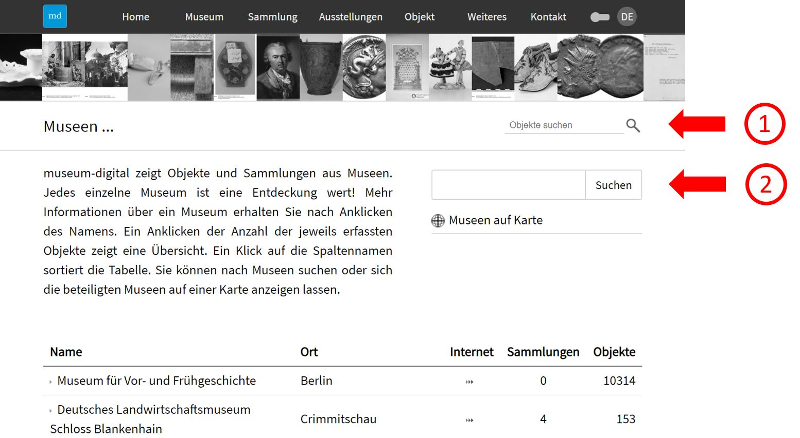
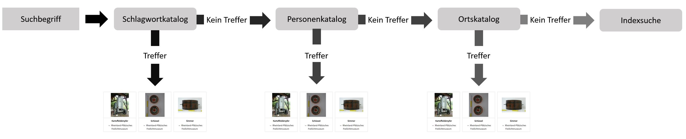
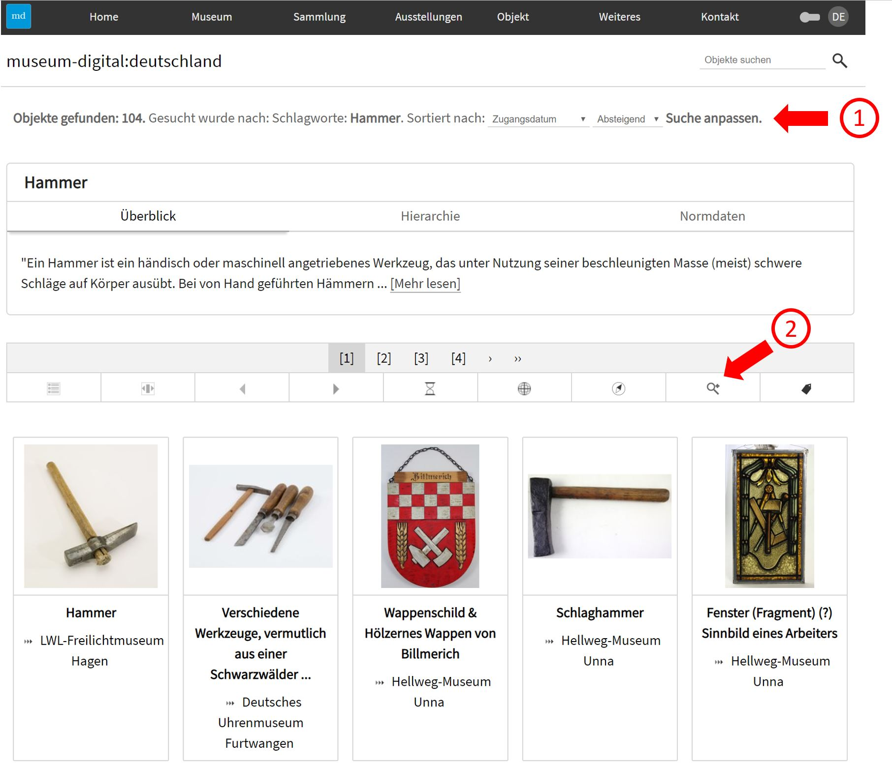
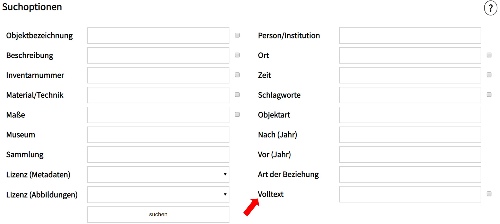

Suche
=====

Die Suchmechanismen bei museum-digital sind komplexer als es zunächst
scheint. Die Mechanismen sind dabei in allen Versionen von
museum-digital gleich - die Ergebnisse sind indes verschieden. Wer nach
\"Albert Schweitzer\" bei museum-digital:westfalen sucht bekommt auch
nur Ergebnisse aus Museen, die Teil dieser Version sind. Wer indes nach
\"Albert Schweitzer\" in der deutschlandweiten Version sucht, bekommt
Ergebnisse aus allen beteiligten deutschen Museen. Die meisten Treffer
wird jener finden, der in der internationalen Version
[global.museum-digital.org](https://global.museum-digital.org/) sucht,
worin alle bei museum-digital beteiligten Museen eingeschlossen sind.
Die Wahl der Version von museum-digital bestimmt das Ergebnis der Suche.
Das gilt auch innerhalb einer Version von museum-digital. Auf der Seite
zu einem Museum oder der Seite zu einer Sammlung gibt es die Möglichkeit
nur innerhalb des gerade gewählten Museums oder der gerade gewählten
Sammlung zu suchen. Der Suchschlitz ändert seine Funktion entsprechend.

Der einfache Suchschlitz
------------------------

Über den Schalter \"Museum\" ist ein Suchschlitz für die Suche nach
Museen, über den Schalter \"Sammlung\" ein Suchschlitz für die Suche
nach Sammlungen erreichbar. Museen und Sammlungen sollten mit diesen
Suchschlitzen gesucht werden. Der am häufigsten gebrauchte Suchschlitz
ist jener für Objekte. Dieser Suchschlitz ist stets oben rechts zu
finden.

Um zu verstehen, wie eine Suche über den \"Objekte suchen\"-Suchschlitz
gestaltet ist, ist es gut zunächst die zu den Objekten gespeicherten
Informationen zu betrachten: Im Grunde gibt es zwei Qualitäten von
Informationen, zum einen freie Texte und Begriffe (Objektart, Titel,
Beschreibung) und zum anderen kontrollierte Begriffe (Schlagworte,
Akteure, Orte). Diese kontrollierten Begriffe sind angereichert und
hierarchisiert. Die Hierarchie erlaubt es untergeordnete Begriffe
einzuschließen. Eine Suche nach \"Spielzeug\" kann auch
\"Schaukelpferde\" finden, eine Suche nach \"Deutschland\" kann alle
Treffer für \"Berlin\" einschließen \... . Die kontrollierten Begriffe
bieten deshalb ein großes Potential für eine erfolgreiche Suche. Sie
sind in verschiedenen Katalogen gespeichert. Eine Suche findet aus
diesem Grund zuerst in den Katalogen kontrollierter Begriffe statt,
bevor sie - falls nichts gefunden wurde - zur Indexsuche wird.

Nach Eingabe eines Suchbegriffes wird zunächst der Schlagwortkatalog
durchsucht, wird dort der gesuchte Begriffe gefunden, werden die Treffer
ausgegeben. Wird der gesuchte Begriff nicht gefunden, wird der
Personen-Institutionen-Katalog abgefragt. Falls jetzt etwas gefunden
wird, so wird es ausgegeben, ist dagegen noch immer nichts gefunden,
geht die Frage weiter an den Ortskatalog, bei Treffern wird angezeigt
und die Suche abgebrochen. Wird allerdings auch im Ortskatalog nichts
gefunden tritt die Suche im Volltextindex in Kraft.

Die Indexsuche schließt fast alle Texte und Begriffe ein, die mit den
Objekten verknüpft sind. Aus dieser Gesamtheit wird in regelmäßigen
Zeitabständen ein Index gebildet, der schnell durchsucht werden kann.
Bei einer Suche mit mehreren Worten kann der Index auf ein- und
ausschließende Weise abgefragt werden. Es lässt sich beispielsweise nach
\"Essen und Trinken\" (ohne Anführungszeichen) suchen. Gefunden werden
alle Objekte in deren Index \"Essen\" und alle Objekte, in deren Index
\"Trinken\" vorkommt. Eine Suche nach \"Essen und Trinken\" - diesesmal
mit Anführungszeichen - sucht alle Objekte in deren Index die
Buchstabenkombination \"Essen und Trinken\" enthalten ist. Eine Suche
nach \"+Essen -Trinken\" findet Objekte für die gilt: \"Essen\" ist im
Index unbedingt enthalten, \"Trinken\" ist jedoch nicht im Index
enthalten. Das Gute an der Suche über einen solchen Index ist, dass die
Reihenfolge der Resultate schon dem Index entnommen werden kann, etwa:
Objekte zu \"Essen und Trinken\" (Buchstabenkombination) zuerst, Objekte
bei denen \"Essen\" UND \"Trinken\" getrennt vorkommen danach, Objekte
bei denen nur einer der Begriffe vorkommt im Anschluss. Innerhalb dieser
Gruppen kann die Häufigkeit berücksichtigt werden, kommt zu einem Objekt
der Begriff \"Essen\" vier mal im Index vor, zu einem anderen Objekt
aber nur drei mal, so wird das erste Objekte vor dem zweiten in der
Trefferanzeige platziert.

Ein kleiner Nachteil der Suche tritt zutage, wenn jemand einen \"Hammer
aus Bremen\" (ohne Anführungszeichen) sucht. Er wird sehr viel finden,
vieles zu \"Hammer\", vieles zu \"aus\" und vieles zu \"Bremen\".
Letztlich war die Frage sehr unscharf formuliert, sollten \"Hämmer, die
in Bremen hergestellt wurden\" gefunden werden, oder \"Hämmer, die in
Bremen genutzt wurden\" oder einfach \"alle Hämmer, die irgendetwas mit
Bremen zu tun haben\"? Im letzten Fall wäre, unabhängig davon dass es
sich sowohl bei \"Hammer\" als auch bei \"Bremen\" um kontrollierte
Begriffe handelt eine Suche nach \"+Hammer +Bremen\" erfolgreicher
gewesen. Mit beiden Begriffen gemeinsam als Sucheingabe wäre der
Algorithmus in keinem der Kataloge fündig geworden und ohnehin zur
Indexsuche fortgeschritten.

### Suche verfeinern

Eine gute Möglichkeit bei der Suche nach mehr als einem Begriff bietet
die Funktion \"Suche anpassen\". Sucht man z.B. zuerst nach \"Hammer\",
dann erscheint oberhalb der Trefferanzeige dieser Schalter. Er erscheint
ebenfalls im Symbolmenü oberhalb der Trefferansicht rechts. Ein Klick
auf einen der Schalter öffnet ein Feld (oder Fenster) mit mehreren
Eingabemöglichkeiten. Hier kann man unter \"Ort\" den Begriff \"Bremen\"
auswählen (nicht: eintippen) und bekommt anschließend jene Objekte
präsentiert, die in Beziehung zum Schlagwort \"Hammer\" und zum Ort
\"Bremen\" stehen. Durch erneutes Anpassen der Suche über \"Art der
Beziehung\" lassen sich bei Eingabe (oder Auswahl) von \"hergestellt\"
alle Hämmer, die in Bremen hergestellt wurden finden.

 

Die erweiterte Suche
--------------------

 Die erweiterte Suche lässt sich über den Menupunkt \"Objekt\"
erreichen. Hier können mehrere Suchbegriffe eingegeben (oder im Falle
von Begriffen aus kontrollierten Katalogen: ausgewählt) und miteinander
kombiniert werden. Die erweiterte Suche ist immer eine \"UND-Suche\",
d.h. wer als \"Ort\" wählt \"Bremen\" und als \"Schlagwort\" den Begriff
\"Hammer\", der findet Objekte, die zu \"Bremen\" UND zu \"Hammer\" in
Beziehung stehen. Wie die einfache Suche, so lässt sich auch die
erweiterte Suche anpassen und verfeinern. Durch Auswahl einer \"Art der
Beziehung\" lassen sich etwa alle Hämmer finden, die in Bremen
\"hergestellt\" wurden und durch zusätzliche Auswahl von \"Museum\"
lassen sich alle Hämmer (Schlagwort) finden, die im Deutschen
Schifffahrtsmuseum (Museum) zu finden sind und in Bremen (Ort)
hergestellt (Art der Beziehung) wurden. Der beste Weg zu guten
Resultaten ist der Weg über die Verfeinerung, unabhängig davon, ob die
einfache oder die erweiterte Suche den Ausgangspunkt bildeten.

### Volltextsuche

Untergebracht im Suchfenster der erweiterten Suche - weil auch mit
dieser kombinierbar - ist die Volltextsuche, die ganz absichtlich die
Kataloge aus kontrollierten Begriffen ignoriert und statt des Begriffes
\"Hammer\" die Buchstabenkombination \"h\"  gefolgt von \"a\" gefolgt
von \"m\" etc. in allen Feldern des Objektdatensatzes sucht.
