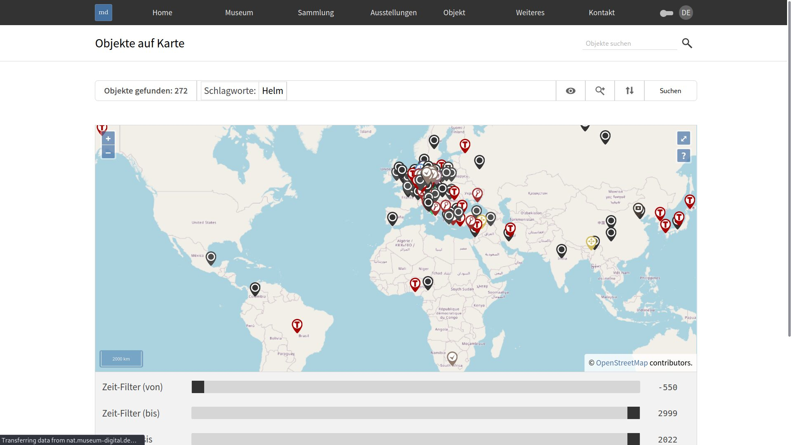
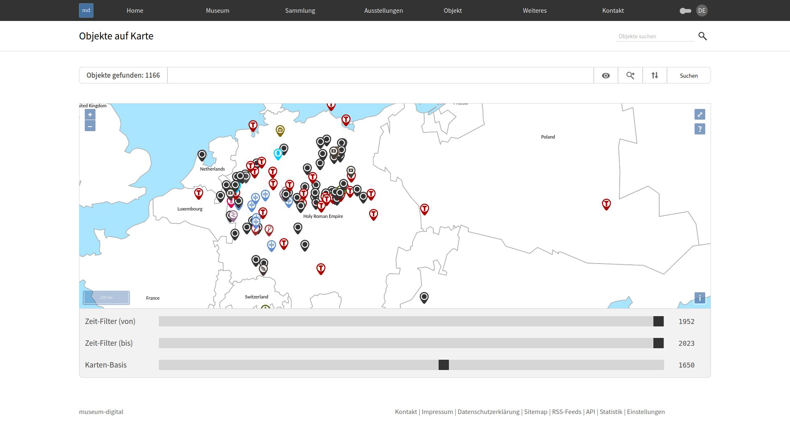
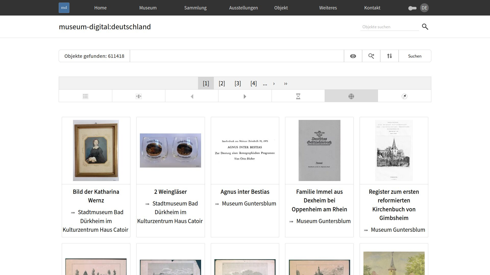

# Objekte auf Karte

Die "Objekte auf Karte"-Funktion zeigt die Orte von bis zu 10000 Objekte auf einer Karte. Die Karte zeigt dabei immer die Ergebnisse einer Objekt-Suche.

## Features

- Zoom
- Vollbildschirm
- Legende für angezeigte Ereignistypen
- Filter nach Zeit als Schieber
- Alternative historisch-politische Karten
- Referenzierbarkeit der Ansicht durch automatisch aktualisierte URL

## Objekte-auf-Karte-Funktion aufrufen

