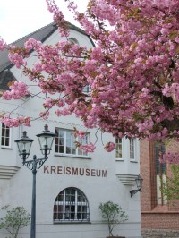

Die Anfänge \...
================

Der Museumsverband Sachsen-Anhalt führte 2008 eine Veranstaltungsreihe
zur Digitalisierung der Museen durch. Die Veranstaltungen waren durchweg
gut besucht. Im Ergebnis taten sich Mitarbeiter:innen verschiedenster
Museen des Verbandes zusammen, um eine Arbeitsgemeinschaft
Digitalisierung zu gründen.

AG Digitalisierung (2009)
-------------------------

Das erste Treffen der AG Digitalisierung fand im Februar 2009 im
Kreismuseum Bitterfeld statt. Die Diskussion zeigte, dass zwar alle
Beteiligten ein allgemeines Interesse daran hatten, die Digitalisierung
in ihren Museen voranzubringen, dass aber die Interessen der Einzelnen
sehr voneinander abwichen. Mancher suchte Ersatz für von Herstellerseite
nicht mehr gepflegte Datenbanken (dbase II), ein anderer wollte über die
optimale Datenbank für mehrere Millionen Objekte diskutieren, andere
wollten -- ausgehend von ihren Museumsobjekten -- die Vernetzung von
Kontextinformationen zu einem Thema machen und wieder andere sahen die
digitale Objektfotografie im Vordergrund\...

Letztlich einigte man sich, kein Thema auszuklammern und Schritt für
Schritt vorzugehen. Das erste Thema sollte die Veröffentlichung von
Objektinformationen sein. Allen war klar, dass die Orientierung an
großen und reichen Museen, die auch schon damals Objekte online
stellten, nicht zum Maßstab genommen werden konnte. Vielmehr wurde eine
kleine Forschung in Gang gesetzt, um die Möglichkeiten der beteiligten
Museen zu ermitteln.

Gib mir Fünf
------------

In einem ersten Schritt wurde ermittelt, welche Informationen über ein
Objekt andere Museen ins Internet stellen oder auf Portalen
veröffentlichen. Was dabei herauskam, waren genau jene
Informationspartikel, von denen auch Interpol jedem Museum empfiehlt,
sie im Internationalen Leihverkehr den verliehenen Objekten beizugeben.
Ganze acht Angaben, darunter Titel, Maße, \... und eine Abbildung. Der
nächste Schritt bestand darin, dass die Mitglieder der AG sich die
Aufgabe stellten, zu jeweils fünf Objekten jeder Sammlung ihres Museums
diese acht Angaben zusammenzutragen und dabei zu messen, wieviel Zeit
dies in Anspruch nahm. Alle hauptamtlich geführten Museen des Verbandes
wurden informiert und eingeladen, sich an dieser kleinen Forschung zu
beteiligen. Der Museumsverband Rheinland-Pfalz griff das Vorhaben auf
und auch dort beteiligten sich Museen an der Ermittlung. Im Ergebnis
stellte sich heraus, dass es zwischen drei Minuten und drei Stunden
dauerte, die ermittelten acht Angaben für ein einzelnes Objekt
zusammenzustellen. Das war überraschend. Als Grund wurde ermittelt, dass
einige Informationen nicht vorhanden waren und erst ermittelt werden
mussten, andere Informationen waren auf Karteikarten, wieder andere in
Eingangsbüchern oder Listen enthalten. Eine Objektabbildung fehlte
zumeist. Wenn das Objekt seit Jahren in den Tiefen eines Depots
schlummerte, so musste es gefunden, hervorgeholt, gereinigt,
fotografiert und wieder an seinen Ort gebracht werden. Die AG wertete
die Ergebnisse aus und beschloß, den Versuch einer Online-Publikation zu
wagen, dabei aber nicht so sehr auf große Anzahlen von Objekten als auf
qualitätvolle Angaben zu setzen.

Erste Sichtbarkeit
------------------

Mit Unterstützung ehrenamtlich Tätiger wurde eine Datenbank
programmiert, um daraus eine Online-Platform zu speisen. Als Grundlage
der Datenbankstruktur wurde das damals gebräuchliche Austauschformat
"museumdat" (heute: [LIDO](https://de.wikipedia.org/wiki/Lightweight_Information_Describing_Objects))
gewählt. So sollte sichergestellt sein, das
die Objektinformationen problemlos an Portale wie die [europeana](https://www.europeana.eu/)
gegeben werden konnten. Eine erste Version der
Online-Platform wurde bereits Mitte 2009 öffentlich gemacht. Die
gesammelten Objektinformationen einiger Museen wurden zudem an ein
Projekt in Athen gegeben, welches eine Software für die Integration der
Informationen in die europeana entwickelte. Ende November konnte die
Mitteldeutsche Zeitung titeln: „[Fahnen aus Anhalt flattern als
Testversion in
Griechenland](http://www.mz-web.de/bernburg/fahnen-aus-anhalt-flattern-als-testversion-in-griechenland-7950844)"
(mz - 19.11.2009). Mitte 2010 wurden dort die ersten Objekte aus
museum-digital sichtbar.

Das Eingabetool entsteht
------------------------

Die ersten Objekte hatten einen holprigen Weg in die neue Datenbank. Die
Kollegen in den Museen füllten in ihrem Textverarbeitungsprogramm ein
Formular pro Objekt aus, schickten dieses mit dazugehörigen Bilddateien
per E-Mail an die Kollegen, welche dann die Informationen in die
Datenbank einfügten. Gut daran war, dass bei der Eingabe Tipp- und
Verständnisfehler in Absprache mit den Kollegen in den Museen beseitigt
werden konnten. Dennoch war es ein sehr aufwändiger Prozess. Eine kleine
Förderung des Landes Sachsen-Anhalt (20.000 Euro) ermöglichte es weitere
Recherchen zu betreiben. Drei "Redakteure" wurden eingestellt, um in die
Museen zu gehen, sich mit deren Datenbanken und dem Stand der Einträge
bekannt zu machen, Objektaufnahmen zu erstellen und diese -- in
Abstimmung mit den Museen -- mit vervollständigten Objektangaben an die
Datenbankbetreuer zur Eingabe zu schicken.

Auch das Land Rheinland-Pfalz förderte die Einrichtung einer regionalen
Instanz von museum-digital für Rheinland-Pfalz mit 10.000 €.

 Weitere technische Entwicklungen
---------------------------------

In den Folgejahren bis 2018 gab es zahlreiche weitere Entwicklungen:

-   [**Eingabetool "musdb" für Museen**](../musdb)
    Aus einem einfachen Formular zum eingeben grundlegendster Informationen
    zur Veröffentlichung von Museumsobjekten hat sich das Eingabetool
    "musdb" zu einem vollständigen Intarisierungsprogramm entwickelt.
-   [**nodac**](../nodac/README.md) und [**md:term**](../md-term/README.md)
    Mit der Software "nodac" werden die
    Normvokabulare, d.h. Personen und Körperschaften, Geographie und
    Gebäude, Zeitbegriffe und Schlagworte, verwaltet. Mit "md:term" wird
    ein öffentlich durchsuchbarer und maschinenlesbar nachnutzbarer Zugriff
    auf die Vokabulare geboten.
-   [**Themator und md:story**](../Themator/README.md)
    Der "Themator" ist eine einfache Möglichkeit für Museen
    und deren externe Partner, Online-Ausstellungen oder Themenportale
    zu erstellen. Objekte, die mit museum-digital inventarisiert wurden
    und öffentlich sichtbar sind, können verknüpft werden.
    Mit *md:story* hat der Themator eine neue Wendung bekommen: Neben langen,
    vor allem textbasierten Erzählungen werden jetzt auch "Scrollitelling-Formate"
    unterstützt.
