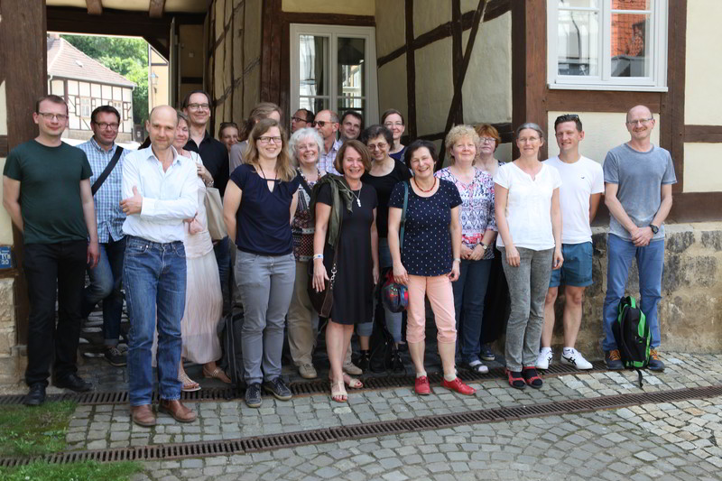

Wer dahinter steht
==================

Grundsätzlich sind es die beteiligten Museen und ihre Verbände, die das
Geschehen von museum-digital lenken. Jedes Museum ist für seine eigenen
Beiträge (und Einträge) verantwortlich. Diese Beiträge gestaltet das
Museum mit den entsprechenden Werkzeugen von museum-digital in der
regionalen (oder thematischen) Version, der es zugeordnet ist.

## Betreuer

Jede regionale (oder thematische) Version von museum-digital hat andere
Betreuer:innen - zumeist sind dies die regionalen Museumsverbände oder
Landesstellen für Museumsbetreuung. [Eine Liste der für die verschiedenen
deutschen Regionen zuständigen Betreuer](https://nat.museum-digital.de/contact)
kann in der deutschlandweiten Instanz von museum-digital eingesehen werden.

Als mittlerweile internationales Projekt haben sich in anderen Ländern andere
Organisationsstrukturen herausgebildet. In Ungarn etwa gibt es ein zentrales Team
von Betreuern.

## Entscheidungen

Weitere Entwicklungen bei museum-digital geschehen auf Anregung aus den Museen
oder ihren Verbänden. Grundsätzliche Änderungen, d.h. Änderungen, die
das Gesamtsystem betreffen, werden nur dann umgesetzt, wenn die AG
Digitalisierung des Museumsverbandes Sachsen-Anhalt, die Keimzelle von
museum-digital, zustimmt. Änderungen, die nur in einer einzelnen Version
zum Tragen kommen und andere Versionen nicht tangieren, werden dann
umgesetzt, wenn die entsprechenden Versions-Betreuer es für nötig
halten.

