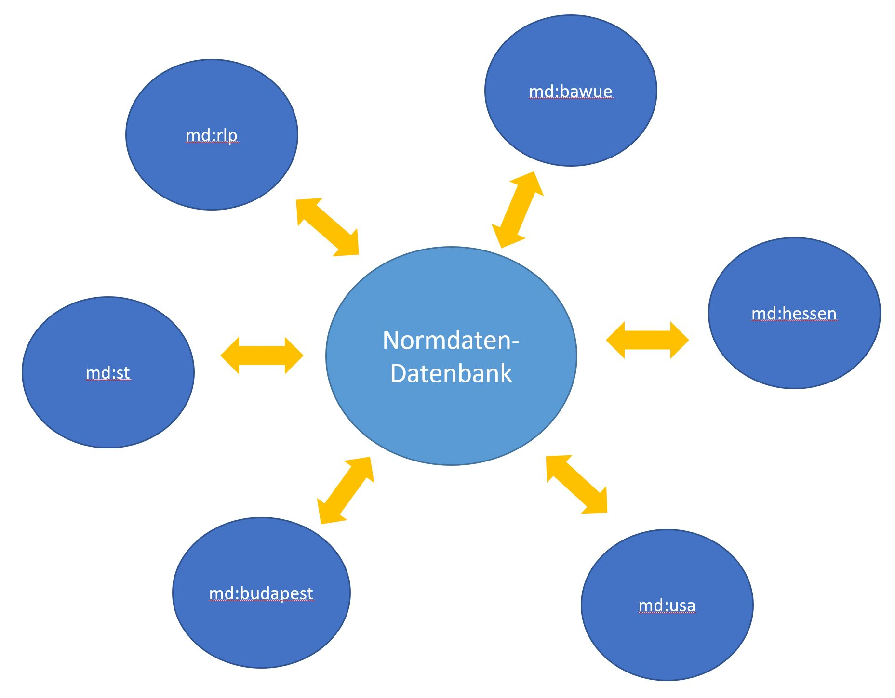

Normdaten
=========

Warum \"Normdaten\"?
--------------------

Unter \"Normdaten\" werden bei museum-digital Begriffe und Konzepte verstanden, die von einer Redaktion (\"Normdaten-Redaktion\") kontrolliert und angereichert werden. Diese Begriffe und Konzepte werden in einer eigenen Datenbank zusammengefasst und mit einem eigens dafür programmierten Werkzeug (\"nodac\") bearbeitet. Alle Versionen von museum-digital greifen auf diese zentrale Datenbank zu. Die Normdaten-Datenbank besteht aus vier Sektionen: Orte, Akteure, Zeitbegriffe und Schlagworte. Die Datenbank ist - gemeinsam mit weiteren Vokabularen - für die Öffentlichkeit über [md:term](https://term.museum-digital.de/) zugänglich.

Die Kontrolle der Begriffe und Konzepte erlaubt wesentlich bessere Suchergebnisse, sie erlaubt eine Hierarchisierung (\"München liegt in Bayern\", \"ein Dachdeckerhammer ist ein Hammer\", ...) und sie erlaubt vor allem die zentralisierte Anreicherung mit mehrsprachigen Varianten, Hintergrundinformationen und Querverweisen in Normdatenrepositorien wie geonames, viaf, aat, \... . Die Anreicherungen stehen dann auch bei Exporten zu Fachportalen oder etwa der Deutschen Digitalen Bibliothek oder europeana zur Verfügung.

Die Zentralisierung der Begriffe und Konzepte hat Vorteile: Jeder Begriff muss nur einmal übersetzt, angereichert und in eine Hierarchie eingepasst werden. Es wird vermieden, dass es zur Bildung mehrerer, sich möglicherweise widersprechender, Hierarchien kommt. Mit den Begriffen und Konzepten wird auch die Bearbeitung zentralisiert und von Personen außerhalb der jeweiligen Museen (\"Normdaten-Redaktion\") übernommen.

Jede Sektion der Normdaten-Datenbank hat ihre Eigenheiten. Einige Beispiele: \"Orte\" brauchen Koordinaten aber kein \"Jahr der Geburt\", Zeiträume und Zeitpunkte lassen sich - entsprechend aufbereitet - relativ leicht maschinell hierarchisieren und sprachraumgemäß darstellen, Schlagworte verlangen mehr als eine Hierarchie ... Es ist aus diesem Grund wichtig für Begriffe und Konzepte stets die richtige
Sektion zu wählen. Insbesondere bei Importen tritt immer wieder der Fall auf, dass sowohl Orte, Akteure, Zeiten als auch Schlagworte als
\"Schlagworte\" zu museum-digital gelangen - weil die Ausgangssoftware keine anderen Möglichkeiten bot, oder weil sich dieser Gebrauch im
Museum verstetigt hat ... . Die Normdaten-Redaktion muss dann in einem ersten Schritt die importierten Begriffe auf die verschiedenen Sektionen
verteilen. Erst dann kann sie mit Vorhandenem abgleichen und gegebenenfalls Anreicherungen und Eingliederungen in die jeweiligen Hierarchien vornehmen.

Begriffe und Konzepte gelangen nicht nur über Importe von Objektdatensätzen in die zentrale Normdaten-Datenbank. Ebenso häufig werden sie auch direkt im Eingabe- und Bearbeitungstool (\"musdb\") von Museumsmitarbeitern erfasst. In diesem Falle wird die korrekte Eingabe (Richtige Sektion? Richtige Schreibweise?) von Vorschlagslisten und Hinweisen unterstützt. Die Begriffe gelangen bei Eingabe direkt in die Normdaten-Datenbank, wo die Normdaten-Redaktion sie weiter bearbeitet. Es gibt zwischen Import und Eingabe einerseits sowie Bearbeitung, Korrektur und Anreicherung andererseits immer eine gewisse Latenzzeit in der die Vorschlagslisten im Eingabe- und Bearbeitungstool auch noch nicht überprüfte Begriffe anbieten.

Die Bearbeitung von Importen und Eingaben ist recht zeitaufwändig, wenngleich sehr unterschiedlich. Ein gemessenes Beispiel: Ein Import von ca. 120 Datensätzen führte ca. 300 zu überprüfende Begriffe mit. Die Einordnung in die richtigen Sektionen, der Abgleich mit schon Vorhandenem (hier waren viele noch nicht erfasste Akteure zu berücksichtigen) und schließlich die Anreicherung dauerte insgesamt 11 Stunden, was ungefähr 2,2 Minuten pro Begriff und 5,5 Minuten pro Datensatz entpricht! Vieles hängt davon ab, ob die beim Import erfassten Begriffe bereits den Vorgaben von museum-digital (z.B. Schlagworte im Singular, Zeiten mit Bindestrich, ...) entsprechen. Ist dies der Fall erfolgt eine automatische Zuordnung - wie auch in dem Fall, dass zu einer Person die gnd-Nummer mitgeschickt wird. Hierdurch sind wesentlich schnellere Bearbeitungen und geringere Latenzzeiten möglich. Oft kommt es auch zu Zwischenlösungen: Wenn die Ausgangssoftware keine ausreichenden Möglichkeiten bietet, dann können \"unbereinigte\" Begriffe auch zunächst aus einem Museum importiert, dann aber von Mitarbeitern des Museums in museum-digital selbst \"geputzt\" werden.

Generell gilt: Solange ein Begriff oder Konzept aus der Normdaten-Datenbank nur von einem einzigen Museum verwendet wird, haben die Mitarbeiter dieses Museums die \"Hoheit\" über diesen Begriff. Sobald ein weiteres Museum ebenfalls eines seiner Objekte mit diesem Begriff verknüpft hat übernimmt die Normdatenredaktion. Die Schreibweise des Begriffs kann dann von keinem der Museen mehr geändert werden (man würde ja sozusagen in die Darstellung der Datensätze des jeweils anderen Museums eingreifen). Zu jedem Begriff gibt es im Eingabe- und Bearbeitungstool die Möglichkeit Annotationen als Nachricht an die Normdatenredaktion zu speichern.

Erfassung von kontrollierten Begriffen
--------------------------------------

Die Erfassung von kontrollierten Begriffen geschieht durch Einträge der Nutzer beim Anlegen von objektbezogenen Ereignissen im Zusammenhang mit der Objektbearbeitung. Soll beispielsweise zu einer Skulptur vermerkt werden, sie sei von \"Andreas Niedermeyer\" erstellt worden und sollte dabei diese Personen noch nicht im Personenkatalog von museum-digital verzeichnet sein, so bittet das Programm die Eingebenden um einige weitere Angaben zur Person, damit auf dieser Grundlage die Normdatenredaktion die Person identifizieren und den entsprechenden Personendatensatz anreichern kann. In ähnlicher Weise gelangen bisher nicht erfasste Ortsnamen in den Ortskatalog.

### Erfassung von Personen

Hier wird das Erfassen bisher nicht bekannter Personen und Institutionen erläutert.

Wichtig: Nur individualisierbare Personen oder Institutionen über Ereignisse erfassen

### Erfassung von Orten

Hier wird das Erfassen bisher nicht bekannter Geographika erläutert.

Wichtig: Nur individualisierbare Orte über Ereignisse erfassen.

### Erfassung von Zeitbegriffen

Hier wird das Erfassen bisher unbekannter Zeiteinheiten erläutert.

Die Normdatenredaktion
----------------------

Die Redaktion der Normdaten kann nicht von jedem übernommen werden. Ein hoher Grad an \"Pingeligkeit\" ist nötig. Bisweilen sind importierte oder von Museen eingetragene Begriffe schwer zu deuten und es sind Rückfragen nötig. Oft hilft es, wenn die NormdatenbearbeiterInnen bereits in Museen tätig waren und so ein Verständis dafür haben, was wohl mit Begriffen wie \"Klassische Zeit\" gemeint sein könnte. Ein wenig Universalismus ist ebenfalls hilfreich, denn es erkennt nicht jeder, dass es eine \"Klassische Zeit\" sowohl für die \"Klassischen Archäologen\" als auch für \"Maya-Forscher\" gibt. Mehrsprachigkeit ist ebenfalls sehr nützlich, denn die kontrollierten Begriffe werden ja in bis zu 27 verschiedene Sprachen übertragen. Die Mitarbeiter der Normdatenredaktion sind entweder ehrenamtlich Tätige oder sie werden von
den museum-digital tragenden Landesverbänden und -beratungsstellen mit dieser Aufgabe betraut. Oft kommt es auch dazu, dass im Rahmen eines Digitalisierungsprojektes Mittel für die  redaktionelle Bearbeitung der entsprechenden Datensätze mitbeantragt werden. Die Arbeit wird dann von geübten Normdatenredakteuren übernommen. Die Normdatenkontrolle und -anreicherung von Datensätzen aus Museen in Sachsen-Anhalt wird von den Museen und vom Land Sachsen-Anhalt finanziell unterstützt.
