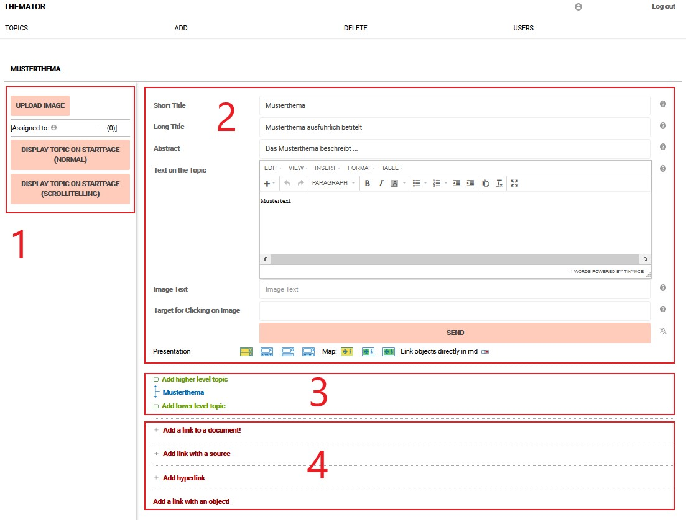
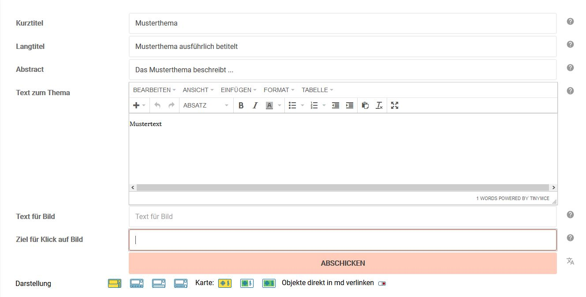

# Eingabeoberfläche

Über die Eingabeoberfläche können alle Inhalte der Ausstellung angelegt
und angeordnet werden. Dies gilt uneingeschränkt für das Ausgabeformat
*Themator*. Beim md/story-Format ist darüber hinaus eine Anpassung der
Gestaltung über den Quelltext (CSS) möglich, was für die Erstellung der
Ausstellung eine größtmögliche Flexibilität erlaubt.

 Die Eingabeoberfläche ist in vier Bereiche aufgeteilt:

1.  Ganz links befindet sich ein Bereich zur Anlage einer Hauptabbildung
    für das Thema.
2.  Rechts daneben befindet sich die Eingabemaske zur Anlage des Themas.
3.  Direkt unter der Eingabemaske befindet sich der Bereich zur
    Strukturierung der Ausstellung.
4.  Daran schließt sich ein Bereich mit vier Schaltflächen an, über die
    verschiedene weitere Inhalte mit dem Thema verknüpft werden können.

In den Abschnitten 1, 2 und 4 arbeitet man immer an einem \"Thema\". Ein
Thema entspricht dabei einer Inhaltsseite in der Ausstellung, die durch
ein Bild, Text oder andere Medien oder deren Kombination repräsentiert
wird. Im Abschnitt 3 besteht die Möglichkeit, neue Themen anzulegen und
die Themen anzuordnen und zu hierarchisieren.

Voransicht und CSS
------------------

Am linken Bildschirmrand der Eingabeoberfläche befinden sich zusätzlich
drei ausklappbare Menüpunkte:

*Vorschau im Themator\
*Hier wird in einem neuen Browser-Tab die Voransicht der Themenseite im
Themator-Modus angezeigt.

*Vorschau im Scrollytelling-Modus\
*Hier wird in einem neuen Browser-Tab die Voransicht der Themenseite im
Scrollytelling-Modus angezeig

*CSS für Scrollytelling-Modus\
*Über diesen Menüpunkt gelangen Sie zum Stylesheet der Ausstellung. Hier
können Sie über Anpassungen die Gestaltung der Ausstellung anpassen und
verändern. Näheres hierzu finden Sie im Kapitel *Vertiefung CSS für
md/Story* (in Bearbeitung)

Anlage einer Hauptabbildung
---------------------------

Die Anlage einer Hauptabildung ist nur für das Themator-Modus relevant.
In der Ausstellung ragt die Hauptabbildung vom linken Rand in den
Bildschirm hinein. Führt man den Mauszeiger zum linken Bildschrimrand,
schiebt sich das Bild über den Bildschirm.

*Abbildung heraufladen*\
Über diese Funktion kann die Hauptabbildung für das Thema ausgewählt
werden. Über die Schaltfläche D*urchsuchen* wählen Sie das entsprechende
Bild aus der Ordnerstruktur Ihres PC und laden es über die Schaltfläche
*Abschicken* hoch. Das Bild muss folgende Voraussetzungen erfüllen:

-   Das Bild muss einen Dateinamen haben, der keine Umlaute, keine
    Punkte (außer vor Dateiendung), keine Sonderzeichen sowie keine
    Leerzeichen aufweist.
-   Das Bild muss im JPG-Format vorliegen und eine Auflösung von 72 dpi
    oder 96 dpi haben.
-   Die kürzere Seite sollte eine MINDESTLÄNGE von 600 Pixeln haben. Die
    längere Seite sollte eine MAXIMALLÄNGE von 3000 Pixeln nicht
    überschreiten.
-   Es sollte nicht größer als 4 Megabyte sein. Idealerweise hat es
    500kb bis 900kb.

*Abbildung austauschen*\
Wenn bereits ein Bild hochgeladen wurde, kann es über diese Funktion
ausgetauscht werden. Das weitere Vorgehen ist das gleiche, wie bei der
Funktion *Abbildung heraufladen.*

*Keine Abbildung\
*Das hochgeladene Bild wird wieder gelöscht.

*Auf Startseite anzeigen (Themator normal)*\
Ist die Ausstellung im Themator-Format fertiggestellt, kann sie mit
einem Klick auf diesem Button in der Ausstellungsübersicht von
museums-digital sichtbar geschaltet werden:
<https://themator.museum-digital.de/>

*Auf Startseite verstecken (Themator Scrollytelling)*\
Ist die Ausstellung im Scrollytelling-Format fertiggestellt, kann sie
mit einem Klick auf diesem Button in der Ausstellungsübersicht von
museums-digital sichtbar geschaltet werden:
https://themator.museum-digital.de/scroll\_index.php

Eingabemaske
------------

*Kurztitel*\
Der Kurztitel einer Themenseite erscheint in beiden Ausstellungsformaten
als Titel im Navigationsmenü. Er sollte deshalb kurz und prägnant sein.

*Langtitel*\
Der Langtitel erscheint in beiden Ausstellungsmodi als Titel der
Themenseite. Er kann deshalb länger und aussagekräftiger sein.

*Abstract*\
Das Abstract ist eine kurze Zusammenfassung des Inhalts der Themenseite.
\...

 

*Text zum Thema*\
In diesem Bereich werden die Inhalte einer Themenseite hinterlegt. Es
handelt sich um einen WYSIWYG-Editor, das heißt, dass Ihre Eintragungen
hier so angezeigt werden, wie sie später bei der Ausgabe der Ausstellung
erscheinen. Angelegt werden können Texte und Bilder, aber auch das
Einfügen von Videos, Tönen, Links und Tabellen ist möglich. Die oben in
dem Bereich befindliche Menü- und Symbolleiste birgt zahlreiche
Funktionen, über die Inhalte eingefügt und formatiert werden können. Der
Großteil dieser Funktionen ist aus den gängigen
Textverarbeitungsprogrammen bekannt. Eine ausführliche Beschreibung der
Funktionen finden Sie in der Vertiefung zum WYSIWYG-Editor.

*Text für Bild*\
Sollten Sie im Bereich *Text zum Thema* ein Bild hochgeladen haben,
können Sie hier ein Text zu diesem Bild eintragen. Dabei kann es sich um
Rechtehinweise, Lizenzangaben oder auch vertiefende Informationen
handeln. In der Ausstellung wird der Text beim Überfahren des Bilds mit
dem Mauszeiger angezeigt.

*Ziel für Klick auf Bild*\
Sollten Sie im Bereich *Text zum Thema* ein Bild hochgeladen haben,
können Sie hier einen Link zu einer Internetressource eintragen. In der
Ausstellung wird man bei einem Klick auf das Bild zu der verlinkten
Internetseite geführt.

*Abschicken*\
Um die von Ihnen vorgenommenen Eintragungen oder Änderungen zu
speichern, drücken Sie bitte stets den *Abschicken*-Button!

* ?-Zeichen neben dem Abschicken-Button*\
Bei einem Klick auf dieses Zeichen, können Sie die Inhalte der
Themenseite in einer weiteren Sprache anlegen. In der aufgerufenen
Eingabemaske müssen Sie zunächts die gewünschte Sprache auswählen. Dann,
füllen Sie analog zur deutschen Eingabemaske die Felder *Kutztitel*,
*Langtitel*, *Abstract* und *Text zum Thema* in der gewählten Sprache
aus. Im Feld *Text zum Thema* müssen neben dem übersetzten Text auch
andere in der deutschen Sprachversion eingefügte Medien wie z.B. Bilder
angelegt werden. Es empfiehlt sich hier, den Quelltext aus der deutschen
Version zu kopieren und in der neuen Sprachversion einzufügen und dann
anzupassen (vgl. Vertiefung zum WYSIWYG-Editor). Nach dem *Abschicken*
wird die Maske der neuen Sprachversion unter der deutschen Eingabemaske
angezeigt. Sind Änderungen in der deutschen Sprachversion nötig, müssen
diese auch in den alternativen Sprachversionen eingearbeitet werden.
Dies passiert nicht automatisch. Mit dem nach unten gerichteten Pfeil
rechts oberhalb der Eingabemaske kann diese zur besser Übersichtlichkeit
ein oder ausgeklappt werden. Mit dem Papierkorb links oberhalb der Maske
wird die alternative Sparchversion gelöscht.

*Darstellung\
*Mit einem Klick auf eines der ersten drei hier aufgeführten Symbolen
kann die Anordnung der mit dem Thema verknüpften Objekte für den
Themator-Modus verändert werden. Probieren Sie doch einfach die
verschiedenen Versionen aus, in dem Sie eine der Optionen auswählen und
sich dann das Ergebnis über **Vorschau im Themator* (*Ausklappmenü links
oben) anzeigen lassen.

Mit den weiteren drei Symbolen neben *Karte* kann ausgewählt werden, ob
in die  Themenseite eine Karte eingefügt werden soll oder nicht. Ist das
mittlere Symbol ausgewählt, werden nur die mit dieser Themenseite
verknüpften Objekte auf der Karte angezeigt. Mit der Auswahl des rechten
Symbols, erscheinen alle Objekte, die mit dem Thema und dessen
Unterthemen (vgl. Strukturierung der Ausstellung) verknüpft sind.

*Objekte direkt mit md verlinken*\
Auch diese Option ist nur für den Themator-Modus relevant. Mit dem
Schalter können Sie bestimmen, ob man in der Ausstellung bei einem Klick
auf ein verknüpftes Objekt, direkt auf die Objektseite bei
museum-digital geführt wird, oder auf eine Zwischenseite. Die
Zwischenseite führt Objektinformationen aus dem Originaleitrag bei md
auf, ist dabei aber an das Layout der Ausstellung angepasst.

Strukturierung der Ausstellung
------------------------------

Die Themenseiten einer Ausstellung können in dem Bereich Strukturierung
angeordnet und in Ober- und Unterthemen hierarchisiert werden. Wie
bereits oben beschrieben, kommt die Strukturierung vor allem im
Themator-Format zum Tragen, da die Hierarchie sich hier direkt in der
Menüleiste der Ausstellung abbildet und man entsprechend sehr frei
zwischen den Themenseiten springen kann. Im md/story-Format werden die
Themenseiten, egal wie sie hierarchisiert sind, fortlaufend
untereinander im Browser angezeigt. Dennoch kann auch hier eine gewisse
Strukturierung in Ober- und Unterthemen die Navigation durch die
Ausstellung erleichtern, da sich die verschiedenen Ebenen durch
eingerückte Menüpunkte in der Navigationsleiste der Ausstellung zeigen.

 Zu Beginn besteht die Ausstellung nur aus einer Themenseite, der
vorangelegten Startseite. Diese Startseite bildet die oberste Ebene in
der Struktur der Ausstellung.  Dieser Seite können nun weitere
Themenseite zugeordnet werden, entweder als Unterthema oder aber auch
als Oberthema. Wird der Startseite einen neues Thema als Oberthema
zugeordnet, so wird diese neue Themenseite zur Startseite.

*Anlage einer neuen Themenseite\
*Mit einem Klick auf *Oberthema hinzufügen* oder *Unterthema hinzufügen*
öffnet sich das Übersichtsfenster der Ausstellung mit den aufgelisteten
Themenseiten. In der Regel sind hier am Anfang noch keine weiteren
Themenseiten angelegt. Um eine neue Themenseite zu erstellen, klicken
Sie auf das kleine + hinter der Frage *Sollte das unterzuordnende Thema
hier nicht aufgeführt sein, dann klicken Sie bitte.* Nun gelangen Sie zu
einer Erfassungsmaske, in der Sie gemäß der bereits oben angeführten
Maßgaben einen *Kurztitel*, einen *Langtitel* und ein *Abstract* für das
neue Thema eintragen (siehe Kapitel Eingabemaske). Außerdem können Sie
hier bereits den Ausstellungstext für die Themseite einfügen. Nach dem
Klick den Button *Abschicken* gelangen Sie wieder zur Eingabeoberfläche,
wo nun die neue Themseite in der Strukturansicht auftaucht. Sollten Sie 
bereits mehrere Themenseiten erstellt haben, können Sie das
einzubindende Thema auch direkt aus der Liste auswählen, die am Anfang
in dem Übersichtsfenster angezeigt wird.

*Themenseiten verschieben und löschen*\
Die Themenseite, mit der Sie gerade arbeiten, wird in der
Strukturansicht blau dargestellt. Die zu diesem Thema zugehörigen
Unterthemen werden darunter aufgelistet. Sollte die Themenseite selbst
einerm Oberthema zugeordnet sein, so wird dieses Oberthema darüber
angezeigt. Die Reihenfolge der dem Thema untergeordneten Seiten kann mit
den rechts befindlichen Pfeilen verändert werden. Mit dem vor dem Thema
befindlichen Stift gelangt man zur Bearbeitungsseite des Themas. Mit
einem Klick auf den Papierkorb wird das Thema gelöscht.

Verknüpfungen
-------------

*Verknüpfung mit Dokument hinzufügen*\
Über diese Schaltfläche lassen sich Dokumente im PDF-Format zu einer
Themenseite hinzufügen. Das PDF darf nicht mehr als 4 MB groß sein. Mit
einem Klick auf das Plus gelangen Sie zu einer Übersicht von
gegebenenfalls bereits hochgeladenen Dokumenten. Hier können Sie das zu
verknüpfende Dokument mit einem Klick auswählen. Sollte das zu
verknüpfende Dokument nicht aufgelistet sein, kann es über einen Klick
auf das Plus (+) hinter *Sollte das Dokument hier nicht aufgeführt sein,
dann klicken Sie bitte *heraufgeladen werden. In der folgenden
Eingabemaske muss zuerst ein *Anzeigtext* eingetragen werden. Dieser
Text wird  in der Ausstellung als Link angezeigt, der zum Dokument
führt.  Über die Schaltfläche D*urchsuchen* wählen Sie das entsprechende
PDF aus der Ordnerstruktur Ihres PC und laden es über die Schaltfläche
*Abschicken* hoch.

*Verknüpfung mit Quelle hinzufügen*\
Über diese Schaltfläche lassen sich Quellenangaben (z.B.
Literaturverweise) zu einer Themenseite hinzufügen, die nicht online
verfügbar sind. Mit einem Klick auf das Plus (+) gelangen Sie zu einer
Übersicht von gegebenenfalls bereits hochgeladenen Quellen. Hier können
Sie das zu verknüpfende Quelle mit einem Klick auswählen. Sollte das zu
verknüpfende Quelle nicht aufgelistet sein, kann es über einen Klick auf
das Plus (+) hinter *Sollte die QUelle hier nicht aufgeführt sein, dann
klicken Sie bitte* angelegt werden. In der folgenden Eingabemaske kann
der *Titel der Quelle* eingetragen werden. Sollte die Quelle Online
verfügbar sein, nutzen Sie zur Verlinkung bitte die Schaltfläche
*Verknüpfung mit Link hinzufügen*.

*Verknüpfung mit Link hinzufügen*\
Über diese Schaltfläche lassen sich beliebige Verlinkungen zu Webseiten
(z.B. Wikipediaeintrag, Museumswebsite) zu einer Themenseite hinzufügen.
Mit einem Klick auf das Plus (+) gelangen Sie zu einer Übersicht von
gegebenenfalls bereits hochgeladenen Links. Hier können Sie den zu
verknüpfenden Link mit einem Klick auswählen. Sollte der zu verknüpfende
Link nicht aufgelistet sein, kann er über einen Klick auf das Plus (+)
hinter *Sollte der Link hier nicht aufgeführt sein, dann klicken Sie
bitte* angelegt werden.  In der folgenden Eingabemaske muss zuerst ein
*Link-Anzeigtext* eingetragen werden. Dieser Text wird  in der
Ausstellung als Link angezeigt, der zur jeweiligen Website führt. Unter
*Link *muss die URL der entsprechenden Website eingetragen werden.

*Verknüpfung mit Objekt hinzufügen*\
Über diese Schaltfläche lassen sich Objekte zu einer Themenseite
hinzufügen, die entweder bei museum-digital eingetragen und sichtbar
geschaltet sind oder die Sie hier selbst über einen WYSIWYG-Editor
anlegen. Mit einem Klick auf die Schaltfläche gelangen Sie zu einer
Eingabemaske. Im oberen Bereich erfolgt die Verknüpfung mit Objekten aus
museum-digital. Unter *museum-digital/\...* wählen Sie die Version von
museum-digital aus, in der das Objekt eingepflegt ist. Welche Version
die richtige ist, können Sie bei der Auswahl des Objekts bei
museum-digital an der Objekt-URL in der Such- und Adressleiste des
Browser erkennen. Steht hier bspw.
https://brandenburg.museum-digital.de/object/9330
handelt es sich um die Version brandenburg usw.. Im folgenden Feld
tragen Sie die *Nummer des Objektes* ein. Die Objektnummer finden Sie am
Ende der Objekt-URL. In unserem Beispiel wäre dies die 9330. Über
*Abschicken* wird das Objekt verknüpft.

 Im unteren Bereich können Sie frei Objektverknüpfungen für die Anzeige
in der Ausstellung anlegen. In dem Feld *Name der Institution* wird der
Name objektbesitzenden Institution eingetragen. Diese Eintragung
erscheint später als Quellennachweis beim Objekt. Unter
*Objektbezeichnung* haben Sie bis zu 200 Zeichen Platz, um das Objekt zu
benennen. Zwingend notwendig ist auch *(Alternative)
Objektbeschreibung*, die idealerweise um die 500 Zeichen umfasst und aus
ganzen Stätzen besteht. Dieses Feld kann aber auch dazu genutzt werden,
bei Objektverknüpfungen über museum-digital, alternative
Objektbeschreibungen anzulegen. Diese Objektbeschreibung erscheint dann
anstelle der Beschreibung, die bei museum-digital bei dem Objekt
hinterlegt ist. Über den Button *Abschicken* wird das Objekt in der
Eingabemaske angelegt. Klicken Sie hier auf *Keine Abbildung vorhanden*
kann inder folgenden Eingabemaske ein Bild zum Objekt hochgeladen oder
die Angaben zum Objekt überarbeitet werden.

 
