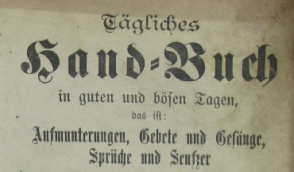

# Einleitung

Warum ein Handbuch für museum-digital? Webseiten, die ein Handbuch
brauchen, um benutzbar zu sein, sollte es nicht geben! museum-digital
ist aber mehr als eine Webseite. In diesem Handbuch geht es weniger um
die Webseite (das, was für jeden sichtbar ist) als um dieses
mehr. „museum-digital" ist zugleich ein Kulturportal für
Museumsobjekte, eine Software zum Inventarisieren für Museumsobjekte und
vieles mehr.

Im Anschluss an eine „Kleine Geschichte von museum-digital" werden die „Ziele"
geschildert. Soviel vorweg: Alles bei museum-digital folgt einem
„iterativen Prozess", d.h. ein Ziel wird definiert, ein Schritt zu
seiner Verwirklichung unternommen, dabei werden Erfahrungen gesammelt,
die dann dazu führen das Ziel genauer zu beschreiben, neu zu definieren
oder fallen zu lassen. Ist das Ziel neu definiert wird wieder ein
Schritt zur Umsetzung unternommen\...

Entsprechend bleiben nur die allgemeinen Zielvorgaben bestehen, die
konkreteren Zielformulierungen ändern sich. Die im Laufe der Zeit
gesammelten Erfahrungen haben zur Formulierung von „Grundsätzen bei
museum-digital" geführt, die ebenfalls vorgestellt werden.

Der „Aufbau" von museum-digital, seine internationalen, nationalen,
regionalen und thematischen Versionen, spiegelt den Verlauf des
Vorhabens. Dieser Aufbau wird in einer eigenen Sektion erläutert. Eine
weitere Sektion widmet sich der Struktur, d.h. der Verwaltung und
Speicherung der einzelnen Informationen. In ihr werden Benutzerrollen
ebenso beschrieben wie die Orientierung an Ereignissen oder der Umgang
mit Zeitangaben.

Grundsätzlich ist jede Version von museum-digital eigenständig, doch sie
nutzen gemeinsam zentrale Datenbanken, in denen kontrolliertes Vokabular
verwaltet wird. Die große Bedeutung, die den Normdaten bei
museum-digital beigemessen wird, welche Kontrollen und Anreicherungen
stattfinden -- das erläutert ein weiterer Abschnitt.

museum-digital veröffentlicht und verwaltet Informationen zu Objekten
aus den beteiligten Museen. Mögliche Wege dieser Informationen in die
Platform von museum-digital werden im Abschnitt „Import nach
museum-digital" erläutert. Neben dem Import besteht bei museum-digital
immer auch die Möglichkeit der direkten Eingabe der Informationen.

Der Umgang mit dem Eingabe- und Bearbeitungswerkzeug von museum-digital
steht im Zentrum dieses Handbuchs. Dieses Werkzeug kann entweder
ausschließlich zum Publizieren von Objektinformation genutzt werden,
oder aber - bei Verwendung weiterer Felder - auch zum Inventarisieren.
Das „Inventarisieren mit museum-digital" hat seinen eigenen Abschnitt.

Bei museum-digital gespeicherte Informationen lassen sich auf
verschiedene Weisen nutzen, neben der Ausspielung auf der Plattform von
museum-digital hat jedes beteiligte Museum die Möglichkeit seine Daten
per Knopfdruck im LIDO-Austauschformat zu exportieren und an Portale wie
die Deutsche Digitale Bibliothek oder die Europeana weiterzugeben. Auch
für das „Exportieren aus museum-digital" gibt es einen eigenen
Abschnitt. Eine weitere Nutzung der Objektinformationen entsteht
dadurch, dass Museen die jeweils passenden Teile aus museum-digital
leicht in ihre eigene Internet-Präsenz einbauen können, so dass die
Objekte des Museums über die Internetseite des Museums erreichbar sind.
Hierfür gibt es zwei Möglichkeiten, die „Einbindung über iframe" und die
Nutzung der „APIs von museum-digital" - beides wird ausführlich
erläutert.

Schließlich hält museum-digital noch ein Zusatzwerkzeug parat: Den
„Themator", ein Werkzeug zum einfachen Erstellen von kleinen digitalen
Ausstellungen. Dieses Werkzeug kann auch separat genutzt, es entfaltet
seine Möglichkeit jedoch erst richtig im Zusammenspiel mit den
verschiedenen Varianten von museum-digital. Der Themator hat seinen
eigenen Abschnitt.

Mit all diesen Informationen soll das Handbuch einen „Blick hinter die
Kulissen" von museum-digital gestatten und es soll die Möglichkeiten
aufzeigen, die allen beteiligten Museen offenstehen. Natürlich wäre das
Handbuch unvollständig ohne zu sagen, wie eine Beteiligung an
museum-digital möglich ist.\
 
