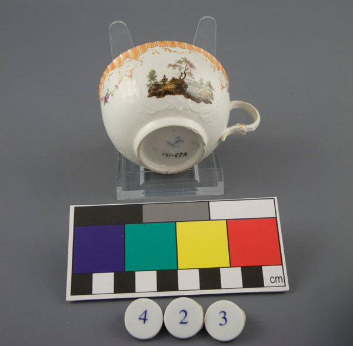
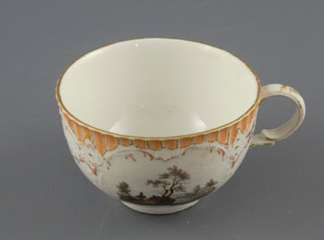

Ziele UND Grundsätze
====================

Das Ziel in einem Satz
----------------------

Das eigentliche Ziel von museum-digital ist es allen Museen eine
Möglichkeit zu bieten fundierte Informationen zu Ihren Objekten auf
einfache Weise effektiv im Internet sichtbar zu machen. Hinter diesem
Ziel steht die Absicht mit der Publikation der Objektinformation auf die
Museen selbst und die in ihnen geleistete Erschließungsarbeit aufmerksam
zu machen. Gleichzeitig sollen den Museen Möglichkeiten der Nachnutzung
digitaler Information erschlossen werden, etwa durch Einbindung der
Informationen in die eigene Internetpräsenz oder durch digitale
Ausstellungen (Themenportale). museum-digital ist in jedem Fall nur ein
Werkzeug. Für jene Museen, die über kein eigenes Programm zur
Inventarisierung verfügen, stellt museum-digital die entsprechenden
Funktionen in einem gesonderten Bereich zur Verfügung.

Aus dieser, schon 2009 von der AG Digitalisierung des Museumsverbandes
Sachsen-Anhalt, formulierten Zielstellung und insbesondere aus den seit
damals gewonnenen Erfahrungen leiten sich einige Grundsätze ab, die für
alle Versionen von museum-digital gültig sind:

Inventarisieren vs. Publizieren
-------------------------------

Inventarisieren ist eine Notwendigkeit. In den meisten Museen dient die
Inventarisierung ausschließlich der Verwaltung der Objekte, dem
Besitznachweis, dem Leihverkehr \... Die Einträge in den zur
Inventarisierung genutzten Datenbanken sind entsprechend vor allem
stichwortartig. Die Inventarisierungsdatenbanken sind in den meisten
Fällen geschlossene Systeme, die nicht mit Systemen anderer Museen oder
zentralen Datenbanken, wie etwa der Gemeinsamen Normdatei der
Bibliotheken, kommunizieren können. Die Einträge in
Inventarisierungsdatenbanken werden üblicherweise von Mitarbeitern des
Museums ausschließlich für Mitarbeiter des gleichen Museums vorgenommen.
Entsprechend sind Einträge wie \"Stuhl, blau\" als Objektbeschreibung
häufig zu finden. Solche Einträge sind für die Publikation wenig
geeignet.

Ganz ähnlich verhält es sich mit Abbildungen zu Objekten. Für die Inventarisierung werden häufig
Fotos erstellt auf denen eine Inventarnummer zuerkennen ist und/oder ein
genormter Farbbalken mit dem Objekt abgelichtet wurde. Dies soll die
Zuordnung von Abbildungen zu Objekten erleichtern und die Rekonstruktion
der Farbigkeit eines Objektes ermöglichen. Bildästhetische Maßstäbe
werden nicht berücksichtigt. Solche Abbildungen (bei denen mitunter die
Darstellung der Inventarnummer das Objekt bedeckt) sind für die
Publikation wenig geeignet.

Für die Internet-Publikation sind ansprechende und aussagekräftige
Objektabbildungen sowie ausführliche und geprüfte Objektinformationen
nötig. Jenen Museen, die mit museum-digital nicht nur publizieren,
sondern auch inventarisieren, wird empfohlen schon die Inventarisierung
publikationsfähig zu gestalten. Das ist der einfachste Weg.

Nicht in erster Linie ein Portal
--------------------------------

Objekte und Museen im Internet sichtbar machen heißt bei museum-digital
die Objekte und Museen vor allem dort zu platzieren, wo die
Internet-Nutzer sind. Der Aufbau eines \"Portals für Museumsobjekte\"
ist nicht das Ziel von museum-digital. Die Mehrzahl der Internet-Nutzer
kennen ihre Suchmaschine und sie sind es gewohnt diese Suchmaschine für
allgemeine Fragen zu benutzen. Entsprechend ist es Absicht von
museum-digital mit möglichst vielen Objekten möglichst weit vorn auf den
Trefferlisten der Suchmaschinen zu sein. Dort suchen die Nutzer und von
dort sollen sie den Weg zu den Objekten finden. Sind sie dann auf den
Seiten von museum-digital angekommen, dann ist es das Ziel durch
Verknüpfungen von Objektinformationen Anreize zu geben, weitere Seiten
bei museum-digital zu lesen. Natürlich wird mit der Zeit bei immer mehr
Nutzern bekannt, dass manche ihrer Fragen bei museum-digital eine
Antwort finden. Diese Nutzer gehen dann, bei passenden Fragen, direkt zu
museum-digital - das, auf diese Weise, ungewollt Portal-Funktionen
wahrnimmt. Die Konsequenz aus diesem Grundsatz ist, dass der Quellcode
von museum-digital in regelmäßigen Abständen für Suchmaschinen optimiert
wird, dass viele Verlinkungsmöglichkeiten zwischen Objekten eingerichet
wurden und dass dennoch die Suchfunktionen bei museum-digital selbst
sehr ausgefeilt sind.

Es bedingt sich gegenseitig: Je mehr Museen mitmachen, desto größer
werden Spektrum und Anzahl von Querverweisen. Mit mehr Querverweisen und
(automatisch entstehenden) Übersichtsseiten steigt das Potential für die
Suchmaschinenoptimierung. Im Streit um Aufmerksamkeit im Internet ist es
für Museen hilfreich Objektinformationen gemeinsam zu publizieren.

Offen für alle Museen
---------------------

Museum-digital steht allen Museen zur Verfügung. Dieser Anspruch hat
Konsequenzen:

-   Die verwendete Software muss sehr einfach zu bedienen sein.
    Mitarbeiter müssen sie ohne teure IT-Schulung benutzen können.
-   Die verwendete Software muss weitestgehend kostenfrei sein. Längst
    nicht jedes Museum kann sich die oft sehr teueren Lizenzen von
    Museums-Softwareproduktion gewinnorientierter Firmen leisten.
    Museum-digital basiert auf frei verfügbarer Software (mysql, php).
-   Das System muss sehr flexibel sein. Es gibt in den verschiedenen
    Museen verschiedene Traditionen des Formulierens von
    Objektinformationen. Als Beispiel sei auf Zeitangaben verwiesen, wo
    \"1600/1650\" häufig das gleiche meint wie \"1600-1650\" oder wie
     \"Erste Hälfte des 17. Jahrhunderts\", was auch oft als \"1. H. 17.
    Jh.\" notiert wird und sich wenig von \"Anfang bis Mitte 17.
    Jahrhundert\" unterscheidet. In einem Museum werden die
    Informationen auf die eine Art und in einem anderen auf eine andere
    Art notiert. Häufig gibt es keine Regeln (oder niemanden, der auf
    eine Einhaltung achtet) und es bleibt dem - möglicherweise täglich
    wechselnden - Geschmack der Bearbeiter überlassen, wie sie die
    Informationen notieren. Verschiedenartige Einträge erschweren die
    Suche - nicht nur in der museumseigenen Objektdatenbank sondern
    besonders bei kooperativen Systemen wie museum-digital, in denen die
    Kreativität vieler Museen aufeinandertrifft. Eine Redaktion
    bestimmter zentraler Angaben (Ortsnamen, Personen- und
    Institutionenbezeichnungen, Zeitangaben und Schlagworte) wird durch
    museum-digital vorgenommen. Einträge werden hierbei gleichgesetzt
    oder zu Synonymen erklärt. Ein Teil der Qualitätssicherung ist damit
    sozusagen von den Museen zu museum-digital verlagert.
-   Weil Museen aller Arten und Sparten mitwirken, kann und will
    museum-digital fachspezifische Internetportale nicht ersetzen. Wer
    beispielsweise sehr tiefgehende Hintergrund- und
    Grundlageninformationen über Mineralien (einschließlich modellhafter
    Abbildungen von Kristallstrukturen, Verbreitungskarten, etc.) sucht,
    der ist bei [mindat.org](https://www.mindat.org/) besser aufgehoben.
    Wo möglich verlinkt museum-digital aber zu solchen
    Fachdatenbank-Systemen.
-   Offen für alle Museen bedeutet auch, dass die beteiligten Museen auf
    die Entwicklung des Software-Systems Einfluß nehmen können. Nur so
    kann sichergestellt werden, dass die Software für alle Museen gut zu
    verwenden ist und dass sie den Ansprüchen der Museen genügt.

Mehrsprachigkeit
----------------

Das Internet ist global. museum-digital ist daher auf Mehrsprachigkeit eingerichtet - in Eingabe,
Ausgabe und Verwaltung von Objektinformationen. Die Navigation der
Seiten, wie auch die Informationen zu Museen, zu Sammlungen oder zu
Objekten lassen sich in beliebig vielen Sprachen ein- und ausgeben. Dies
ermöglicht Kooperationsprojekte über Sprachgrenzen hinweg. Im Augenblick
stehen im Eingabe- und Bearbeitungwerkzeug folgende Sprachen zur
Verfügung: Deutsch, Englisch, Indonesisch, Polnisch, Portugiesisch,
Ungarisch. Auf der Internetseite können die Nutzer zwischen Deutsch,
Englisch, Indonesisch, Italienisch, Polnisch, Portugiesisch und
Ungarisch wählen. Ein eigenes Werkzeug erleichtert das Einrichten
weiterer Sprachversionen.

Mehrfachnutzung
---------------

museum-digital ist keine Einbahnstraße und kein Selbstzweck! Museen, die
Informationen zu ihren Objekten bei museum-digital publizieren haben von
hier aus zahlreiche einfach nutzbare Möglichkeiten:

-   Museum-digital verfügt einen leicht zu bedienenden Exportmechanismus
    mit dem sich jedes Museum eine Exportdatei für ausgewählte Objekte
    erstellen kann. Diese Exportdatei ist im LIDO-Datenaustauschformat
    gehalten und kann einfach an Portale weitergegeben werden. Etliche
    Museen haben auf diese Weise bereits ihre Informationen an die
    \"europeana\" oder die \"ddb\" (Deutsche Digitale Bibliothek)
    weitergereicht. Mehr zu den Exportmöglichkeiten finden Sie unter
    [Ausgabe/Export](?lan=de&q=Ausgabe/Export).
-   Jedes Museum kann seine eigenen Objektinformationen auch in die
    eigene Internetseite einbinden. Dafür gibt es den einfachen Weg über
    einen iframe (mehr dazu unter
    [Ausgabe/Einbinden](?lan=de&q=Ausgabe/Einbinden)) oder über eine API
    (mehr dazu unter [Ausgabe/APIs](?lan=de&q=Ausgabe/APIs)).
-   Eine weitere Möglichkeit, die eigenen Daten selbst zu nutzen, bietet
    das einfache Themen-Erstellungsprogramm von museum-digital. Hiermit
    können die Objekte in Form einer kleinen digitalen Ausstellung
    gruppiert, annotiert und (als Gruppe) beschrieben, vor allem aber
    präsentiert werden (Mehr dazu unter
    [Ausgabe/Themen](?lan=de&q=Ausgabe/Themen)).

Transparenz
-----------

Zu den Grundsätzen von museum-digital gehört auch eine möglichst große
Transparenz. Aktuelle Zugriffszahlen werden öffentlich zugänglich
gemacht. Grundlegende Zahlen zur Benutzung und Entwicklung von museum-digital
finden sich auf dem [Dashboard der Projektseite](https://de.about.museum-digital.org/dashboard).
