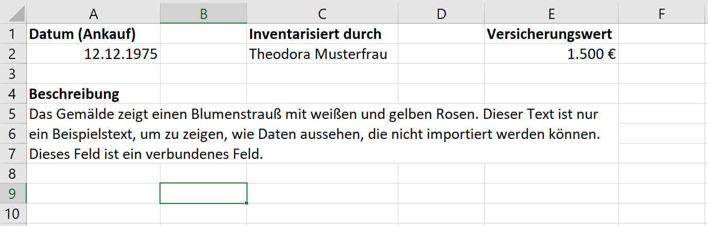
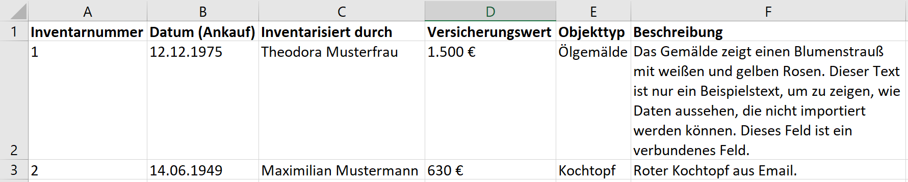

# Importe: Einleitung

Was ist ein Import?
-------------------

Wenn Ihr Museum aktuell eine andere Datenbank zur Inventarisierung
verwendet, aber gerne auf die Arbeit mit museum-digital umsteigen
möchte, so gibt es die Möglichkeit eines Imports der Daten aus dem
bisherigen Programm. Gleiches gilt, wenn Sie bei Ihrer
Inventarisierungssoftware bleiben, aber museum-digital zum
Veröffentlichen Ihrer Daten nutzen möchten. Dabei werden gebündelt alle
Daten und Bilder aus der alten Datenbank in museum-digital importiert --
vorausgesetzt, die Daten erfüllen die notwendigen Vorgaben.

Ein Import kann grundsätzlich stattfinden, wenn die Metadateien im XML
oder CSV-Format und Bilddateien im JPG-Format vorliegen.

Wer importiert?
---------------

Das Importieren Ihrer bisherigen Datenbestände wird aktuell nur von den
technischen Entwicklern von museum-digital durchgeführt. Zur
Vorbereitung eines Imports nehmen Museen in Baden-Württemberg,
Brandenburg, Bremen, Mecklenburg-Vorpommern, Rheinland-Pfalz, Sachsen,
Sachsen-Anhalt, Westfalen und Ostwestfalen-Lippe bitte mit ihrem/ihrer
jeweils zuständigen Regionaladministrator\*in Kontakt auf. Museen aus
den übrigen Regionen in Deutschland wenden sich an Stefan Rohde-Enslin.

[**\> Hier geht es zu den richtigen
Ansprechpartner\*innen!**](https:/nat.museum-digital.de/index.php?t=kontakt)

Sie sollten aber Ihre Daten selbst für den Import vorbereiten. Im
Folgenden wird beschrieben, wie das funktioniert.

Welche Daten können importiert werden?
--------------------------------------

Daten können importiert werden, wenn sie als CSV- oder XML-Datei
vorliegen. In einer CSV-Datei sind die Werte in einer Textdatei
gespeichert und werden durch ein standardisiertes Trennzeichen (zum
Beispiel ein Komma) getrennt. Tabellenprogramme können CSV-Dateien
normalerweise öffnen und darstellen -- die durch das Trennzeichen
getrennten Werte werden dabei in separaten Zellen angezeigt.

Viele Inventarprogramme bieten die Möglichkeit, die Daten als CSV-Datei
zu exportieren. Wenn das funktioniert hat, ist der nächste Schritt, die
Datenfelder aus dem alten Programm den Datenfeldern in museum-digital
zuzuordnen (siehe Abschnitt \"Zuordnen der Datenfelder\").

Die jeweils zuständen Regionaladministator\*innen überprüfen gerne die
zu importierenden Daten auf ihre Qualität und auf ihre Übereinstimmung
mit den Standards von museum-digital. Bei Bedarf unterstützen sie auch
bei notwendigen Anpassungen, damit der Import reibungslos funktioniert.

Welche Daten können nicht importiert werden?
--------------------------------------------

[Daten von händisch geführten, analogen Listen oder Karteikarten können
nicht automatisiert importiert werden. Sie müssen zuerst in ein
Tabellenprogramm übertragen werden. Dabei entspricht eine Spalte einem
Datenfeld in museum-digital. Eine Zeile entspricht einem Datensatz. Wenn
in einem Tabellenprogramm inventarisiert wurde, dürfen Zellen nicht
miteinander verbunden sein. Spalten und Zeilen dürfen nicht ausgeblendet
sein.]{style="font-size: 18.4px;"}

[Wenn eine Tabelle wie ein Formular verwendet wurde, d. h. mit
verbundenen Zellen und unterschiedlichen Informationen in einer Spalte,
dann müssen diese Daten zuerst händisch korrigiert werden, bevor sie
importiert werden können.]

[{width="1279"
height="268"}]{style="font-size: 18.4px;"}

[Auf diesem Bild sieht man, dass in Spalte A zwei verschiedene Arten von
Informationen erfasst werden, die eigentlich in zwei verschiedene
Spalten gehören. Das sind \"Datum (Ankauf)\" und \"Beschreibung\".
Außerdem wurden für das Feld \"Beschreibung\" mehrere Zellen miteinander
verbunden. Die Daten dieses Beispiels können daher nicht importiert
werden.]{style="font-size: 18.4px;"}

[

[In dieser Tabelle enthält jede Spalte nur eine Art von Informationen.
Es gibt keine verbundenen Zellen. Mit dieser Tabelle kann nun
weitergearbeitet werden.]

Import von Bildern
------------------

[Das massenhafte Hochladen von Bildern zu bereits bestehenden
Datensätzen ist nicht programmiert, das gleichzeitige Hochladen von
Bildern und zu importierenden Datensätzen ist leicht möglich. Bilder im
Internet benötigen allerdings immer Angaben zu den
Bildrechten.]{style="font-size: 18.4px;"}

[Auf der im Folgenden verlinkten Seite finden sich die Titel für die
entsprechenden Spalten der vorzubereitenden CSV-Tabelle im Bereich
„Abbildungen". Man muss dort in der Spalte den tatsächlichen Bildnamen
eintragen, also „123456.jpg" und nicht den Pfad (z.B.
„c:\\\\123456.jpg") und der Import funktioniert auch nur mit
jpg-Dateien. Zudem müssen die jpg-Dateien die Mindestgröße von 540 Pixel
für die kurze Seite haben.]

**[[ \> Hier geht es zur CSV-Vorlage sowie zum
Prüfassistenten.]](http://www.museum-digital.de/csvxml)**

Importe für große Museen
------------------------

Für große Museen mit umfangreichen Daten und Sammlungsbeständen besteht
gegebenenfalls die Möglichkeit, dass ein eigenes Importskript von den
Entwicklern von museum-digital programmiert wird. Nehmen Sie mit Ihren
Regionaladministrator\*innen oder  den Entwicklern Kontakt auf:

[**\> Hier geht es zu den richtigen
Ansprechpartner\*innen!**](https:/nat.museum-digital.de/index.php?t=kontakt)
