# Icons

## Icons für Ereignistypen

An einigen Stellen in der Ausgabe - besonders bei den Zeitleisten und
Karten für Ereignisse bei Objekt- und Personenseiten - werden Ereignisse
visualisiert. Hierfür verwenden wir die folgenden Icons.

Bei Karten erscheinen die Icons in einem Marker. Dieser basiert auf dem
Marker-Icon von
[SimpleIcon](https://www.flaticon.com/packs/simpleicon-places) (CC-BY).
Die Icons sind unter CC-BY unten verfügbar. Attribuiert werden können
sie auf \"Joshua R. Enslin / museum-digital\". Erstellt wurden sie
mithilfe von [Inkscape](https://inkscape.org/).

Icons mit Marker - für Orte
---------------------------

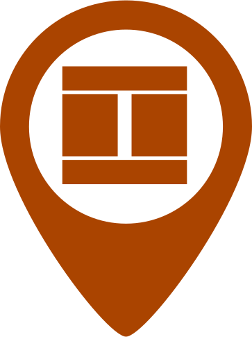

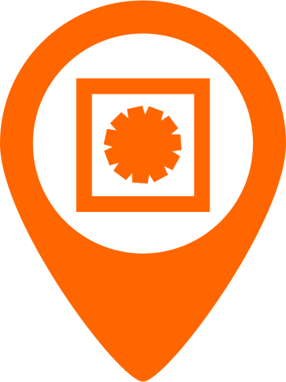

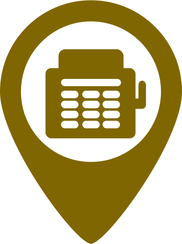

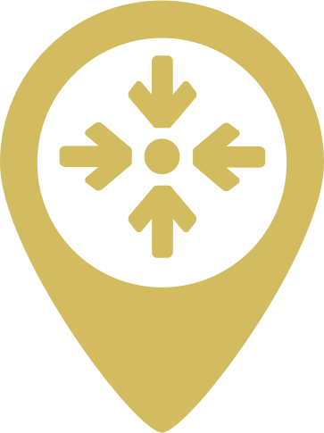

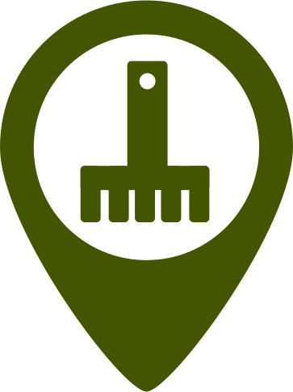

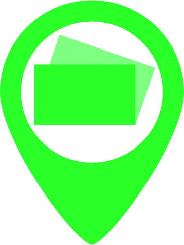

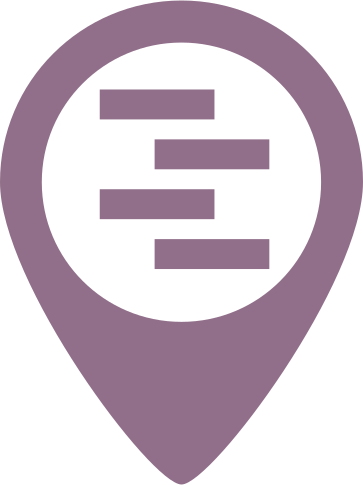

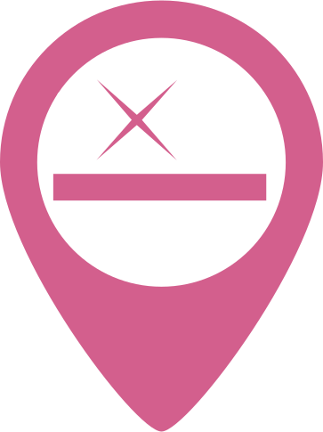

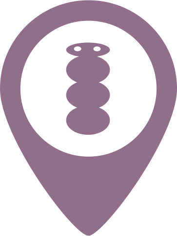

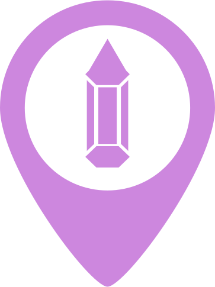

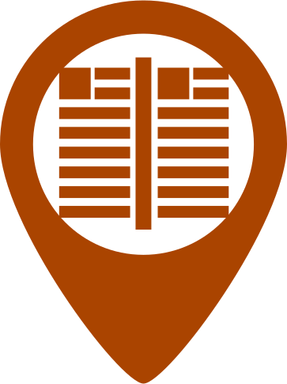

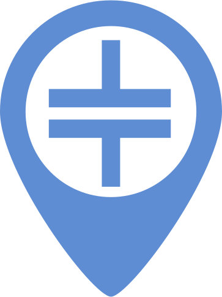

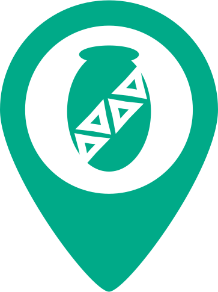}

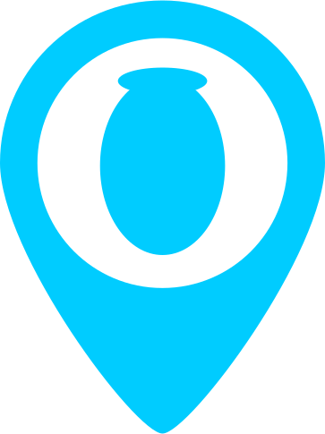

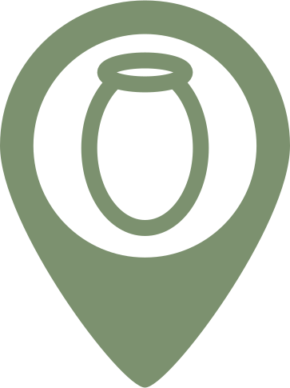

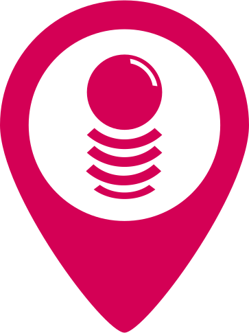

Icons im Quadrat - für Zeiten
-----------------------------

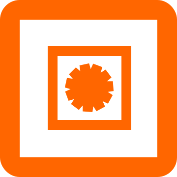

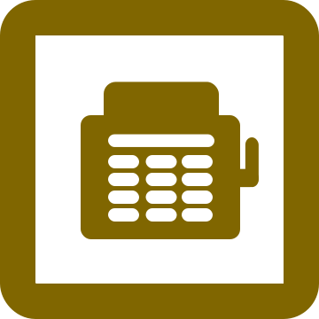

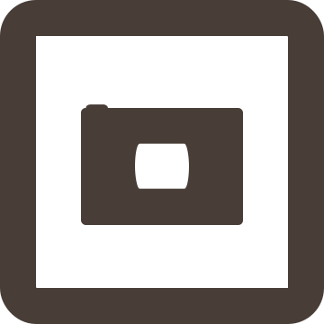

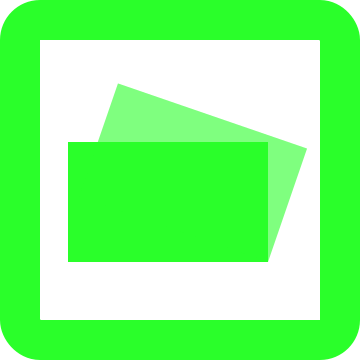

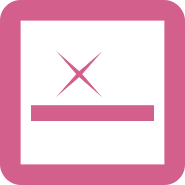

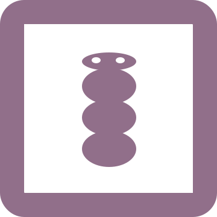

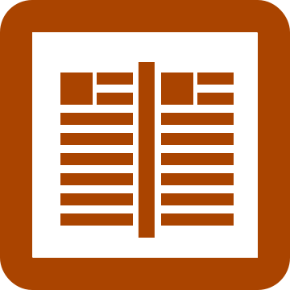

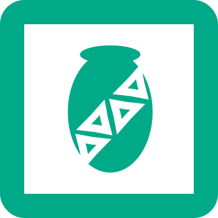

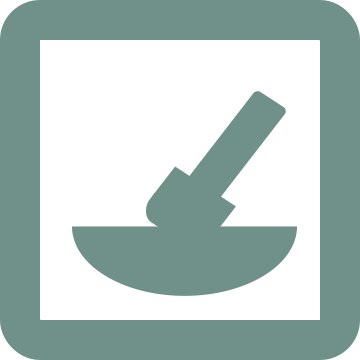

