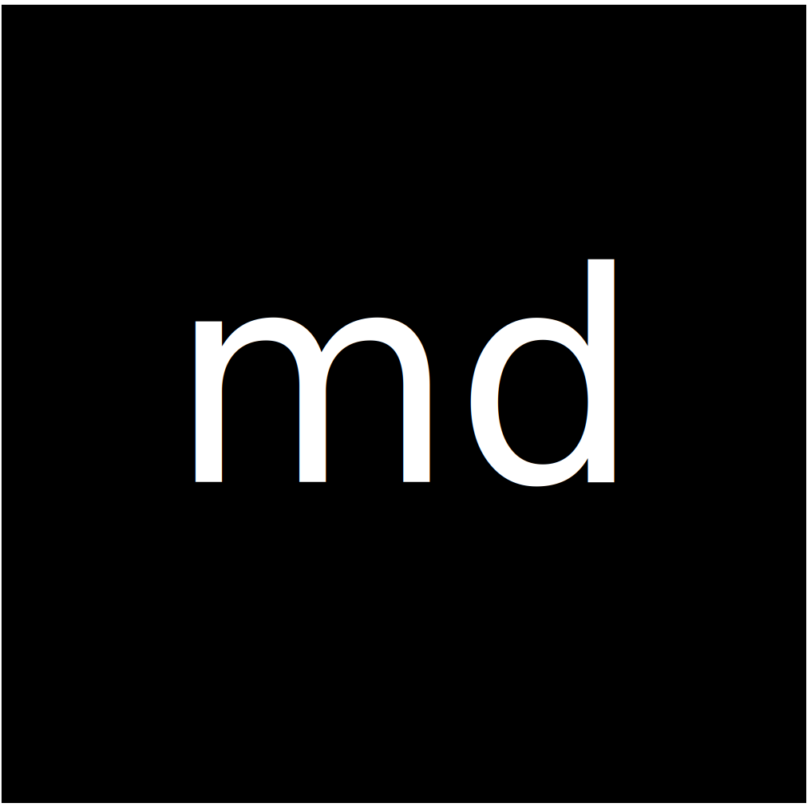
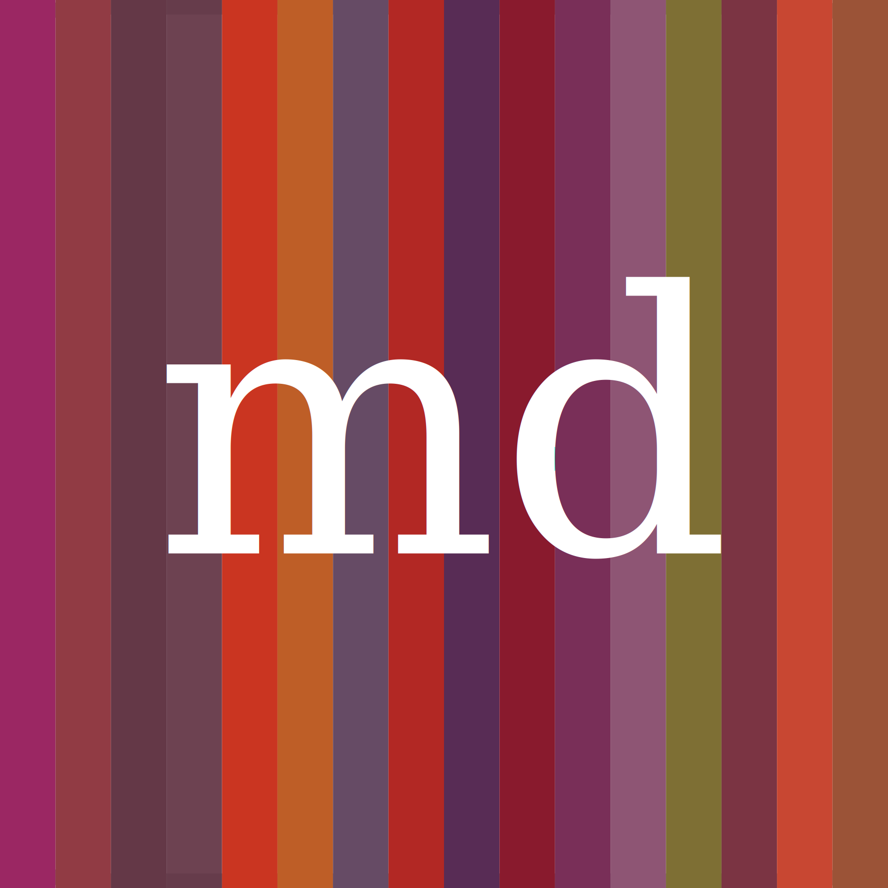
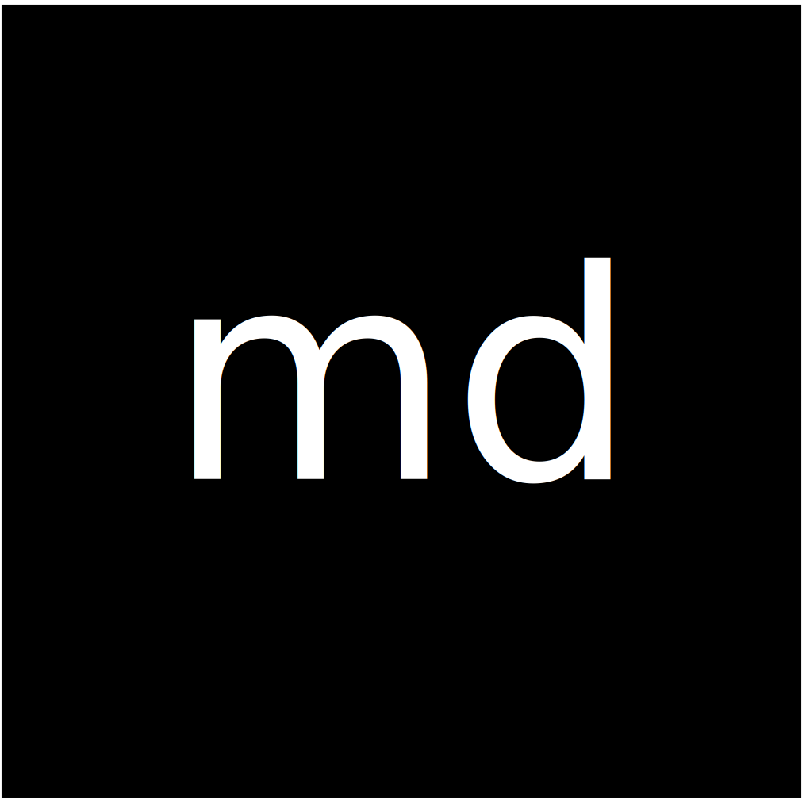
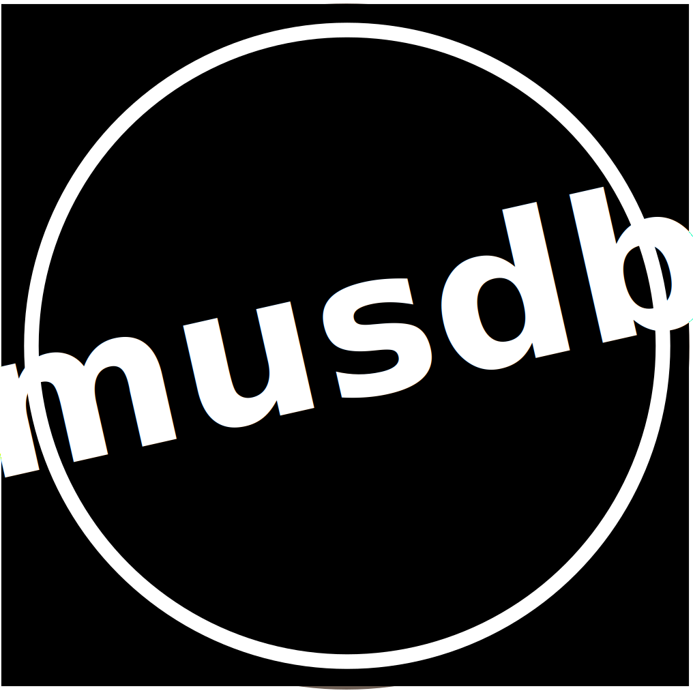
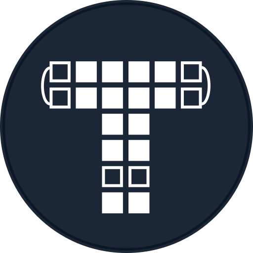

# Logos

Die verschiedenen Instanzen von museum-digital sind regional
organisiert: Innerhalb Deutschlands nach Bundesländern (abseits des
Themenportals
[*Agrargeschichte*](https://agrargeschichte.museum-digital.de/),
international nach Ländern. Eine Besonderheit stellt dabei die
bundesweite deutsche Version dar, in der keine Dateneingabe möglich ist,
und die aus den regionalen Instanzen zusammengeführt wird. Zusätzlich zu
diesen drei Ebenen - deutsche Bundesländer, Deutschlandweit,
International - besteht museum-digital als übergeordnetes Projekt.

Wir benutzen verschiedene Logos um dieser Teilung der Ebenen Rechnung zu
tragen. Alle Logos auf dieser Seite stehen per [CC
BY](https://creativecommons.org/licenses/by/4.0/) zur Verfügung, das
heißt, sie können ohne Probleme wiederverwendet werden, solange eine
Attribution zum Projekt museum-digital besteht.

Logo für museum-digital als Projekt
-----------------------------------

Logo für Versionen innerhalb von Deutschland
--------------------------------------------

Da es mehrere Instanzen auf dieser Ebene gibt, hat das Logo den
verschiedenen Instanzen entsprechende Farben:

| Instanz                | Farbe     |
|------------------------|-----------|
| Agrargeschichte        | `#705644` |
| Baden-Württemberg      | `#184E4E` |
| Bayern                 | `#0E7EAD` |
| Berlin                 | `#00ACAF` |
| Brandenburg            | `#E54800` |
| Hessen                 | `#CD990D` |
| Mecklenburg-Vorpommern | `#1C7489` |
| Niedersachsen          | `#B52D06` |
| Ostwestfalen-Lippe     | `#00356A` |
| Rheinland              | `#48691F` |
| Rheinland-Pfalz        | `#E26B22` |
| Sachsen                | `#7B070F` |
| Sachsen-Anhalt         | `#2C6087` |
| Thüringen              | `#423C6F` |
| Westfalen              | `#6C87A7` |

Logo für die deutschlandweite Instanz von museum-digital
--------------------------------------------------------

museum-digital als deutschlandweites Projekt und die deutschlandweite
Instanz von museum-digital haben ein eigenes Logo. Die verschieden
gefärbten Balken sollen die vielfältigen regionalen Instanzen und
Teilprojekte darstellen.

Logo für internationale Instanzen
---------------------------------

Auch das Logo für internationale Versionen ist auf
Mehrfachverwendbarkeit ausgelegt. Abseits der [ungarischen
Instanz](https://hu.museum-digital.org), die ein eigenes Logo
hat, werden die folgenden Hintergrundfarben für die Logos der
internationalen Instanzen verwendet.

| Instanz    | Farbe     |
| -----------|-----------|
| Indonesien | `#CC3333` |
| Brasilien  | `#358e27` |

Logo für musdb
--------------

Auch [musdb, das Eingabetool von
museum-digital](../musdb/README.md), hat ein
eigenes Logo. Dieses wird nicht Instanz-spezifisch angepasst und findet
bisher nur auf Offline-Seiten und als Logo der Progressive Web App
Anwendung.

Logo für den Themator
---------------------

Ab Januar 2019 hat auch der Themator, das Themen- und Ausstellungsmodul
von museum-digital, ein eigenes Logo.

Logo für md:term
----------------

Ab Januar 2019 hat auch der md:term, der öffentliche Zugang zu den
kontrollierten Vokabularen von museum-digital, ein eigenes Logo.
