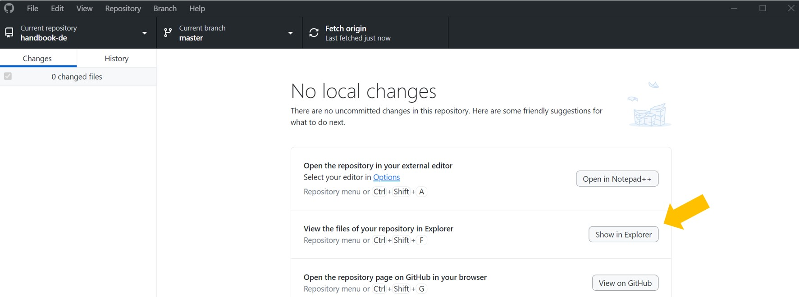
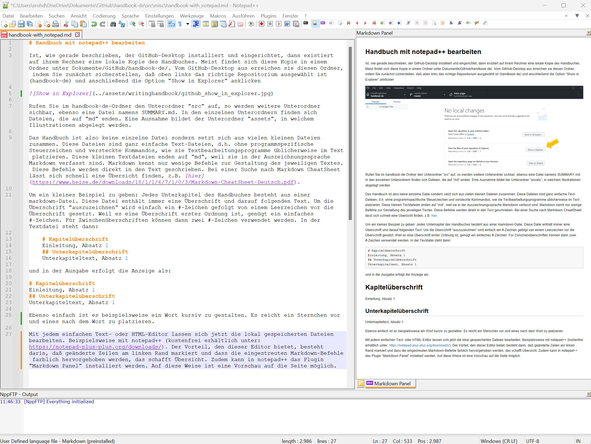

# Texte im Handbuch bearbeiten

Ist, wie gerade beschrieben, der GitHub-Desktop installiert und eingerichtet, dann existiert auf ihrem Rechner eine lokale Kopie des Handbuches. Meist findet sich diese Kopie in einem Ordner unter Dokumente/GitHub/handbook-de/. Vom GitHub-Desktop aus erreichen sie diesen Ordner, indem Sie zunächst sicherstellen, daß oben links das richtige Repositorium ausgewählt ist (handbook-de) und anschließend die Option "Show in Explorer" anklicken

Rufen Sie im handbook-de-Ordner den Unterordner "src" auf, so werden weitere Unterordner sichbar, ebenso eine Datei namens SUMMARY.md. In den einzelnen Unterordnern finden sich Dateien, die auf "md" enden. Eine Ausnahme bildet der Unterordner "assets", in welchem Illustrationen abgelegt werden.

Das Handbuch ist also keine einzelne Datei sondern setzt sich aus vielen kleinen Dateien zusammen. Diese Dateien sind ganz einfache Text-Dateien, d.h. ohne programmspezifische Steuerzeichen und versteckte Kommandos, wie sie Textbearbeitungsprogramme üblicherweise im Text platzieren. Diese kleinen Textdateien enden auf "md", weil sie in der Auszeichnungssprache Markdown verfasst sind. Markdown kennt nur wenige Befehle zur Gestaltung des jeweiligen Textes. Diese Befehle werden direkt in den Text geschrieben. Bei einer Suche nach Markdown CheatSheet lässt sich schnell eine Übersicht finden, z.B. [hier](https://www.heise.de/downloads/18/1/1/6/7/1/0/3/Markdown-CheatSheet-Deutsch.pdf).

Um ein kleines Beispiel zu geben: Jedes Unterkapitel des Handbuches besteht aus einer markdown-Datei. Diese Datei enthält immer eine Überschrift und darauf folgenden Text. Um die Überschrift "auszuzeichnen" wird einfach ein #-Zeichen gefolgt von einem Leerzeichen vor die Überschrift gesetzt. Weil es eine Überschrift erster Ordnung ist, genügt ein einfaches #-Zeichen. Für Zwischenüberschriften können dann zwei #-Zeichen verwendet werden. In der Textdatei steht dann:

    # Kapitelüberschrift
    Einleitung, Absatz 1
    ## Unterkapitelüberschrift
    Unterkapiteltext, Absatz 1

und in der Ausgabe erfolgt die Anzeige als:

# Kapitelüberschrift
Einleitung, Absatz 1
## Unterkapitelüberschrift
Unterkapiteltext, Absatz 1

Ebenso einfach ist es beispielsweise ein Wort kursiv zu gestalten. Es reicht ein Sternchen vor und eines nach dem Wort zu platzieren.

Mit jedem einfachen Text- oder HTML-Editor lassen sich jetzt die lokal gespeicherten Dateien bearbeiten. Beispielsweise mit notepad++ (kostenfrei erhältlich unter: https://notepad-plus-plus.org/downloads/). Der Vorteil, den dieser Editor bietet, besteht darin, daß geänderte Zeilen am linken Rand markiert und dass die eingestreuten Markdown-Befehle farblich hervorgehoben werden, das schafft Übersicht. Zudem kann in notepad++ das Plugin "Markdown Panel" installiert werden. Auf diese Weise ist eine Vorschau auf die Seite möglich. Das sieht dann beispielsweise so aus:

Ist die Bearbeitung beendet, dann wird die Datei gespeichert. Lokal, d.h. auf Ihrem Rechner liegt jetzt die aktuelle Version vor. Damit dieses auch tatsächlich öffentlich werden kann muss sie zunächst auf den Server transferiert werden. Dazu wird der Github-Desktop aufgerufen. Während der Bearbeitung lief dieser im Hintergrund und hat die Änderungen protokolliert.
In der linken Spalte des Github-Desktop findet sich unten ein Pflichtfeld "Summary (required)" in welches zusammengefasst eingetragen werden sollte, worin die Änderungen bestanden. Ist dieses Feld ausgefüllt (und vielleicht noch eine ausführlichere Beschreibung der Änderungen im darunterstehenden Feld angegeben) muss der Schalter "Commit to master" (unten links) angeklickt werden. Erst dann erscheint der Schalter "Push origin" mit dem der neue Inhalt auf den Server transferiert wird.

Nach der Freigabe durch den Handbuch-Redakteur erscheint die Seite dann auch öffentlich.
