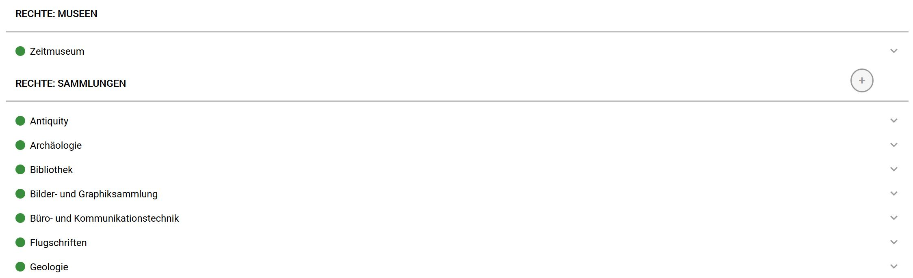
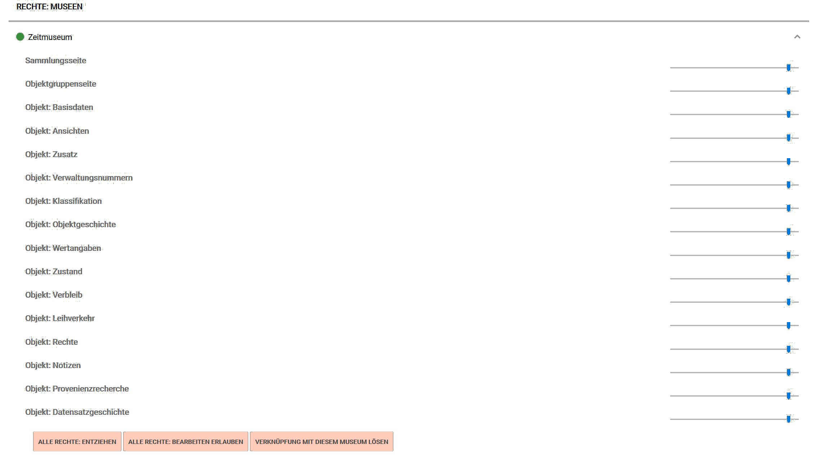
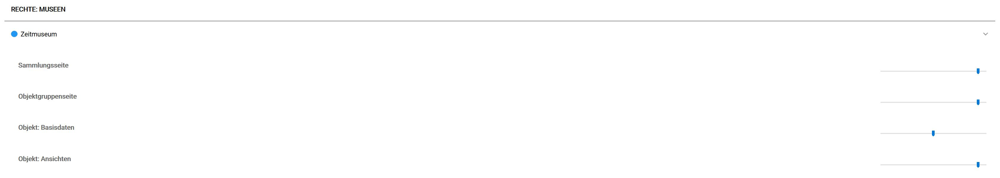

Nutzerrollen und -Rechte
========================

Nicht jeder darf alles bei museum-digital! Wer was darf, das wird
prinzipiell über Rollen geregelt. Jeder Benutzer hat eine ihm
zugewiesene Rolle. Zur Zeit gibt es sechs verschiedene Rollen bei
museum-digital. Die größten Möglichkeiten hat der
\"Regionaladministrator\", der alle Angaben zu allen Museen, Sammlungen,
Objekten etc. einer Version von museum-digital ändern kann. Ein
\"Regionaladministrator\" kann z.B. ein Museum bei museum-digital und
ein Nutzerkonto für jemanden aus diesem Museum mit der Rolle
\"Museumsdirektor\" anlegen. Der Inhaber der Rolle \"Museumsdirektor\"
kann anschließend weitere Nutzerkonten für das Museum einrichten
(einschließlich weiterer Konten mit der Rollenzuschreibung
\"Museumsdirektor\"). Er kann beliebig viele Nutzerkonten einrichten und
ihnen die jeweils entsprechenden Rollen zuweisen: \"Museumsdirektor\",
\"Mitarbeiter\" oder \"Eingebender\" - die beiden letztgenannten
unterscheiden sich prinzipiell vor allem darin, dass ein \"Eingebender\"
zwar Objektinformationen erfassen und ändern darf, jedoch nicht
berechtigt ist, diese Informationen öffentlich zu machen.

Eine besondere Rolle, die einem Nutzer ebenfalls vom \"Museumsdirektor\"
zugewiesen werden kann, ist die Rolle des \"Visiting Scientist\". Nutzer
mit dieser Rolle können alle Informationen zu Objekten des Museums
(einschließlich der Inventarisierungsinformation, aber keine
Wertangaben)  lesen, sind aber nicht in der Lage Änderungen oder
Löschungen vorzunehmen. Diese Rolle sollte nur Wissenschaftlern
zugestanden werden, zu denen ein großes Vertrauen besteht. Sobald der
Wissenschaftler seine Arbeit beendet hat kann der \"Museumsdirektor\"
das entsprechende Konto wieder löschen.

Schließlich gibt es eine Rolle mit der Bezeichnung \"Specifically
determined\". Diese Rolle ist im Prinzip ohne alle Rechte, die Rechte
müssen einzeln zugewiesen werden. Zum Einsatz kommt diese Rolle auch in
der Maschine-Maschine-Kommunikation, z.B. die automatisierte Integration
von Objektinformationen aus externen Systemen, etwa einem Temperatur-
und Feuchtigkeitsmesser, welcher automatisch Daten an museum-digital
übermittelt, oder einen Besucherzähler. Sie erlaubt den jeweiligen
Fremdsystemen stets nur genau eingegrenzte Zugriffsmöglichkeiten auf die
Datenbank von museum-digital.

Nutzerrollen bei museum-digital
-------------------------------

|                       | Name                  | Standardberechtigungen                                                                                  |
|-----------------------|-----------------------|---------------------------------------------------------------------------------------------------------|
| 1                     | Regionaladministrator | -   Darf Museen anlegen                                                                                 |
|                       |                       | -   Darf Nutzerkonten für alle Museen anlegen                                                           |
|                       |                       | -   Darf Angaben zu allen Museen, Sammlungen, Objekten hinzufügen, ändern oder löschen                  |
|                       |                       | -   Darf Sichtbarkeit von Objekten ändern                                                               |
| 2                     | Museumsdirektor       | -   Darf Nutzerkonten für das Museum anlegen                                                            |
|                       |                       | -   Darf Einstellungen für das Museum ändern                                                            |
|                       |                       | -   Darf Angaben zum Museum hinzufügen, ändern oder löschen                                             |
|                       |                       | -   Darf Angaben Sammlungen des Museums hinzufügen, ändern oder löschen                                 |
|                       |                       | -   Darf Angaben zu Objekten des Museums hinzufügen, ändern oder löschen                                |
|                       |                       | -   Darf Sichtbarkeit von Objekten ändern                                                               |
| 3                     | Mitarbeiter           | -   Darf Angaben zu Sammlungen des Museums ändern                                                       |
|                       |                       | -   Darf Angaben zu Objekten des Museums hinzufügen, ändern oder löschen                                |
|                       |                       | -   Darf Sichtbarkeit von Objekten ändern                                                               |
| 4                     | Eingebender           | -   Darf Angaben zu Objekten des Museums hinzufügen oder ändern                                         |
|                       |                       | -   Darf Sichtbarkeit von Objekten **nicht** ändern (d.h. darf von ihm Eingegebenes nicht freischalten) |
| 5                     | Visiting Scientist    | -   Darf alle Angaben zu Objekten eines Museums lesen (außer Wertangaben)                               |
| 6                     | \[\"Specifically      | -   Hat per se nur Rechte, die spezifisch zugewiesen werden (siehe unten)                               |

Rechteverwaltung bei museum-digital
-----------------------------------

Die Rechte einzelner Nutzer sind nur bedingt mit den jeweiligen
Nutzerrollen verknüpft. Bei Neuanlage eines Nutzerkontos wird eine Rolle
zugewiesen und es werden die Rechte etwas zu sehen oder zu bearbeiten
gemäß dieser Rolle vorgegeben. Das lässt sich jedoch im Nachhinein
ändern und es lassen sich allerlei Kombinationen erstellen, etwa ein
Nutzerkonto für einen Mitarbeiter, der nur eine oder zwei bestimmte
Sammlungen bearbeiten während er eine weitere Sammlung ausschließlich
sehen darf. Die Rechtesteuerung kann aber noch wesentlich feiner
gestaltet werden indem einem Nutzer vom jeweiligen Museumsdirektor
bestimmte Bereiche der Informationen zu Objekten für das Ansehen oder
für die Bearbeitung entzogen oder gewährt werden. Ein solcher Nutzer
kann dann z.B. keine Angaben zum Verbleib von Objekten ändern, kann die
erfassten Provenienzinformationen nicht sehen, dafür aber Leihvorgänge
bearbeiten - Vieles ist möglich.

Rechtevergabe ist prinzipell nur jemandem in der Rolle
\"Museumsdirektor\" (oder Administrator) gestattet, die im folgenden
beschriebenen Funktionen stehen deshalb nur für jemanden in der Rolle
\"Museumsdirektor\" zur Verfügung. Um die Rechte für jemand Anderen, der
für das gleiche Museum aktiv ist, zu setzen muss zunächst dessen
Nutzerkonto aufgerufen werden. In der oberen Symbolleiste findet sich
ein Museumssymbol, welches beim Überfahren ein Menü öffnet in dem sich
der Punkt \"Benutzer\", gefolgt von einem Stift (für \"Bearbeiten\")
findet. Klickt man auf den Stift bekommt man eine Liste der aktuell für
das Museum eingetragenen Nutzerkonten. Ein Klick auf den Namen des
Nutzers öffnet dessen Kontoeinstellungen. Im oberen Teil dieses Fenstern
können Passworte neu gesetzt, die e-Mail-Anschrift korrigiert oder
automatische Benachrichtigungen angeschaltet werden. Im unteren Teil des
Fensters findet sich die Rechteverwaltung.

 

In diesem Beispiel möchte ein Museumsdirektor des \"Zeitmuseums\" die
Rechte eines seiner Mitarbeiter (hier angezeigt) bestimmen. Die
Rechtevergabe ist in zwei Blöcke gegliedert \"Rechte: Museen\" und
\"Rechte: Sammlungen\". Vor dem Eintrag \"Zeitmuseum\" findet sich ein
grüner Punkt. Dies ist der Hinweis, dass der Mitarbeiter, dessen Rechte
hier eingestellt werden, alle Rechte an den Informationen zum
\"Zeitmuseum\" und zu dessen Objekten hat. Durch Klick auf den
Museumsnamen werden Rechte museumsweit bearbeitet, durch Klick auf den
Namen einer Sammlung werden die Rechte zu dieser Sammlung (und den darin
enthaltenen Objekten) bestimmt. Was die Bestimmung der Rechte genau
bedeutet, dass erfährt man, wenn man auf \"Zeitmuseum\" klickt \...

 

Es erscheint eine Liste der \"Informationsbereiche\" für die eine
Rechtevergabe möglich ist. Ein solcher \"Informationsbereich\" ist etwa
die Sammlungsseite, d.h. die Seite auf welcher die Sammlungen des
Museums präsentiert werden. Dort, wo in der Liste links
\"Sammlungsseite\" steht findet sich rechts ein Schieberegler, der drei
Zustände kennt:

-   Linke Position bedeutet: Keine Befugnisse
-   Mittlere Position bedeutet: Darf nur sehen
-   Rechte Position bedeutet: Darf ändern

In diesem Beispiel steht der Schieberegler rechts, der Mitarbeiter darf
deshalb auf den Seiten für Sammlungsbeschreibungen arbeiten.

Analog verhält es sich mit den anderen wählbaren Informationsbereichen,
etwa \"Objekt-Basisdaten\". Dieser Informationsbereich umfaßt die
Registerkarte \"Basis\" auf der Objektbearbeitungsseite, also die
Verknüpfungen zwischen Objekten und Sammlungen, Objekten und
Ereignissen, Objekten und Schlagworten, Objekten und Literatureinträgen,
\... Wenn hier beispielsweise der Schieberegler in die mittlere Position
gebracht wird, dann kann der Mitarbeiter dessen Rechte bestimmt werden,
diese Basisdaten zwar noch sehen, darf sie aber nicht ändern. Bei dieser
Einstellung ändert sich auch automatisch der grüne Punkt vor dem
Museumsnamen in einen blauen Punkt, denn dieser Mitarbeiter hat nicht
mehr uneingeschränkte Rechte an allen Objekten des Museums. Beispiel:

Genau genommen wurde also folgendes bestimmt: Dieser Mitarbeiter kann -
und das gilt für alle Objekte des Museums - die Basisdaten der Objekte
stets nur sehen aber nicht verändern. In analoger Weise hätte diese
Beschränkung auch nur für die Objekte einer bestimmten Sammlung gesetzt
werden können, wenn statt des Museumsnamen der Name der entsprechenden
Sammlung gewählt worden und danach die Einschränkung getroffen worden
wäre.

Damit die Einschränkung tatsächlich wirksam ist, muss sichergestellt
sein, dass der Nutzer die entsprechenden Rechte weder vom Museum aus
gesehen noch von einer Sammlung aus gesehen erhalten hat. Es gilt: Für
die Bearbeitung greifen immer die weiterreichenden Rechte. Hat ein
Benutzer museumsweit Sichtrechte (im Beispiel: Für die
Objektbasisinformationen), aber sammlungsweit Bearbeitungsrechte, kann
er die Objektbasisinformationen bearbeiten (Bearbeitung ist
weiterreichend als Sehen). Hat er museumsweit Sichtrechte, aber
keinerlei sammlungsweite Rechte (im Beispiel: Für die
Objektbasisinformationen), so darf er die Informationen weiterhin sehen.

Je feiner eine Rechteverwaltung ist, desto mehr gilt, dass man sich erst
in sie hineindenken muss. Die Rechteverwaltung von museum-digital ist
vor allem auf Flexibilität ausgelegt. Hätte der Regionaladministrator
den Direktor des Zeitmuseums zum Direktor eines weiteren Museums
erklärt, so hätte dieser die Möglichkeit gehabt einem Mitarbeiter des
Zeitmuseums auch Rechte am zweiten Museum oder auch nur an einer
einzelnen Sammlung desselben zuzugestehen. Das war in diesem Beispiel
nicht der Fall, deshalb erscheint in der Rubrik \"Rechte: Museen\"
ausschließlich das Zeitmuseum und kein \"Plus im Kreis\"-Symbol am
rechten Rand (wie es hinter \"Rechte: Sammlungen\" zu sehen ist). Man
kann immer nur Rechte vergeben, über die man selbst verfügt.
