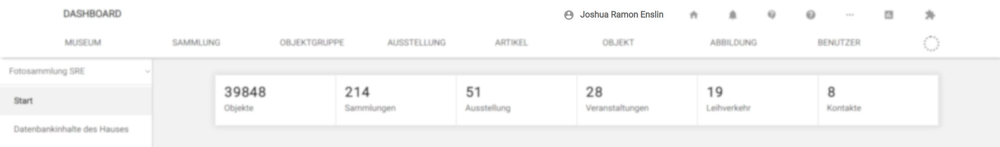
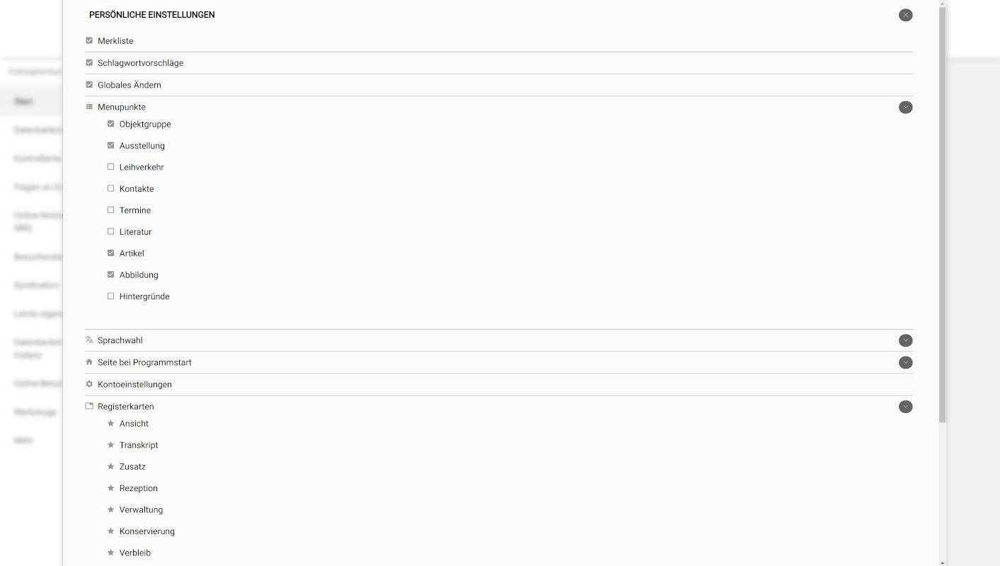
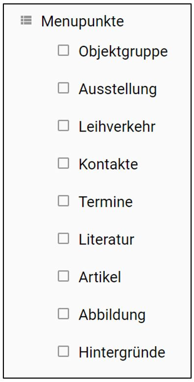

# Einstellungen (Privat): Die Benutzeroberfläche anpassen

Ganz oben mittig in der Navigation von musdb findet sich der Name des
gerade angemeldeten Benutzers. Klickt man darauf, gelangt man zu den
"Persönlichen Einstellungen", die sich als Overlay öffnen. Über das Setzen
von Statusindikatoren kann man hier die Benutzeroberfläche von musdb an die
eigenen Notwendigkeiten anpassen, indem man etwa zusätzliche Menüpunkte in
die Navigation zuschaltet oder Features gänzlich (de-)aktiviert.

## Zu- und abschaltbare Features

Mithilfe der ersten drei Menüpunkte der persönlichen Einstellungen lassen sich
üblicherweise deaktivierte Features hinzu- oder abschalten.

- Die [Merkliste](../Objektsuche/Merkliste.md) ist zur Vereinfachung der Oberfläche,
  und weil sie angeschaltet viel Platz auf dem Bildschirm verschwendet,
  standardmäßig ausgeschaltet.
- Mit der Funktion "Schlagwortvorschläge" kann man Objekttitel und Objektbeschreibung
  analysieren lassen und Schlagworte vorschlagen lassen. Die Funktion ist standardmäßig
  aktiviert, aber nur verfügbar, wenn man musdb auf Deutsch verwendet.
- Die Funktion [Globales Ändern](../Objektsuche/Batch/Globales-Aendern.md) ermöglicht
  Stapel-Bearbeitungen auf Basis der Treffermengen einer Objektsuche. Da man mit
  einer schief gelaufenen Stapelverarbeitungen schnell viel Unheil anrichten kann,
  ist diese Funktion standardmäßig deaktiviert.

## "Menüpunkte"

<!--  -->

An dieser Stelle können Sie häufig verwendete Funktionen von museum-digital ins
allgemeine Menü (Grundeinstellung: Museum - Sammlung - Objekt) einfügen.
Die entsprechenden Funktionen sind dann stets direkt aufrufbar. Eine
Einbindung dieser Funktionen ins Menü ist jederzeit möglich, wie auch
das Herausnehmen aus der Menüleiste. In jedem Fall bleiben eingegebene
Informationen davon unberührt. Alternativ können Sie aber auch jederzeit
die Shortcuts in der Navigationsleiste verwenden (s.u.).

## Sprachwahl

Über das Untermenü "Sprachwahl" kann man die Sprache, in der man musdb benutzt, wechseln.
Anders als die sonstigen persönlichen Einstellungen wird die Wahl der Umgebungssprache nicht
in der Datenbank gespeichert, sondern an das konkrete Login gebunden. Loggt man sich also aus
und wieder ein, öffnet sich musdb in der Standardsprache des Browsers.

## Seite bei Programmstart

Hier können Sie die \"Startseite\" festlegen, d.h. jene Seite, die
erscheint, wenn Sie sich im Eingabe- und Bearbeitungswerkzeug anmelden.
Sie können z.B. festlegen, dass Ihnen die Funktionen des Dashboards
stets als erstes angeboten werden, oder dass Sie direkt zur Objektübersicht gelangen.

## Kontoeinstellungen

Über diesen Schalter gelangen Sie auf eine Seite zur Pflege Ihrer
eigenen Benutzerangaben. Auf dieser Seite können Sie dann ihr Passwort
ändern, ein Bild von sich im Profil platzieren, eine
Zwei-Faktor-Authentifizierung zur Erhöhung der Sicherheit anschalten,
\... Vor allem aber können Sie Ihr Profil für KollegInnen freischalten
und auf diese Weise mit Ihnen an geeigneten Stellen in Austausch treten.
Diese \"Expertenfunktion\" und weitere Funktionen der Bearbeitung des
eigenen Profils finden Sie auf den Seiten zum Benutzerkonto.

## Registerkarten

Die Verwaltung von Objektinformation geschieht - in der
Standardeinstellung - über Registerkarten, an dieser Stelle können Sie
einzelne Registerkarten an- oder abschalten.

## Abmelden

Dies ist der Logout-Button.
