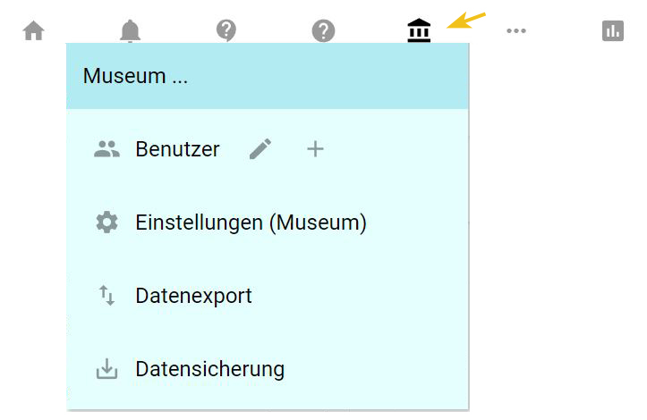
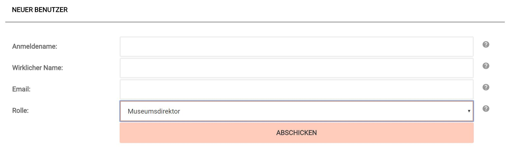

Neue Benutzer hinzufügen
========================

Dieser Abschnitt des Handbuchs ist ausschließlich für Nutzer in der
Rolle Museumsdirektor relevant. Nur Museumsdirektoren und
Administratoren können neue Benutzer hinzufügen. Im Weiteren werden die
einzelnen Schritte erklärt.

Nach dem Anmelden im Eingabe- und Bearbeitungstool von museum-digital
erscheint am oberen Rand des Bildschirms eine Symbolleiste. In dieser
Symbolleiste findet sich ein Museumssymbol. Wird dieses mit der Maus
überfahren öffnet sich ein kleines Menu mit Unterpunkten. Gleich der
erste dieser Menupunkte heißt \"Benutzer\". Der Bezeichnung des
Menupunktes folgt ein Stift (das Symbol für \"Benutzer bearbeiten\") und
ein \"+\" als Symbol für \"Benutzer hinzufügen\". Ein Klick auf dieses
Symbol öffnet das Fenster zum Neueintrag eines Nutzers:``

 

Dieses Eingabefenster muss vollständig ausgefüllt werden. Unter
\"Anmeldename\" ist jener Name einzutragen, mit dem der zukünftige
Nutzer sich später anmelden muss (er kann ihn nach erfolgter Anmeldung
ändern). In das Feld \"Wirklicher Name\" tragen Sie bitte keinen Alias
sondern den tatsächlichen Namen des zukünftigen Benutzers ein. Um
fortgeschrittene Funktionen wie das Benutzerprofil zu benutzen sollte
der hier eingegbene Name darüber hinaus einzigartig sein. In das Feld
\"Email\" ist unbedingt eine funktionierende Email-Adresse einzutragen,
ohne diese kann das Verfahren nicht abgeschlossen werden. Schließlich
ist eine passende Rolle für den neuen Nutzer zu wählen.

Sobald alle Felder ausgefüllt und \"Abschicken\" geklickt wurde schickt
das System dem zukünftigen Nutzer eine email. Diese email enthält einen
Link, den der neue Benutzer anklicken (oder in die URL-Zeile kopieren)
kann. Folgt der Angeschriebene diesem Link gelangt er auf eine Seite,
auf welcher - gemäß DSGVO - erklärt wird, welche Angaben bei
museum-digtial von ihm gespeichert werden. Unten auf dieser Seite kann
er sich selbst ein Passwort vergeben. Mit dem Setzen eines Passwortes
und Klick auf Abschicken erklärt sich der neue Nutzer mit der
notwendigen Speicherung seiner email-Adresse einverstanden. Danach ist
das Konto aktiviert und der neue Nutzer kann sich mit dem ihm vom
Einrichtenden vergebenen Anmeldenamen sowie dem von ihm selbst gesetzten
Passwort in der entsprechenden Instanz von museum-digital anmelden.

Wichtig ist zu beachten: Das Konto muss **innerhalb von 72 Stunden (drei
Tagen)** aktiviert werden. Ist das nicht der Fall, dann muss der Prozess
von vorne begonnen werden. Wichtig auch: Ein gültiges Passwort muss
**mindestens 8 Zeichen** umfassen und dabei wenigstens ein Sonderzeichen
enthalten.

 
