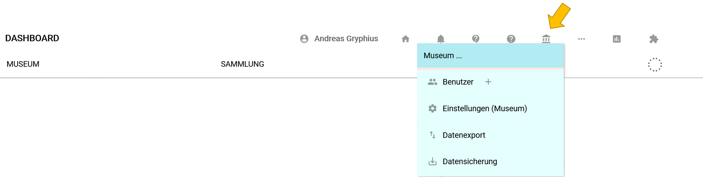

Neue Benutzer hinzufügen
========================

Dieser Abschnitt des Handbuchs ist ausschließlich für Nutzer in der Rolle Museumsdirektor relevant. Nur Museumsdirektoren und Administratoren können neue Benutzer hinzufügen. Im Weiteren werden die einzelnen Schritte erklärt.

Nach dem Anmelden im Eingabe- und Bearbeitungstool von museum-digital erscheint am oberen Rand des Bildschirms eine Symbolleiste. In dieser Symbolleiste findet sich ein Museumssymbol. Wird dieses mit der Maus überfahren öffnet sich ein kleines Menü mit Unterpunkten. Gleich der erste dieser Menüpunkte heißt "Benutzer". Wer als Museumsdirektor angemeldet ist, der kann auf "Benutzer" klicken und die Benutzerverwaltung für sein Museum aufrufen. Der Bezeichnung des Menüpunktes folgt ein "+" als Symbol für "Benutzer hinzufügen". Ein Klick auf dieses Symbol öffnet das Fenster zum Neueintrag eines Nutzers:

Dieses Eingabefenster muss vollständig ausgefüllt werden. Unter "*Anmeldename*" ist jener Name einzutragen, mit dem der zukünftige Nutzer sich später anmelden muss (er kann ihn nach erfolgter Anmeldung ändern). In das Feld "*Wirklicher Name*" tragen Sie bitte keinen Alias sondern den tatsächlichen Namen des zukünftigen Benutzers ein. Der hier eingegebene Name sollte darüber hinaus einzigartig sein. In das Feld "*e-Mail*" ist unbedingt eine funktionierende e-Mail-Adresse einzutragen, denn ohne diese kann der Benutzer sein Konto nicht aktivieren. Schließlich ist eine passende [Benutzerrolle](../../musdb/Benutzerkonto/Berechtigungen.md) für den neuen Nutzer zu wählen.

## Das Benutzerkonto bestätigen

Sobald alle Felder ausgefüllt und "Abschicken" geklickt wurde, schickt das System dem zukünftigen Nutzer eine e-Mail. Diese e-Mail enthält einen Link, den der neue Benutzer anklicken (oder in die URL-Zeile kopieren) kann. Folgt der Angeschriebene diesem Link gelangt er auf eine Seite, auf welcher - gemäß DSGVO - erklärt wird, welche Angaben bei museum-digital von ihm gespeichert werden. Unten auf dieser Seite kann er sich selbst ein Passwort vergeben. Mit dem Setzen eines Passwortes und Klick auf Abschicken erklärt sich der neue Nutzer mit der notwendigen Speicherung seiner e-Mail-Adresse einverstanden. Danach ist das Konto aktiviert und der neue Nutzer kann sich mit dem ihm vom Einrichtenden vergebenen Anmeldenamen sowie dem von ihm selbst gesetzten Passwort in der entsprechenden Instanz von museum-digital anmelden.

Wichtig ist zu beachten: Das Konto muss **innerhalb von 72 Stunden (drei Tagen)** aktiviert werden. Ist das nicht der Fall, dann muss der Prozess von vorne begonnen werden. Wichtig auch: Ein gültiges Passwort muss **mindestens 8 Zeichen** umfassen und dabei wenigstens ein Sonderzeichen enthalten.

## Überprüfung der Mailadressen beim Anlegen des Kontos

Damit ein neues Benutzerkonto eingerichtet werden kann, muss also eine Mail empfangen werden können. Das heißt zwangsläufig auch, dass das angegebene Mailkonto valide sein muss. Um fälschliche Angaben sofort zu bemerken und frühzeitig zu warnen, statt Einladungen an nicht existente oder nicht kompatible Mailkonten zu versenden, wird die angegebene Mailadresse kurz überprüft, bevor die Einladungsmail tatsächlich versandt wird.

Zuerst wird die angegebene Domain (also z.B. `example.com` im Falle der Mailadresse `mail@example.com`) gecheckt. Existiert die Domain nicht, oder gibt es unter dieser Domain keinen Mailserver, kann das neue Benutzerkonto nicht angelegt werden, und man wird aufgefordert, eine neue - potentiell existierende - Mailadresse anzugeben.

In einem zweiten Schritt wird die Domain mit einer Liste von bekannten Mailanbietern verglichen, die die Einladungsmails blockieren. Bisher gibt es hier nur einen relevanten Fall: t-online.de (und damit auch die anderen Domains, unter denen @t-online.de-Adressen üblicherweise angeboten wird; z.B: magenta.de).
