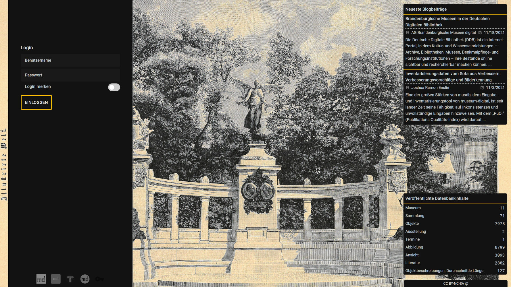

Zugang erhalten
===============

museum-digital ist eine Community. Um Zugang zu erhalten, muss man sich
an einen schon vorhandenen Benutzer wenden. Im Zweifelsfall heißt das,
dass entweder der Museumsdirektor eines Museums Zugang gibt - oder, dass
sich Museen, die noch nicht bei museum-digital sind, bei den
Administratoren ihrer jeweiligen Instanz melden, um Zugang zu erhalten.

Sobald ein Administrator oder Museumsdirektor einen neuen Benutzer
hinzugefügt hat, erhält dieser eine E-Mail-Benachrichtigung mit einem
Link. Folgt man diesem Link, kann man die Anmeldung beenden, indem man
die Datenschutzvereinbarung zur Benutzung von musdb akzeptiert und sich
ein Passwort gibt.

In der Mail finden sich ebenfalls der Username und ein Link zum Anmeldebildschirm
von musdb, wo der Username und das gerade gesetzte Passwort verwendet werden können.

Loggt man sich zum ersten Mal ein, erscheint zuerst einmal eine kurze Einführung in
die grundlegendsten Konzepte der Benutzung von musdb. Diese Einleitung erscheint auch
nach einer Abwesenheit von mehr als einem halben Jahr.

## Ablaufen der Einladung

Der Link zur Aktivierung des Accounts ist nach versenden drei Tage nutzbar -
sind die drei Tage verstrichen, ohne dass der Account vollständig aktiviert
wurde, wird er gesperrt und mittelfristig gelöscht. Aus Sicht des Museumsdirektors
oder Administrators ist es daher ratsam, Accounts gemeinsam mit neuen Nutzern
anzulegen oder neue Accounts lieber Montags als Freitags - vor dem Wochenende
anzulegen.

## Benutzerrechte

Beim Anlegen eines neuen Benutzeraccounts muss eine
[Benutzerrolle](../Benutzerkonto/Berechtigungen.md) für den neuen Benutzer
ausgewählt werden. Diese Rolle entscheidet über die grundlegenden Berechtigungen
des Benutzers. Feinere Einstellungen des Berechtigungen (etwa, wenn ein Benutzer
nur eine Sammlung bearbeiten können soll) können eingestellt werden, sobald der
neue Account aktiviert ist.

## "Ich habe schon ein Konto. Aber wo ist musdb?"

Die "Ausgabe" von museum-digital ist für die Veröffentlichung optimiert und hat
deshalb keinen (!) Link zum dazugehörigen Login. Deshalb passiert es immer wieder,
dass Benutzer - besonders solche, die nur selten direkt mit der Datenbank arbeiten -
den Loginscreen nach Monaten schlicht nicht wiederfinden.

Die Einladungsmail beinhaltet wie schon oben besprochen einen Link in zur jeweiligen
Instanz von musdb. Aber es geht auch einfacher: Navigiert man zur jeweiligen regionalen
Instanz der Ausgabe und fügt hinten an die URL "/musdb" an, wird man zur Eingabeoberfläche
geleitet.
