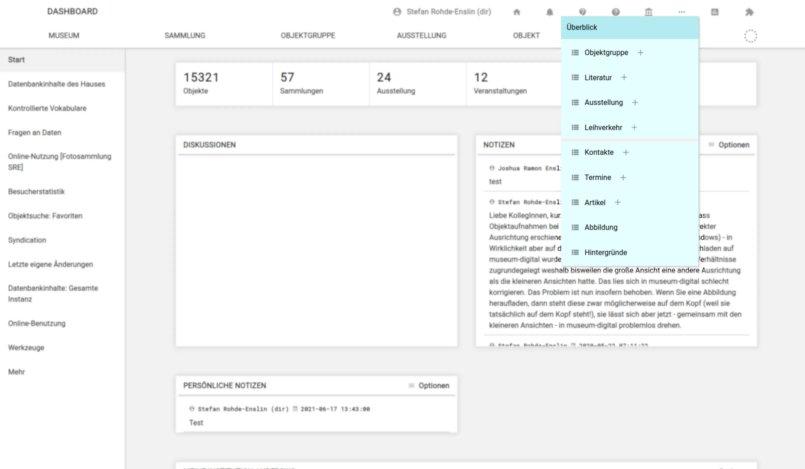
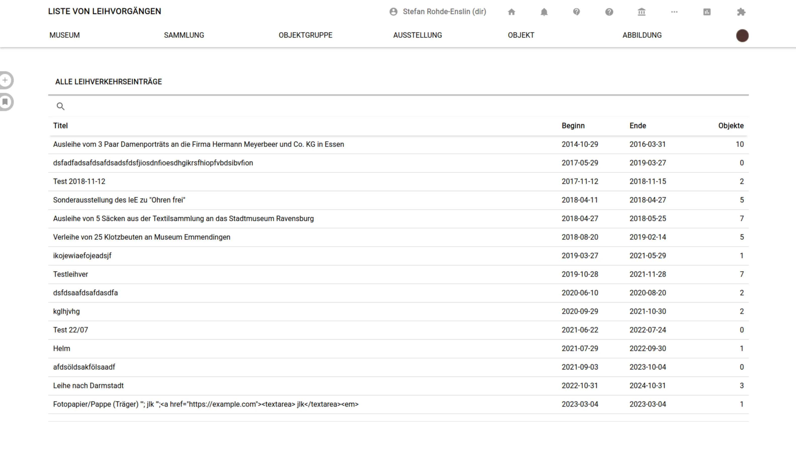
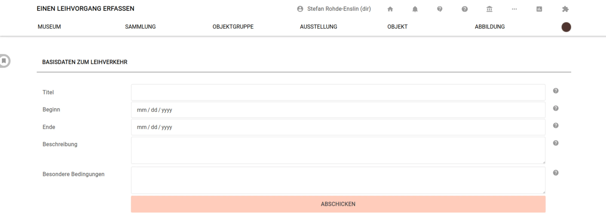

# Leihverkehre

- Erreichbar über die drei Punkte in der Navigation
- Neue Einträge können über das "Plus"-Symbol hinter dem Navigationspunkt oder in der Toolbar (linker Bildschirmrand) auf der Leihverkehrs-Übersicht eingetragen werden
- Leihverkehrs-Einträge sind erst einmal nur das. Die Verknüpfung mit Objekten geschieht über den [Reiter "Leihverkehr"](../Objekte/Registerkarten-Zusatz/Leihverkehr.md) auf der Objektseite.

