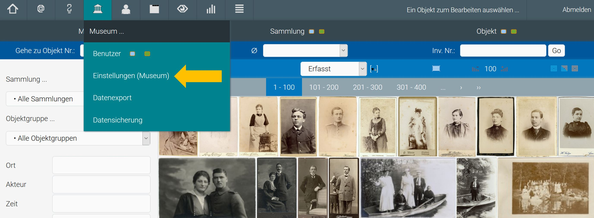
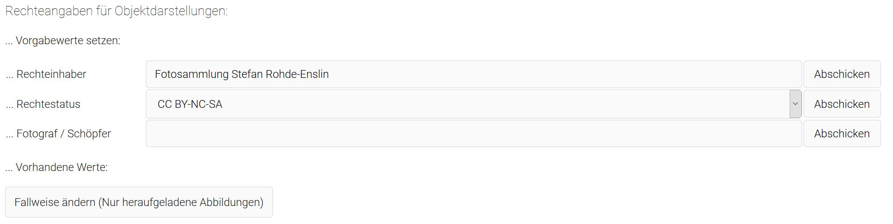
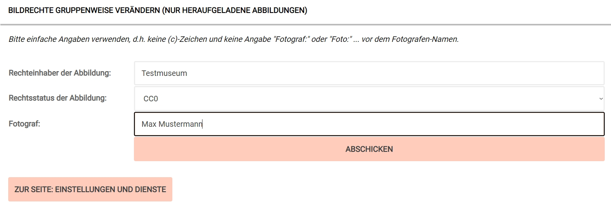
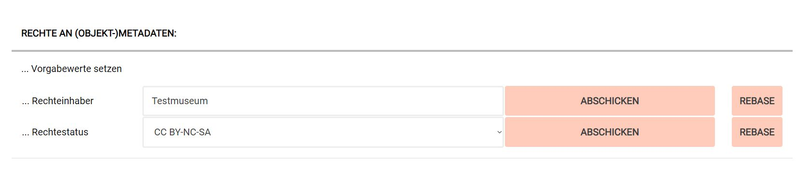
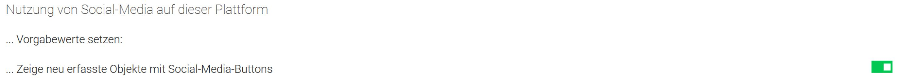
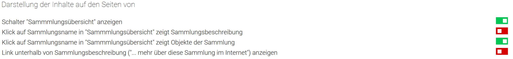
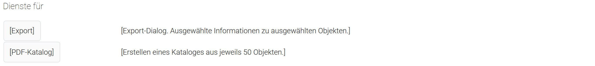

Einstellungen (Museum)
======================

Einstellungen für das Museum kann nur jemand in der Rolle
\"Museumsdirektor\" vornehmen. Ist jemand mit dieser Rolle angemeldet so
erscheint in der Navigationsleiste das Symbol \"Museum\". Bei Berührung
mit dem Mauszeiger öffnet sich ein Aufklappmenu:

Hat der \"Museumsdirektor\" den Punkt \"Einstellungen (Museum)\"
ausgewählt, so erscheint das entsprechende Eingabefenster mit mehreren
Optionen:

 

Rechteangaben für Objektdarstellungen
-------------------------------------

 

An dieser Stelle können Vorgabewerte für das Heraufladen von Abbildungen
oder anderen Ressourcen gesetzt werden. Jede Ressource hat eigene ihr
anhaftende Rechte. Sobald eine Ressource zu einem Objekt heraufgeladen
(oder mit dem Objekt verknüpft) wird, verlangt das System Angaben zur
Rechtesituation dieser Ressource. Die dort erscheinenden Eingabeschlitze
sind jeweils vorausgefüllt mit den hier gesetzten Vorgabewerten. In den
meisten Fällen ist der Rechteinhaber an den Abbildungen von Objekten das
Museum selbst, deshalb ist hier der Museumsname vorausgefüllt. Die am
häufigsten verwendete [Rechtsform](?lan=de&q=musdb/Rechtsformen) ist
\"CC BY-NC-SA\" (Namensnennung - keine kommerzielle Verwendung -
Weitergabe unter gleichen Bedingungen), auch dieses ist hier
standardmäßig vorgegeben. Beide Werte können jedoch verändert werden, um
andere Vorgabewerte für das Hochladen von Abbildungen zu setzen.
Beschäftigt ein Museum einen Fotografen, von dem die meisten der
hochzuladenden Abbildungen stammen, so kann hier ebenfalls ein
Vorgabewert gesetzt werden. Änderungen in den drei Feldern dieser Option
wirken sich nicht auf schon vorhandene Abbildungen aus.

Der letzte Punkt dieser Option \"Fallweise ändern (Nur heraufgeladene
Abbildungen)\" führt bei Anklicken zu einer Übersicht der für die
heraufgeladenen Abbildungen vorkommenden Rechteangaben. Jede einzelne
Kombination aus Rechteinhaber, Rechtestatus und Fotograf/Schöpfer läßt
sich an dieser Stelle ändern. Vorgenommene Änderungen betreffen dann
alle Abbildungen (und Ressourcen), für welche die entsprechende
Kombination zutraf. Auf diese Weise ist es leicht möglich, bei z.B.
einem Namenswechsel des Museums auch zu allen Abbildungen einen neuen
Rechteinhaber-Namen einzutragen oder bei einer Änderung der Grundsätze
im Museum selbst, für alle Abbildungen den Rechtestatus zu ändern.

Rechte an (Objekt-)Metadaten
----------------------------

 

In der Sektion \"Rechte an (Objekt-)Metadaten\" geht es wiederum um
Vorgabewerte für Rechtsangaben. An dieser Stelle geht es nicht um Rechte
an Abbildungen oder Ressourcen, sondern um Rechte an den Informationen
zu einem Objekt. Werden diese Felder nicht ausgefüllt, so wird als
Rechteinhaber der Name des Museums eingetragen und der Rechtestatus mit
CC BY-NC-SA angenommen. Die hier gesetzten, museumsweiten gültigen
Vorgabewerte erscheinen auf der objektbezogenen Registerkarte \"Rechte\"
und können dort mit objektspezifischen Angaben überschrieben werden.
\"Rechte an (Objekt-)Metadaten\" sind vor allem wichtig für Exporte an
Portale, die diese Angaben verlangen.

Nutzung von Social-Media auf dieser Plattform
---------------------------------------------

Die Sektion \"Nutzung von Social-Media auf dieser Plattform\" enthält
wiederum einen Vorgabewert. Dieser entscheidet bei Neueingaben darüber,
ob die Nutzung von Social-Media auf museum-digital standardmäßig
erlaubt- oder untersagt ist. Zu jedem Objekt läßt sich der Eintrag
jederzeit individuell im Rahmen der Objektbearbeitung ändern. Dort ist
ein Schalter \"Verberge SM-Buttons\" zu finden, der den Vorgabewert der
Einstellungen (Museum) übernimmt. Ist der \"Verberge
SM-Buttons\"-Schalter auf \"Nein\" gesetzt so erscheint in der Anzeige
des Objektes auf den Seiten von museum-digital kein Leiste mit Links zu
Facebook, Twitter und Co.

Wenn ein Museum also diese Leiste zu einem einzelnen Objekt nicht
angezeigt haben möchte, so schaltet es \"Verberge SM-Buttons\" auf ja.
Will das Museum generell die Leiste bei keinem seiner neu erfassten
Objekte angezeigt haben, so wählt es unter Einstellungen (Museum) die
Nutzung von Social-Media auf dieser Plattform ab.

DARSTELLUNG DER INHALTE AUF DEN SEITEN VON \...
-----------------------------------------------

Dieser Menupunkt betrifft ausschließlich jene Museen, die ihre eigenen
Objekte aus museum-digital über einen iframe einbinden. Einige
grundsätzliche Gestaltungsmöglichkeiten für diese Option können hier
gesteuert werden, d.h. es wird das Erscheinen des aus museum-digital
kommenden Inhalts gesteuert.

\- Schalter \"Sammlungsübersicht\" anzeigen. Mit diesem Schalter wird
bestimmt, ob im iframe der Museumsseite der Schalter und das betreffende
Menu \"Sammlungsübersicht\" angezeigt wird. Steht dieser Schalter auf
grün, wird also die Sammlungsübersicht angezeigt wird, so kann über die
nächsten beiden Schalter bestimmt werden, wie sich ein Klick auf einen
Eintrag im Menu \"Sammlungsübersicht\" innerhalb des iframes der
Museumsseite auswirkt, soll dieser Klick zu einer (aus museum-digital in
den iframe übermittelten) Sammlungsbeschreibung führen oder zu einer
Übersicht der Objekte in der ausgewählten Sammlung?

\- Unter jeder Sammlung kann bei museum-digital der Satz \"\... mehr
über diese Sammlung im Internet\" angezeigt werden, wenn entsprechende
Dokumente oder Quellen verlinkt sind. Mit dem Schalter \"Link unterhalb
von Sammlungsbeschreibung \...\" kann diese Möglichkeit für die
iframe-Lösung abgeschaltet werden. In vielen Fällen würde sonst der Link
unterhalb von Sammlungbeschreibung nur zur Museumsseite führen.

Für all jene Museen, die ihre Objekte über die API von museum-digital
einbinden oder die auf eine Einbindung von Objekten in die Museumsseite
verzichten ist die Option \"Darstellung der Inhalte auf den Seiten von
\...\" ohne Belang.

Dienste
-------

Diese Sektion bietet einen Link zum Export-Dialog-System von museum-digital. Im
Export-Dialog kann ausgewählt werden, welche Informationen zu welchen
Objekten in welchem Format exportiert werden sollen. Mehr über das
Export-Dialog-System findet sich [hier](?lan=de&q=Ausgabe/Export).

Darüber hinaus gibt es hier die Möglichkeit einen Katalog aller Objekte
des Museums zu erstellen. Aus technischen Gründen werden dabei jeweils
Teil-Kataloge aus 50 Objekten erzeugt.

 
