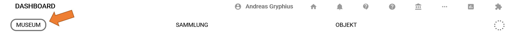
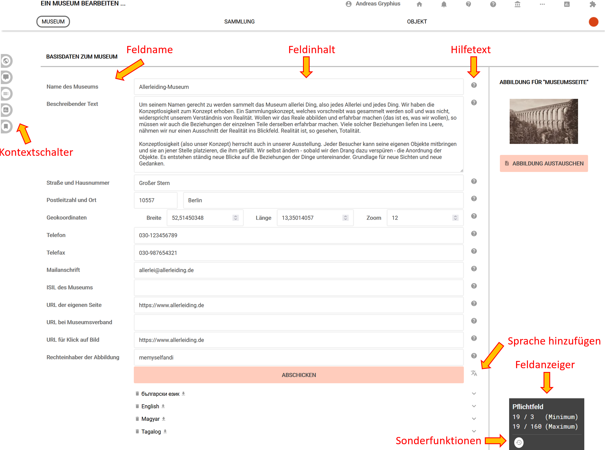

# Allgemeine Museumsinformation bearbeiten

Jeder Nutzer von musdb ist mindestens einem Museum zugeordnet. Hat er dabei die Rolle "Museumsdirektor", so kann er alle Angaben über das Museum ändern. Nutzer mit der zugewiesenen Rolle "Mitarbeiter" oder "Eingebender" sind hierzu nicht berechtigt. Die allgemeinen Museumsinformationen sind prinzipiell öffentlich und nach einem Klick auf "Abschicken" sofort auch in der öffentlichen Ausgabe von museum-digital aktualisiert.

Zur Bearbeitung aller Informationen über das Museum genügt ein Klick auf den Menüpunkt "Museum".

Es erscheint die Eingabeoberfläche für Museumsinformation, die in ihrer Gestaltung ähnlich ist wie andere Eingabeoberflächen bei museum-digital.

## Eingabeoberfläche für Museumsinformation

Die Elemente der Eingabeoberfläche bestehen aus Feldname, Feldinhalt, Hilfetext, Kontextschalter, Sprachschalter und Feldanzeiger mit Sonderfunktionen.

