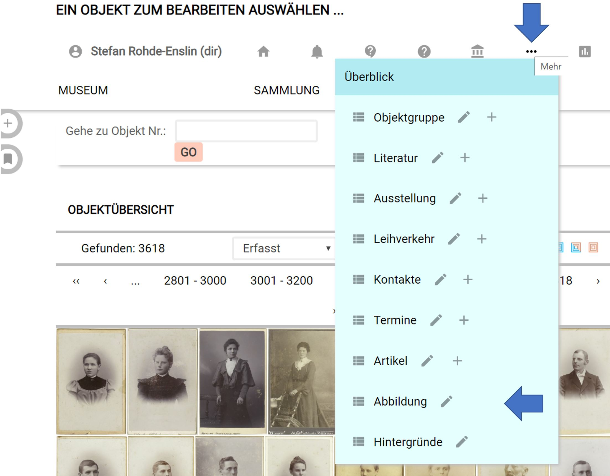
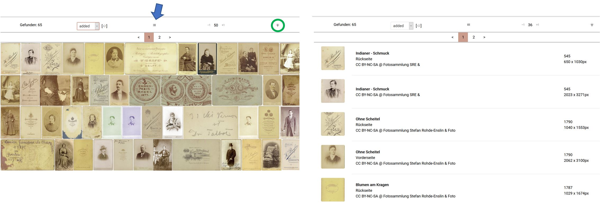

Abbildungen von Objekten
========================

Darstellungen und Repräsentationen von Objekten können bei
museum-digital von vielerlei Gestalt sein. Die folgenden Angaben
beziehen sich ausschließlich auf bildliche Darstellungen von Objekten,
nicht auf Texte, Videos, Tonmitschnitte oder 3-D-Modelle. Sie beziehen
sich zudem nur auf bildliche Darstellungen die bei museum-digital selbst
gespeichert sind, also nicht auf externe Ressourcen, von denen
museum-digital nur Voransichten gespeichert hat.

Abbildungsverwaltung
--------------------

Um die Menüführung bei museum-digital nicht zu überfrachten ist die
Abbildungsverwaltung nicht standardsmäßig in der Navigationsleiste
(Menü) aktiviert.  Die Abbildungsverwaltung kann auf zwei Weisen
erreicht werden:

1\) Sie steht immer zur Verfügung im Menü: \"Mehr\"

Wenn Sie die drei Punkte im Symbolmenü überfahren können Sie im
erscheinenden Untermenü den Punkt \"Abbildungen\" anklicken.

2\) Sie können sich den Menüpunkt \"Abbildungen\" in der
Navigationsleiste freischalten. Klicken Sie auf Ihren Namen in der
oberen Symbolleiste so erscheint das Menü \"Persönliche Einstellungen\",
hier wählen Sie \"Menüpunkte\" und klicken \"Abbildung\" an. Fortan
erscheint ein Schalter \"Abbildung\" in der Navigationsleiste. Er bleibt
dort, bis er im Menü \"Persönliche Einstellungen\" durch erneutes
Klicken auf \"Abbildung\" deaktiviert wurde.

Abbildungen auswählen
---------------------

Über die Abbildungsverwaltung sind alle heraufgeladenen Abbildungen
aller Objekte eines Museums erreichbar. Um hieraus eine Auswahl treffen
zu können bietet der oberen Bereich der Abbildungsverwaltung
Möglichkeiten zu filtern.

### Filtermöglichkeiten

 \"Farbe\"

Jeder Abbildung wird automatisch eine \"dominante Farbe\" zugewiesen.
Durch Anklicken des Quadrates einer gewünschten Farbe werden Abbildungen
deren \"dominante Farbe\" dem gewählten Farbton entspricht ausgewählt.
Erneutes Klicken auf das gleiche Quadrat setzt die Farbauswahl zurück
und es werden wieder Abbildungen aller Farben angezeigt.

\"Name der Abbildung\" und \"Bildbeschreibender Text\"

Hier können Sie Begriffe oder Buchstabenkombinationen eingeben und
Abbildungen finden, bei denen entweder der \"Name\" (der Abbildung,
nicht der des abgebildeten Objektes) oder der \"Bildbeschreibende Text\"
(nicht der das abgebildete Objekt beschreibende Text) die entsprechende
Buchstabenkombination enthält

\"Seitenverhältnis\"

 Die Voreinstellung lautet: \"Alle Seitenverhältnisse berücksichtigen\".
Durch ein Klick auf eines der drei Symbole werden die entsprechenden
Abbildungen aus der Gesamtmenge ausgeschlossen. Ein Klick auf das
liegende Rechteck (\"Querformat\") bedeutet, die vorhandene Auswahl -
die querformatige Abbildungen einschließt - so zu begrenzen, dass nur
noch Abbildungen im \"Hochformat\" und im \"Quadrat\" ausgewählt werden.
Ein erneuter Klick auf das Symbol \"Querformat\" wählt auch die
entsprechenden Abbildungen wieder aus. Die Schalter wirken wie
\"An/Aus\"-Schalter.

\"Rechteinhaber der Abbildung\", \"Rechtsstatus der Abbildung\" und
\"Fotograf\"

Möglichkeiten der Auswahl werden entsprechend den vorhandenen Einträgen
geboten.

\"Bildgröße\"

Die Auswahl nach Mindest- und Maximalwerten für Breite und Höhe ist an
dieser Stelle möglich. So können beispielsweise nur Abbildungen gewählt
werden, die mindestens 1000 Pixel breit und höchstens 2000 hoch sind.

Alle Filter lassen sich miteinander kombinieren.

### Trefferübersicht

 Die Trefferleiste gibt zunächst die Anzahl der gefundenen Abbildungen
kund. Sodann bietet sie die Möglichkeit die Reihenfolge der Treffer zu
gestalten, nach Zeitpunkt der Erfassung,  Zeitpunkt der Überarbeitung,
Höhe und Breite. In dieser Leiste findet sich auch der Umschalter
zwischen Tableau- und Listenansicht der gefundenen Abbildungen.

Am rechten Rand der Trefferleiste ist ein \"Magic Button\" angebracht,
der beim Anklicken eine Zusammenfassung der Angaben zu den jeweils
ausgewählten Abbildungen bietet. Die einzelnen Einträge dieser
Zusammenfassung können von hier aus als neue Filter für eine neue
Auswahl gesetzt werden.

Einzelabbildung
---------------

Über das Anklicken einer einzelnen Abbildung ist es möglich die (1)
Angaben zu der gewählten Abbildung zu überarbeiten, (2) den Namen der
Masterdatei einzutragen, (4) die Abbildung (in eingeschränktem Maße)
umzugestalten, (5) sie mit Anmerkungen zu versehen, (6) sie (und ihre
bei museum-digital gespeicherten Derivate einschließlich der
Bildinformationen) herunterzuladen oder (7) - mit einem Werkzeug  - eine
gestaltete Kopie der Abbildung derselben zu erhalten.

Mehr dazu unter "Ein Objekt bearbeiten" -> "Standard-Registerkarten" -> ["Registerkarte Ansicht" (4.6.2.2)](../../musdb/Objekte/Registerkarten-Standard/Ansicht.md)
