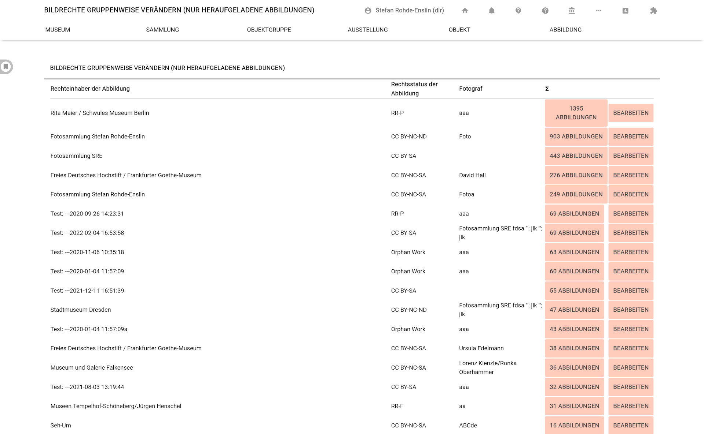
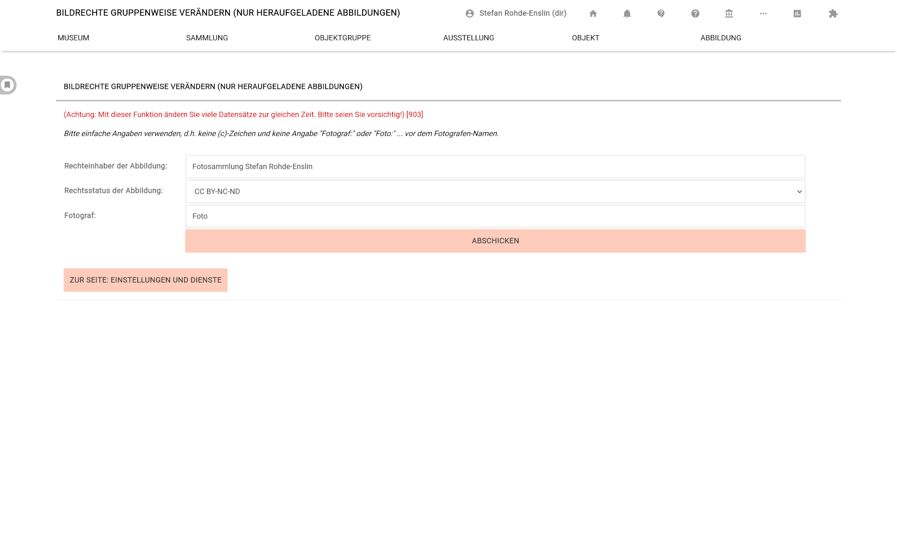

# Stapelbearbeitung für Bildlizenzen ("Fallweise Ändern")

Benutzern mit der Benutzerrolle "Museumsdirektor" steht eine Funktion für das stapelweise Ersetzen und Anpassen von Bildlizenzen zur Verfügung. Dies ist nützlich, wenn das Todesdatum eines etwa Künstlers, dessen Gemälde in musdb verzeichnet sind, etwa gerade länger als 75 Jahre vergangen ist - und die Objekte damit aus dem Urheberschutz fallen. In diesem Fall können alle Abbildungen, deren Lizenzangabe zuvor "RR-F" (also, "Alle Rechte vorbehalten") lautete und deren Rechteinhaber der Künstler ist, auf einen Schlag gemeinfrei gestellt werden.

Die Stapelbearbeitung für Bild-Lizenzangaben ist über die Seite [Einstellungen für das Museum](../../Museum/Einstellungen.md) erreichbar. Klickt man hier im Bereich für ["Rechteangaben für Objektdarstellungen"](../../Museum/Einstellungen.html#rechteangaben-für-objektdarstellungen) auf den Button "Fallweise ändern", erscheint eine Liste der bisher gesetzten Kombinationen von Fotograf, Rechteinhaber und Bildlizenz.

Hinter jeder aufgeführten Kombination finden sich in der Liste zwei Buttons. Mit dem ersten Button wird auf die Anzahl der so ausgezeichneten Abbildungen hingewiesen (ein Klick auf den Button führt zur entsprechend gefilterten [../Abbildungen.md](Bildübersicht)). Der zweite Button, "Bearbeiten", führt zur Seite für die Stapelweise Bearbeitung der Rechteangaben für alle Abbildungen, die die entsprechenden Rechteangaben aufweisen.

Klickt man auf den Button "Bearbeiten", erscheint eine Seite mit drei Eingabeschlitzen bzw. Auswahllisten, in denen die zu bearbeitenden Werte vorausgefüllt sind. Ändert man einen dieser Werte und klickt "Abschicken", werden alle passenden Abbildungen angepasst und mit den so neu eingestellten Rechteangaben ausgezeichnet.
