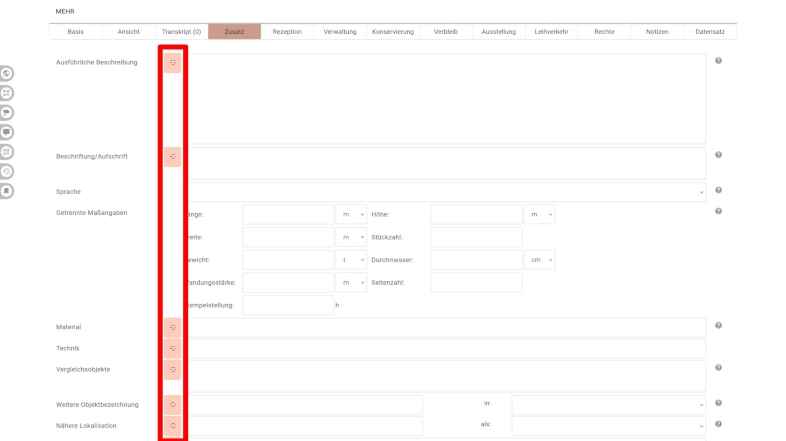
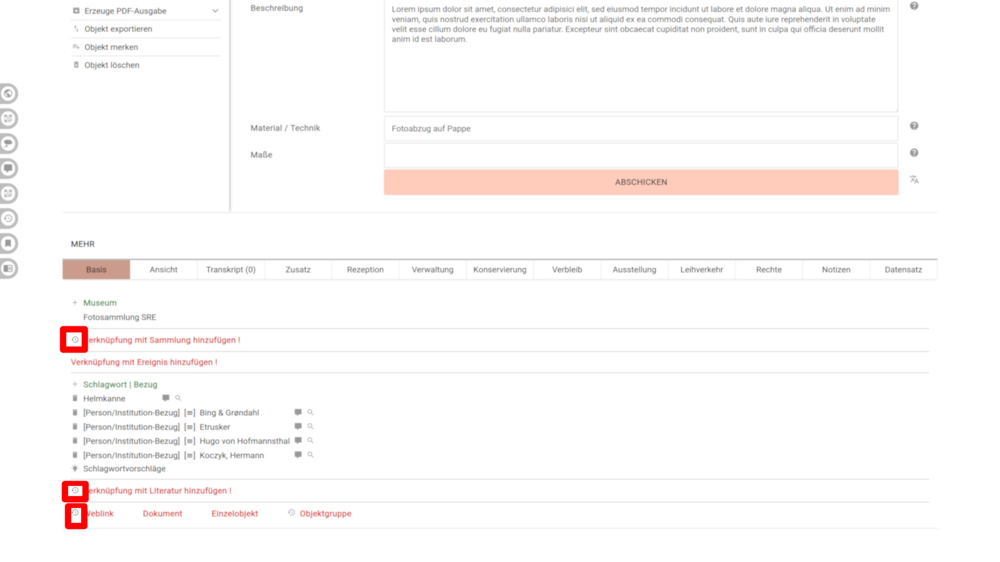
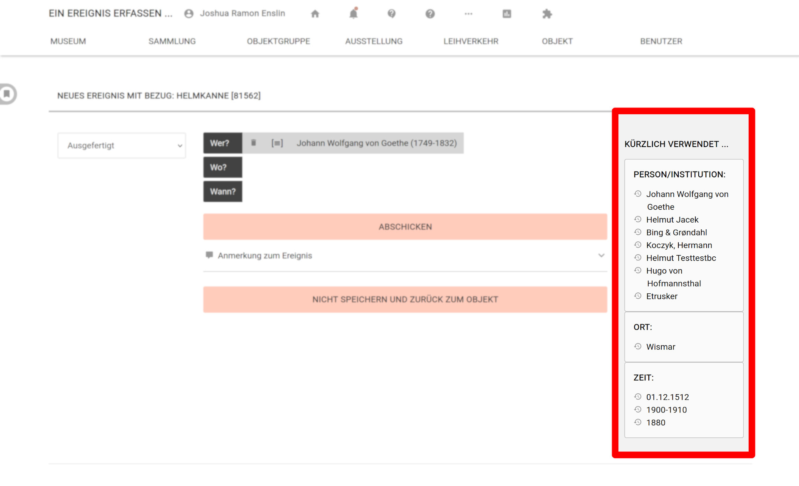
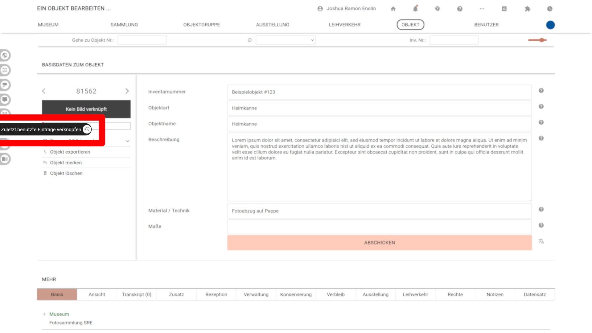
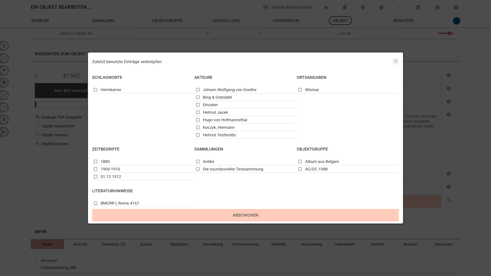
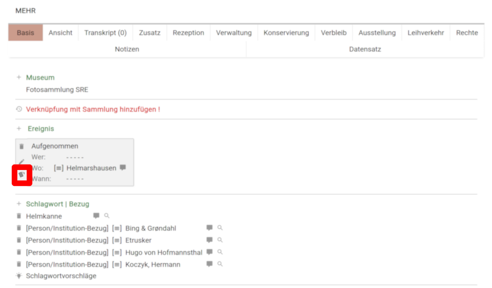

# Eingabe beschleunigen: Angaben wiederholen

Gibt man häufig dasselbe ein, kann musdb Hilfestellung geben um die Geschwindigkeit der Eingabe zu erhöhen ohne die Qualität der erzeugten Daten zu mindern. Neben den allgemeinen Funktionen wie z.B. den [feldspezifischen Textbausteinen](../UI/Keyboard.md) geschieht das auf zwei Arten:

- Einerseits werden Optionen angeboten, die zuletzt eingegebenen Werte zu wiederholen
- Andererseits lassen sich an einigen Stellen automatisch Schlüsse aus den Daten ziehen, sodass sinnvolle nächste Schritte angeboten werden können

## Inhalte von Freitextfeldern wiederholen

Die offensichtlichste Option, um gerade eingegebene Werte wieder zu benutzen findet sich jeweils direkt vor fast allen Freitextfeldern der verschiedenen Reiter der Objekt-Bearbeitungsseiten. Mit einem Klick auf einen der "Wiederholen"-Buttons wird der zuletzt im selben Feld eingetragene Wert in das zum Button gehörigen Feld übertragen.

Dieselben Buttons finden sich übrigens auch auf den Seiten für das Eintragen neuer Übersetzungen und neuer Museen, Sammlungen, Objektgruppen, etc. Von der Funktion sind bisher solche Felder ausgenommen, die direkt in Beziehung zu einem Anderen stehen und mit diesem in einer Zeile zusammengeführt sind.

## Verknüpfungen wiederholen

Nicht nur Texte lassen sich wiederholen: Gerade die Verknüpfungen zu Sammlungen oder Objektgruppen, aber auch Orten, Personen, und Schlagworten wiederholen sich beim Eingeben einer Sammlung häufig.

### Jeweils letzten Eintrag auf dem Reiter "Basis" wiederholen

Ist bisher noch kein Eintrag einer Kategorie (z.B. Verknüpfung zur Sammlung) mit dem gegebenen Objekt verknüpft, und wurde innerhalb der laufenden Sitzung bereits eine Verknüpfung derselben Kategorie erstellt, wird das Wiederholen derselben Verknüpfung mit einem "Wiederholen"-Symbol vorgeschlagen. Klickt man auf den Button wird eine Verknüpfung zur selben verknüpften Entität (z.B. eine Sammlung) für das gerade ausgewählte Objekt erstellt.

### Zuletzt verknüpfte Vokabularbezüge

Beim Anlegen oder Bearbeiten von [Ereignissen](Registerkarten-Standard/Basis.md#verknüpfung-mit-ereignis) und beim Verknüpfen von [Schlagworten](Registerkarten-Standard/Basis.md#verknüpfung-mit-schlagwort--bezug) erscheinen am rechten Seitenrand Seitenspalten, in denen die jeweils letzten zehn benutzten Akteure, Orte, Zeiten und / oder Schlagworte zur Wiederbenutzung aufgelistet sind. Besonders hilfreich kann das auf der Seite für das Verknüpfen von Schlagworten sein: Weil die Bezüge zu Schlagworten und direkte Orts-, Personen- und Zeitbezüge ohne weitere Spezifizierung auskommen, lassen sich hier gleich mehrere Einträge auswählen und gesammelt verknüpfen.

Auch diese Liste ist an die laufende Sitzung gebunden. Nach einem Logout wird die Liste geleert. Um trotz dessen auch nach einem Login sinnvolle Vorschläge machen zu können, versucht das Programm die vom Nutzer zuletzt neu eingetragenen Schlagworte und die mit den 10 zuletzt vom Benutzer bearbeiteten Ereignissen verknüpften Akteure, Orte und Zeiten zu ermitteln.

### Overlay: "Zuletzt benutzte Einträge verknüpfen"

Analog zur gruppenweisen Wiederholung der Vokabularbezüge auf der Seite für das Verknüpfen von Schlagworten und Akteurs-, Orts- und Zeitbezügen lassen sich die jeweils letzten zehn innerhalb der laufenden Sitzung benutzten Einträge der jeweiligen Kategorien über ein Overlay wiederholen. Dieses Overlay lässt sich mit einem Klick auf den Menüpunkt "Zuletzt benutzte Einträge verknüpfen" in der Toolbar am linken Bildschirmrand öffenen.

Mit einem Klick auf die zu verknüpfenden Einträge lassen sich diese auswählen. Mit einem Klick auf "Abschicken" werden sie dann gesammelt mit dem Objekt verknüpft.

### Ereignisse duplizieren

Ein weiterer oft auftretender Fall ist, dass man ein Ereignis duplizieren möchte, um ein sehr ähnliches Ereignis einzufügen. Das lässt sich über den untersten Button in der linken Spalte einer Ereignis-Kachel auf dem Reiter Basis umsetzten: Klickt man darauf, wird der Dialog zum Anlegen eines neuen Ereignisses für das Objekt geöffnet. In dem so geöffneten Dialog sind die jeweiligen Felder bereits mit den Werten des duplizierten Ereignisses ausgefüllt, sodass sie nur noch für das neue Ereignis angepasst werden müssen.

## Shortcuts bei bekannten Eingabetypen

### Vorgeschlagene Ereignistypen

Ist das Objekt von einer Objektart, die ebenso als Schlagwort bekannt ist und einer dem Programm bekannten Kategorie angehört, werden beim Anlegen eines neuen Ereignisses oberhalb der Liste der Ereignistypen schon passende Ereignistypen vorgeschlagen. Handelt es sich beim Objekt etwa um eine Fotographie, werden die Ereignistypen "Aufgenommen", "Vorlagenerstellung" und "Wurde abgebildet (Akteur)" vorgeschlagen.

