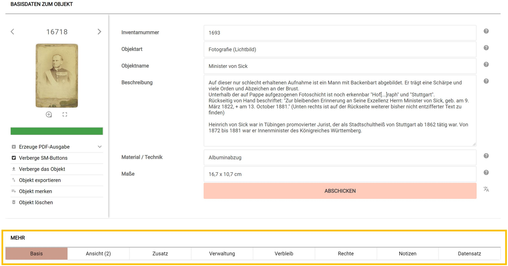

# Objekt-Basisangaben

Sobald die Grundinformationen zu einem Objekt erfasst sind, gelangen Sie
automatisch in den Objektbearbeitungsmodus. Um der Fülle von möglichen
weiteren Informationen über das Objekt etwas Struktur zu geben, sind
einzelne Informationen auf Registerkarten zusammengefasst. Diese
Registerkarten Sie sich im Menü ["Persönliche Einstellungen"](../UI/Navigationsleiste.md) selbst an- oder abschalten.

Museum-digital ist flexibel einsetzbar, wer es nur zur Veröffentlichung
von Objektinformationen verwenden möchte, der wird andere Informationen
erfassen als jener, der museum-digital vornehmlich als
Inventarisierungswerkzeug zur Objektverwaltung verwendet. Die zur
Verfügung stehenden Registerkarten sind in zwei Gruppen zusammengefasst:
\"Standardreiter\" und \"Zusatzreiter\". Die \"Standardreiter\" erlauben
ein einfaches Erfassen von sowohl Inventarisierungs- als auch von
Publikationsinformationen - sie werden an dieser Stelle erläutert.
Manche der \"Zusatzreiter\" erlauben das komplexere Erfassen einzelner
Aspekte, die in einfacher Form auch in \"Standardreitern\" eingetragen
werden könnten - jedes Museum kann dann entscheiden, welche der beiden
Eintragsmöglichkeiten verwendet werden soll. Andere der \"Zusatzreiter\"
erlauben zusätzliche Informationen zu erfassen, die - das ist abhängig
von der im Museum vorhandenen Art der Objekte - nur möglicherweise
vorhanden sein können (Ein Omnibus hat keine \"Transkription\" -
Fahrzeugmuseen werden die entsprechende Registerkarte wahrscheinlich
nicht aktivieren).

Alle Registerkarten (\"Reiter\") erscheinen im Objektbearbeitungsfenster
unterhalb der Steuerelemente (links) und der Objekt-Grundinformationen
(rechts) in einer eigenen Leiste.

Standardreiter
--------------

Die \"Standardreiter\" oder \"Standardregisterkarten\" lauten \"Basis\",
zum Erfassen von Informationen, die - sollte das Objekt publiziert
werden - öffentlich werden sollen. Die Registerkarte \"Ansicht\" erlaubt
das Heraufladen und Verknüpfen von Abbildungen, Textdateien (PDF), Ton-
oder Videosequenzen oder von 3D-Elementen. \"Zusatz\" als Registerkarte
enthält mehrheitlich Elemente, die wahlweise veröffentlicht werden
können. Die vier Registerkarten \"Verwaltung\", \"Verbleib\", \"Rechte\"
und \"Notizen\" erfassen ausschließlich interne Informationen für die
Objektverwaltung, die nicht veröffentlicht werden können. Die
Registerkarte \"Datensatz\" informiert darüber, wer wann was erfasst
oder geändert hat - auch diese Registerkarte dient nur der internen
Information.

Mehrsprachige Basisangaben
--------------------------

Übersetzungen der Objekt-Basisangaben können über einen Klick auf das
Sprach-Symbol neben dem Abschicken-Button eingegeben werden. Mit dem
Klick öffnet sich ein zusätzliches Menü mit Eingabefeldern für den
Objektnamen, die Objekt-Beschreibung, etc.; mit einem zusätzlichen
Eingabefeld für die Sprache der Übersetzung.

<b>Anleitung auf Youtube</b> 
Mit einem Klick wird das Video geladen. Damit werden andererseits ihre Daten mit Youtube geteilt.

