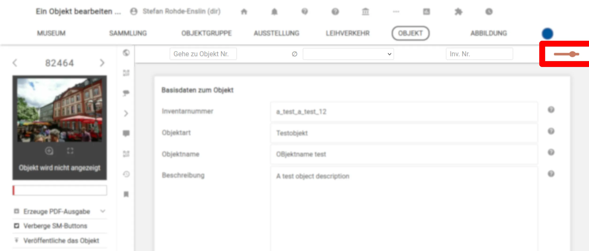
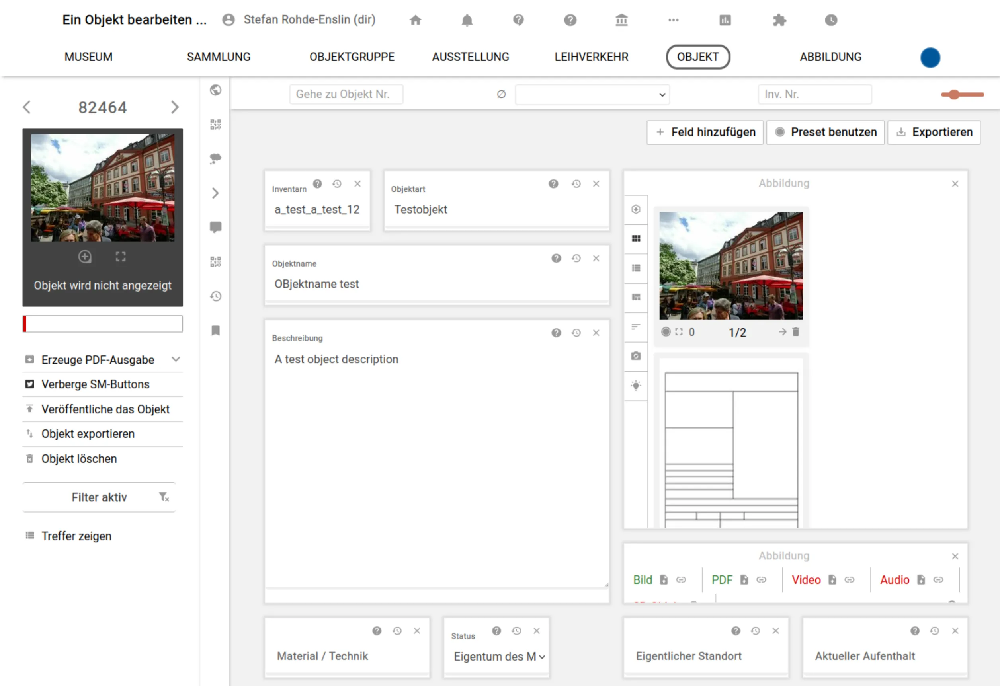
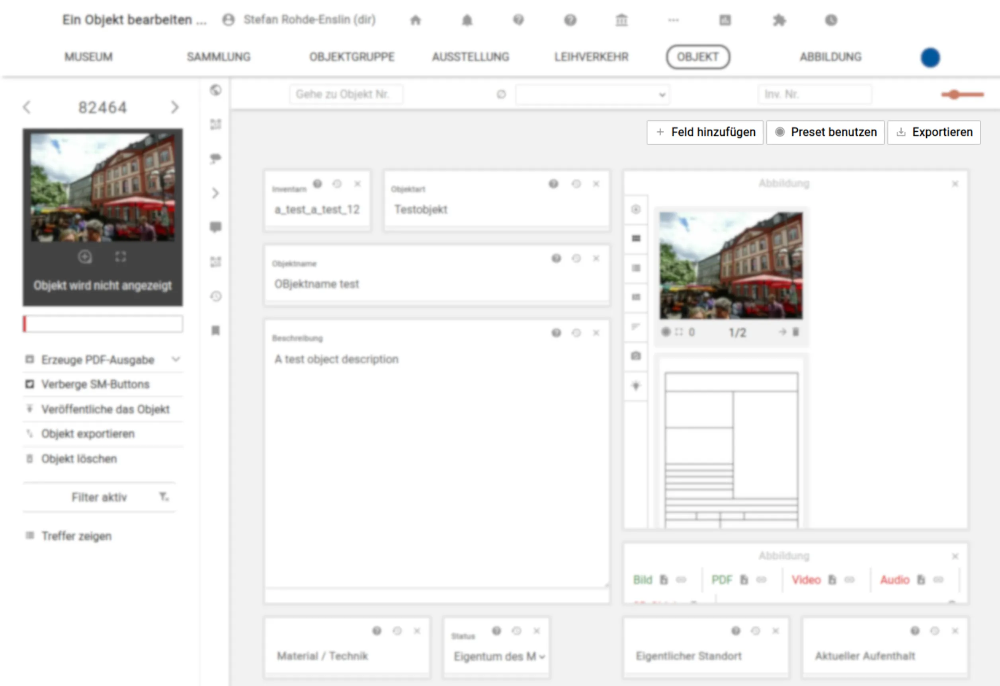
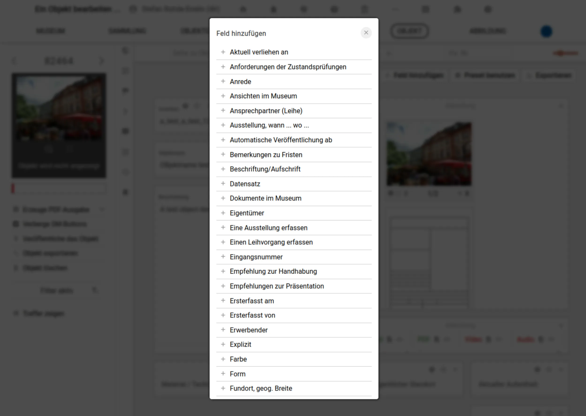

# Benutzerdefinierte Bearbeitungsoberfläche

Neben der klassischen Ansicht der Objekt-Bearbeitung mit ihren Reitern lässt sich eine benutzerdefinierte Ansicht zusammenstellen. Um diese Option zu benutzen, muss zuerst einmal in den benutzerdefinierten Modus gewechselt werden, indem man auf den Schalter oben rechts in der Navigation der Objektseite klickt.

Mit einem weiteren Klick auf denselben Schalter kann wieder zur klassischen Ansicht zurückgewechselt werden.

## Bearbeitungsoberfläche einstellen

Ist der benutzerdefinierte Modus aktiviert wird zuerst eine leere Seite angezeigt, auf der neben einer neuen Navigation nur die Aufforderung zu sehen ist, dass man einen der gegebenen Presets auswählen solle. Diese bieten einen ersten Einstieg in die Konfiguration der Ansicht. Klickt man auf den Namen eines Presets, wird die benutzerdefinierte Ansicht entsprechend angepasst und man sieht die dem Preset entsprechenden Felder oder Feld-Gruppen als bewegbare Kacheln auf der Seite. Einfache Felder (z.B. Objektbeschreibung) haben hier im Gegensatz zur klassischen Ansicht keine Abschicken-Buttons und werden einfach beim Tippen aktualisiert.

Die jeweiligen Kacheln lassen sich durch drag-and-drop bewegen und über die entsprechenden Schalter unten rechts in der Kachel größer oder kleiner ziehen. Weitere Felder oder Feldgruppen lassen sich über den Menüpunkt "Feld hinzufügen" eintragen.

Klickt man auf diesen Button, erscheint eine Liste aller verfügbaren Felder oder Feldgruppen in einer Überblendung. Das jeweilige Feld kann nun durch Auswahl aus der Liste hinzugefügt werden.

## Eigene Presets mit den Kollegen oder der Community teilen

Möchte man sein Preset mit Kollegen teilen (etwa, wenn neue Mitarbeiter dieselbe Ansicht benutzen sollen), lässt sich die Konfiguration als `.json`-Datei exportieren, indem man den entsprechenden "exportieren"-Button in der Navigation anklickt. Die so exportierte Konfiguration kann nun von den Kollegen importiert werden, indem sie auf den "Presets benutzen"-Button in der Navigation klicken und die Datei unten in der Überblendung hochladen.

Die Liste der verfügbaren Presets generiert sich aus einem Open-Source Repository, sodass jeder Benutzer seine (exportierte) Konfiguration als Preset vorschlagen kann. Die Quelldateien finden sich [hier](https://gitea.armuli.eu/museum-digital/MusdbCustomObjectPagePresets).
