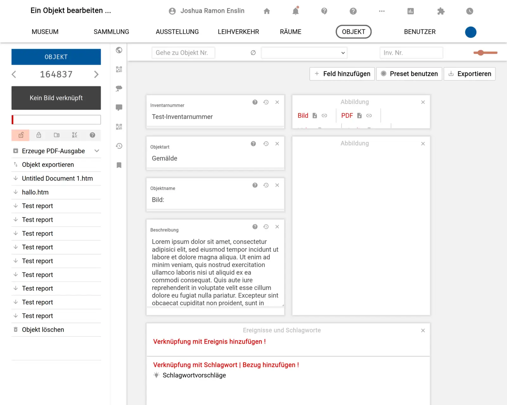

# AG Minimaldatensatz

Die Vorlage "AG Minimaldatensatz" richtet sich nach den [Empfehlungen der gleichnamigen Gruppierung](https://wiki.deutsche-digitale-bibliothek.de/pages/viewpage.action?pageId=120422678). Diese  versucht, aufbauend auf einem  Vergleich wesentlicher Standards der Museumsdokumentation grundlegend benötigte Datenfelder für die Publikation von (Erschließungs-)Informationen zu Kulturerbe-Objekten festzustellen ein Bewusstsein für Datenqualität zu schärfen und so eine niederschwellige und praxisnahe Grundlage für die Online-Veröffentlichung von Objektinformationen aus Museen und Sammlungen bereitzustellen.  

So ist die Empfehlung der AG Minimaldatensatz ein guter Startpunkt zur Konfiguration der benutzerdefinierten Objektbearbeitungsoberfläche für Museen, die ihre Daten publizieren wollen. Dies gilt insbesondere für solche Museen, die ihre Bestände auch in der Deutschen Digitalen Bibliothek und/oder Europeana  vertreten sehen wollen.

## Felder

- Inventarnummer
- Abbildung
- Objektart
- Objektname
- Beschreibung
- Ereignisse
- Schlagworte
- Maße

## Screenshot

