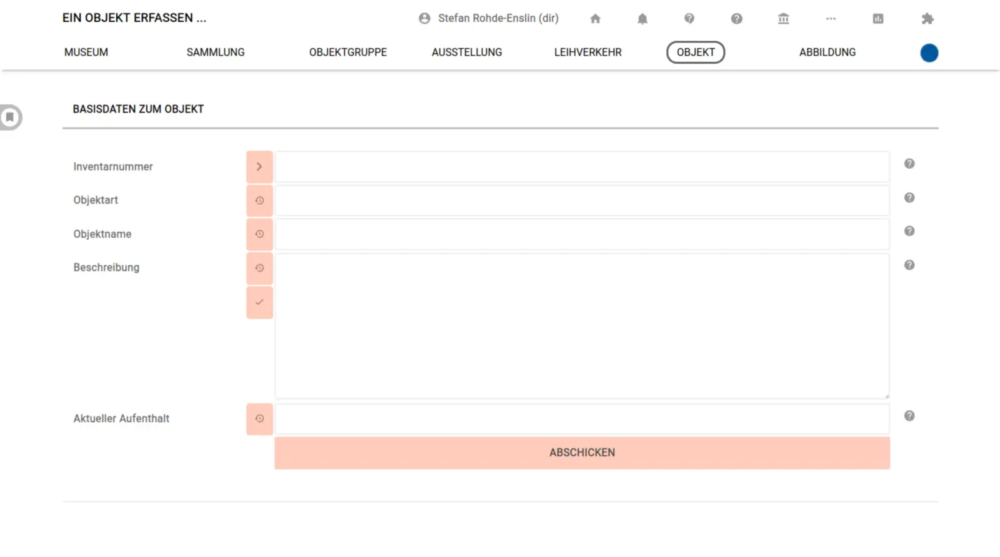

# Ein Neues Objekt anlegen

## Zusätzliche Felder bei der Eingabe zur Verfügung stellen und als Pflichtfelder definieren

Über die Seite ["Einstellungen für das Museum"](../Museum/Einstellungen.md) können zusätzliche Felder (alle Freitextfelder und einige der Verknüpfungsoptionen) direkt auf der Objekt-Eingabeseite verfügbar gemacht werden.

## Inventarnummern vorschlagen

Ebenso bietet musdb die Möglichkeit, Inventarnummern vorzuschlagen. Um das zu tun, muss ein entsprechendes Schema für neue Inventarnummern auf der Seite ["Einstellungen für das Museum"](../Museum/Einstellungen.md) 
hinterlegt werden. Variable Bestandteile der Inventarnummer können hier über Platzhalter eingefügt werden:

- ``{no}`` steht für eine hochzählende Nummer. Sie kann über das Anfügen einer Ziffer auf eine gegebene Länge erweitert werden, also ``{no}6`` für Nummern der Art 000001, ``{no}2`` für 01.
- ``{c_sig}`` bedeuted, dass an dieser Stelle die Signatur der vorher ausgewählten Sammlung (die Auswahlliste für Sammlungen muss separat für die Objekt-Eingabeseite aktiviert werden) eingefügt wird. Die Signatur kann beim Bearbeiten der Sammlung eingetragen werden.
- ``{year}`` entspricht dem derzeitigen Kalenderjahr.
