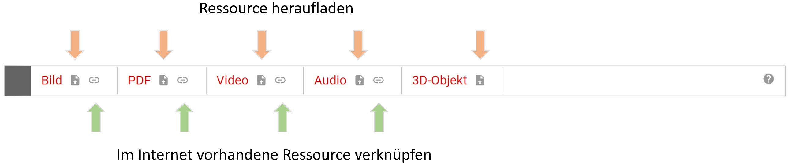
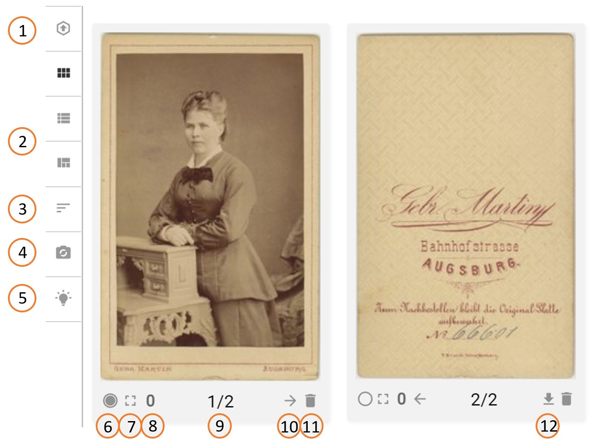
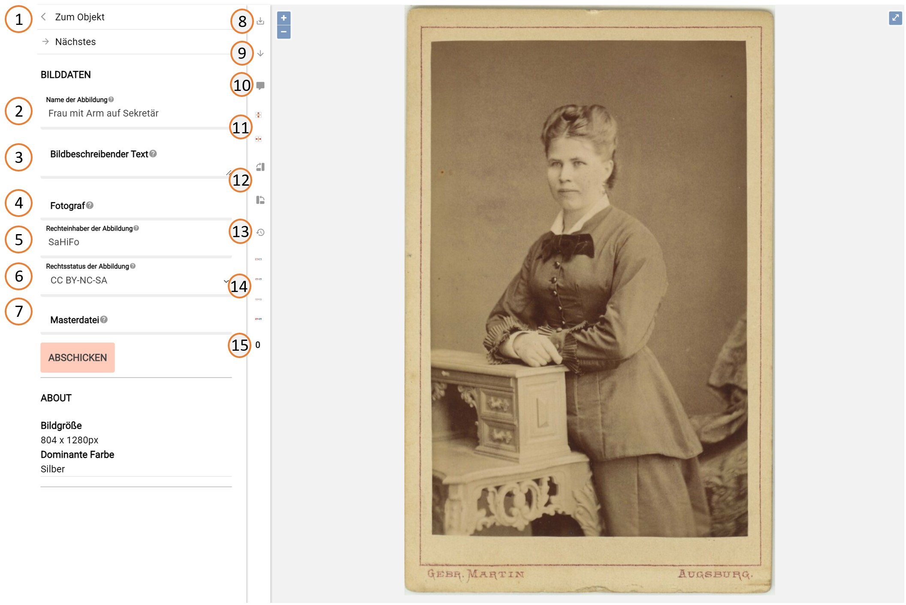
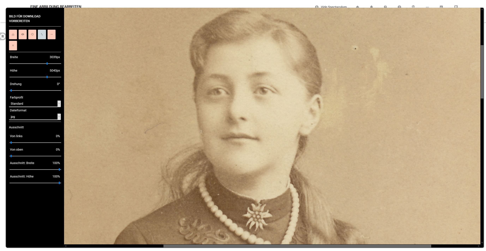
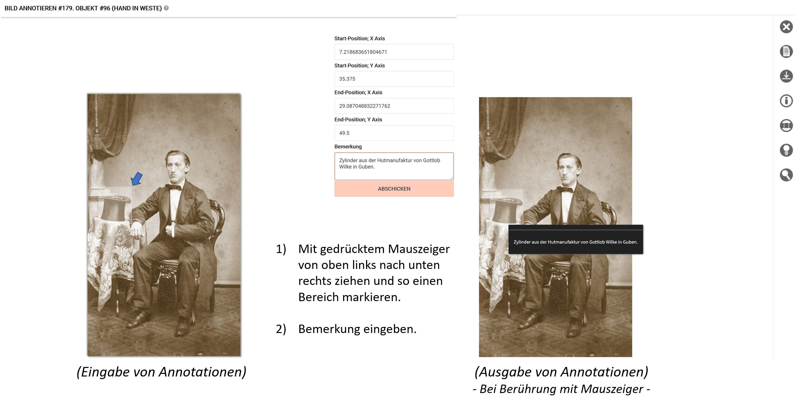

# Registerkarte "Ansicht"

Die Registerkarte "Ansicht" dient zum Heraufladen, Verknüpfen und Verwalten von Abbildungen und anderen Darstellungen, wie Text-, Ton-, Video- und 3D-Repräsentationen, des jeweiligen Objektes. Da für eine Veröffentlichung und Verwaltung der Objekte diese Verknüpfungen essentiell sind stehen die entsprechenden Funktionen auch dann zur Verfügung, wenn die Registerkarte "Ansicht" deaktiviert ist. Die wesentlichen Funktionen stehen bei deaktivierter Registerkarte "Ansicht" am unteren Ende der Registerkarte "Basis" zur Verfügung.

## Ressourcen heraufladen oder verknüpfen

Zentraler Bestandteil der Registerkarte ist die Steuerleiste für das Heraufladen oder Verknüpfen von Ressourcen (Darstellungen). Für das Heraufladen gelten, je nach Art des Mediums, entsprechende Vorgaben, die sobald einer der "Heraufladen-Buttons" angeklickt wurde, erscheinen. Für das Verknüpfen gilt, dass nur solche Ressourcen verknüpft werden sollten bei denen alle möglichen rechtlichen Bedenken der Nutzung ausgeräumt sind und die voraussichtlich auch noch lange online verfügbar sind. Der einzutragende Link muss direkt auf die Ressource zeigen, was meistens der Fall ist, wenn die URL der zu verknüpfenden Seite mit ".jpg" endet.

Für jedes Objekt kann eine beliebige Anzahl von Ressourcen heraufgeladen oder verknüpft werden. Auch hinsichtlich des Kombinierens (z.B. drei Abbildungen und eine Audiodatei für ein Objekt) gibt es keine Einschränkung. Nach dem Anklicken eines der Buttons für das Heraufladen erscheint ein Dialogfenster, das beispielsweise für das Heraufladen von Abbildungen so gestaltet ist:

Im oberen Teil werden die Voraussetzungen aufgelistet, dann folgen Angaben, die zumeist schon vorausgefüllt sind und für die gerade heraufzuladenden Abbildungen angepasst werden können. Die an dieser Stelle stehenden Vorgaben:

- Name der Abbildung: Es wird der Name des Objektes vorgeschlagen
- Fotograf, Rechteinhaber, Rechtestatus: Diese drei Einträge werden von der Seite ["Einstellungen für das Museum" (4.4.3)](../musdb/Museum/Einstellungen.md), auf der museumsweite Vorgaben gemacht werden können, übernommen.

Sind die Angaben im Dialogfenster zutreffend, dann können bis zu 20 Dateien ausgewählt werden, die gleichzeitig heraufgeladen werden. Die Datenmenge darf dabei höchstens 20 Megabyte betragen.

Wurden mehr als eine Abbildung heraufgeladen, so erscheint direkt nach dem Heraufladen die Registerkarte "Ansicht". Falls nur eine einzige Abbildung heraufgeladen wurde, erscheint stattdessen die Bildbearbeitungsseite.

## Ressourcen verwalten

Sind Abbildungen auf der Registerkarte vorhanden, dann gibt es eine ganze Reihe von Optionen.

Die Schalter im Einzelnen:

- (1) Mit diesem Schalter bestimmen Sie die Position der "Upload-Leiste" (s.o.). Diese Leiste kann entweder ober- oder unterhalb der heraufgeladenen Abbildungen platziert werden.

- (2) Die drei Schalter unterhalb von (1) bieten verschiedene Möglichkeiten der Anzeige der heraufgeladenen oder verknüpften Ressourcen. Insbesondere dann, wenn sehr viele Ressourcen vorhanden sind erhöht eine kleinere Bildvoransicht die Übersichtlichkeit.

- (3) Dieser Schalter führt in den Sortiermodus für Ressourcen, in welchem man eine Ressource wählt und diese leicht an eine andere Stelle der Reihung bringt.

- (4) Um die IPTC-Daten aller Abbildungen neu schreiben genügt ein Klick auf diesen Schalter.

- (5) Durch KI der Bilderkennung wird versucht aus den Abbildungen Schlagworte zu extrahieren, die dann zur Übernahme als Schlagworte zum Objekt angeboten werden.

- (6) Unter den Ressourcen muss es eine Hauptansicht geben. Um zu bestimmen, welches die Hauptansicht sein soll ist unterhalb jeder Abbildung als erster Schalter ein Kreis angebracht. Ein Anklicken des Kreises macht die darüber stehende Ressource zur hauptsächlichen. Der Kreis erscheint dann ausgefüllt.

- (7) Dieser Schalter führt zu einer großen Ansicht der darüber stehenden Abbildung in einem neuen Tab oder Fenster

- (8) Hier ist der Schalter durch die Anzahl vorhandener Annotation repräsentiert. Klicken Sie auf diese Zahl so können Sie Bildbereiche markieren und als sensible Bereiche, die sich beim Überfahren mit Anmerkungen füllen, definieren.

- (9) Dies ist der Anzeiger für die  Position der Ressource in der aktuellen Reihung.

- (10) Mit einem Klick auf "Pfeil nach rechts" rückt die Ressource in der Reihung nach hinten, mit Klick auf "Pfeil nach links" rückt sie nach vorn.

- (11) Löschen der Ressource oder der Verknüpfung zu einer externen Ressource.

- (12) Eine Ressource, die nicht die hauptsächliche ist, lässt sich über diesen Schalter "verstecken". Wenn ein Objekt freigeschaltet wird, dann bleibt diese Ressource verborgen. Auf diese Weise lassen sich für öffentliche Objekte beispielsweise historische Karteikarten als Begleitmaterial heraufladen ohne diese selbst öffentlich zu machen.

## Abbildungen bearbeiten

Jede Abbildung auf der "Registerkarte Ansicht" ist ein Schalter. Hierüber ist die Bearbeitung von Informationen zur Abbildung und - in begrenztem Maße - eine Bildbearbeitung möglich.

Die Schalter und Eingabefelder:

- (1) Über diesen Schalter gelangt man zu den Informationen des mit der jeweiligen Abbildung verknüpften Objektes. Ist mehr als eine Abbildung dem Objekt zugeordnet erscheinen direkt darunter Möglichkeiten zur nächsten (oder vorigen) Abbildung zu gelangen.

- (2) In diesem Eingabefeld kann der Abbildung ein individueller Name gegeben werden.

- (3) Eine Möglichkeit der Beschreibung der Abbildung (nicht des Objektes) ist hier gegeben. Mögliche Einträge könnten sein: Detailaufnahme, Aufnahme vor der Restaurierung, Draufsicht, Abbildung der Rückseite ...

- (4) Hier kann der Name des Erstellers der Abbildung eingetragen werden. Ist das Objekt selbst eine Fotografie, so ist der Name des (eigentlichen) Fotografen über ein Ereignis zum Objekt zu erfassen. An dieser Stelle geht es um den Ersteller der Kopie, des Abbildes, der Ressource.

- (5) Rechteinhaber der Ressource (nicht des Objektes)

- (6) Rechtsstatus der Ressource (nicht des Objektes)

- (7) Der Dateiname einer Masterdatei (üblichlicherweise in TIFF)

- (8) "Backup-Image". Die Funktion "Backup-Image" gibt die Möglichkeit sich mit einem Klick eine ZIP-Datei vom Server von museum-digital schicken zu lassen. Diese Datei enthält alle Derivate der Abbildung sowie eine Textdatei mit den Bildzusatzinformationen.

- (9) "Prepare for Download". Dieser Schalter gibt Zugang zu Bildbearbeitungsmöglichkeiten einer temporären Kopie der Abbildung. Die temporäre Kopie kann in der Größe (durch Verändern der Breite
und/oder Höhe), in der Ausrichtung (durch Verändern der Drehung), in der Tonalität (durch Wahl des Farbprofils) und im Dateiformat (aktuell in JPEG und PNG) bestimmt werden. Schließlich können (mit ein wenig Übung) Ausschnitte des Originalbildes bestimmt werden. Die so veränderten Dateien werden nicht dauerhaft bei museum-digital gespeichert, sie sind für den jeweiligen Bedarf hergestellte Kopien. Durch Klick auf das "x" im Schaltermenü schließt sich das \"Prepare for download\"-Fenster und man gelangt wieder zur Seite der Einzelabbildung.

- (10) Wie zu Objekten, so lassen sich auch interne, d.h. museumsweite oder persönliche Notizen zu einer Abbildung speichern.

- (11) Horizontales oder vertikales Spiegeln der Abbildung

- (12) Kippen der Abbildung um 90 Grad nach links oder rechts

- (13) Ursprünglichen Zustand wiederherstellen

- (14) Mit vier Schaltern können Sie entweder alle Versionen einer Abbildung austauschen oder nur die große, nur die mittlere oder nur die kleine gespeicherte Version. Auf diese Weise kann, auch wenn es nötig sein sollte, die große Abbildung mit Wasserzeichen versehen sein während die anderen Versionen ohne Wasserzeichen bleiben.

- (15) Die Anzahl vorhandener Navigationen dient hier als Schalter zum Anbringung und Verwalten von Annotationen.

## Annotationen

Durch Klick auf die Anzahl der vorhandenen Annotationen lässt sich das Annotationswerkzeug erreichen (s.o.) Seine Benutzung ist recht einfach. Es wird ein Bereich mit der Maus markiert und diesem Bereich eine Bemerkung zugeschrieben. Im Ausgabetool wird diese Bemerkung sichtbar sobald jemand mit dem Mauszeiger den entsprechenden Bereich berührt.

