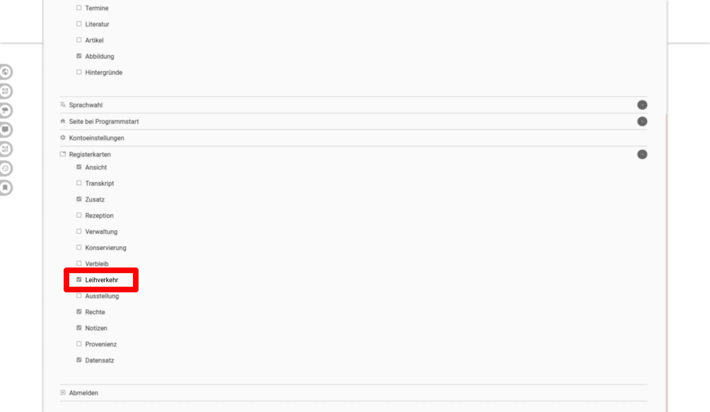
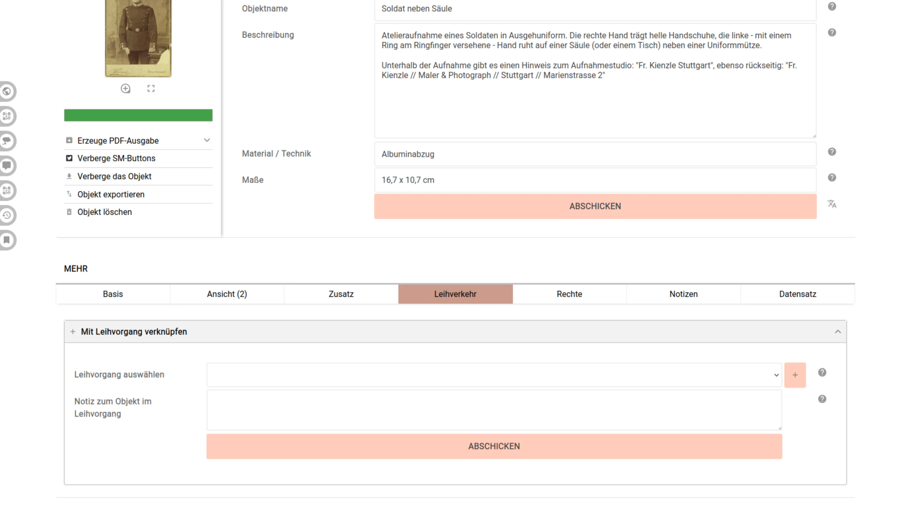

# Registerkarte "Leihverkehr"

- Wie auch die meisten anderen Reiter muss der Reiter Leihverkehr erst über das Menü (Klick auf den eigenen Namen ganz oben in der Navigation) aktiviert werden

- Einmal aktiviert erscheint die Option, das Objekt einem Leihverkehr zuzuordnen
  - Dabei kann eine objektspezifische Notiz eingetragen werden

