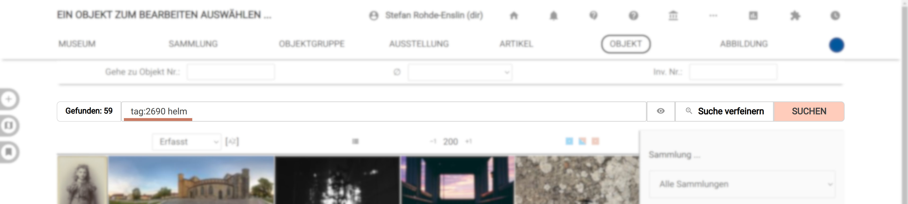

# Abfragesprache

Die Objekt-Suchfunktion funktioniert auf Basis einer eigenen Abfragesprache. Suchanfragen, die über die graphische Oberfläche erstellt wurden, werden zuerst in diese Abfragesprache übersetzt und dann an den Server geschickt, wo sie wiederum in tatsächliche Datenbankabfragen übersetzt werden.

Durch diese eigene Abfragesprache wird einerseits die Sicherheit erhöht - nur die vorgesehenen Suchmöglichkeiten werden übersetzt - und gleichzeitig ist es durch die Einfachheit der Abfragesprache möglich, als Benutzer auch selbst schnell kompliziertere Abfragen zu schreiben.

## Grundlegende Logik

Die grundlegende Logik der Such-Abfragesprache lässt sich am besten mit einem Beispiel erklären. Eine Suchabfrage mit drei zusammengesetzten Suchbedingungen mag etwa `Foto tag:132 -place:61 -name:München -length:>1000` sein. Wie im Beispiel zu sehen, werden einzelne Suchbedingungen durch ein Leerzeichen getrennt. Damit besteht eine einzelne Suchbedingung aus bis zu vier Elementen.

Alle vier Elemente sind im Beispiel `-length:>1000` zu sehen:

- **-**: Der Präfix "-" bestimmt, dass es sich um eine negative Suche handelt. _Suche Objekte, die nicht..._
  Standardmäßig - also, wenn kein Präfix gesetzt ist - wird nach Objekten gesucht, die den Suchbegriff enthalten. Andere mögliche Präfixe sind "~" für "oder" und "=" für exakt.
- **length**: Die Kategorie vor dem Doppelpunkt bestimmt, in welchem Feld die Suche durchgeführt wird.
  Um eine Liste der verfügbaren Kategorien zu bekommen, ist es am einfachsten, mit dem Menü "Suche verfeinern" zu arbeiten, und sich dann die erstellte Suchabfrage anzuschauen. Ist die Kategorie nicht gesetzt, wird eine Volltextsuche durchgeführt (Die Suche nach `Foto` ist also eigentlich eine Volltextsuche).
  Nach der Kategorie folgt ein Doppelpunkt.
- **>**: Nach dem Doppelpunkt können die Zeichen `[` und `>` eingegeben werden, um nach Objekten mit einem Wert kleiner oder größer als dem eingegebenen zu suchen.
- **1000**: Als letztes folgt der Suchbegriff selbst. Wie im Falle von `-place:61` ("ohne Bezug zum Ort Berlin") zu sehen, werden Schlagworte, Orte, Akteure und Schlagworte hier mit ihrer ID eingetragen (deshalb lohnt es sich bei diesen, die verfügbaren Auswahllisten zu benutzen und die Suchbedingung nicht händisch einzugeben).

Die Beispielabfrage `Foto tag:132 -place:61 -name:München -length:>1000` bedeutet also:

- Suche im Volltext nach "Foto"
- Die Objekte müssen einen Bezug zum Tag 132 (_Fotographie_) haben, oder zu einem diesem untergeordneten Schlagwort (Objekte mit Bezug zu _Carte de Visite_ würden also auch gefunden)
- Die Treffer dürfen keinen Bezug zum Ort 61 (_Berlin_) oder einem untergeordneten Ort haben
- Im Objektnamen darf "München" nicht enthalten sein
- Und schließlich dürfen die Objekte nicht länger als 1000 mm (also einen Meter) lang sein.

## Beschränkungen

Um eine negative Suche nach Texten (also z.B. eine Volltextsuche nach Objekten ohne das Wort "Helm") durchzuführen, muss schon eine "positive" Suchbedingung nach einem Text-Teil gesetzt sein.
