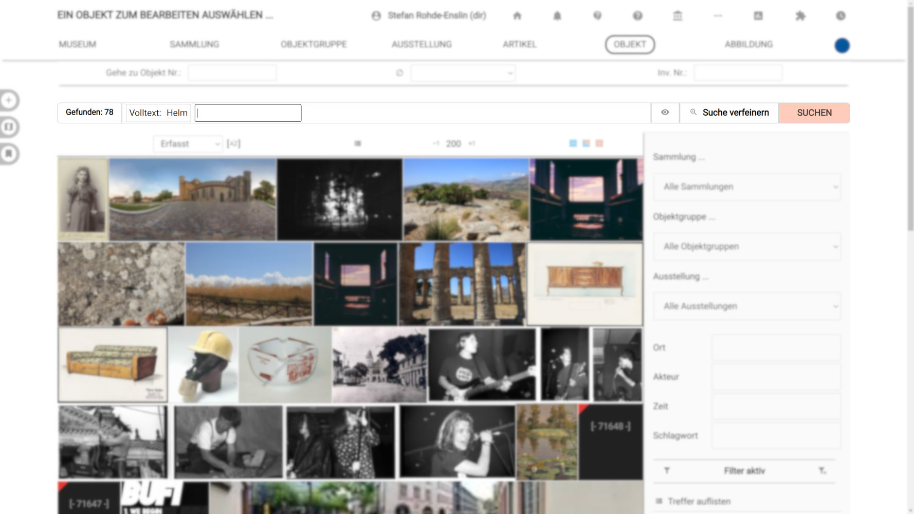
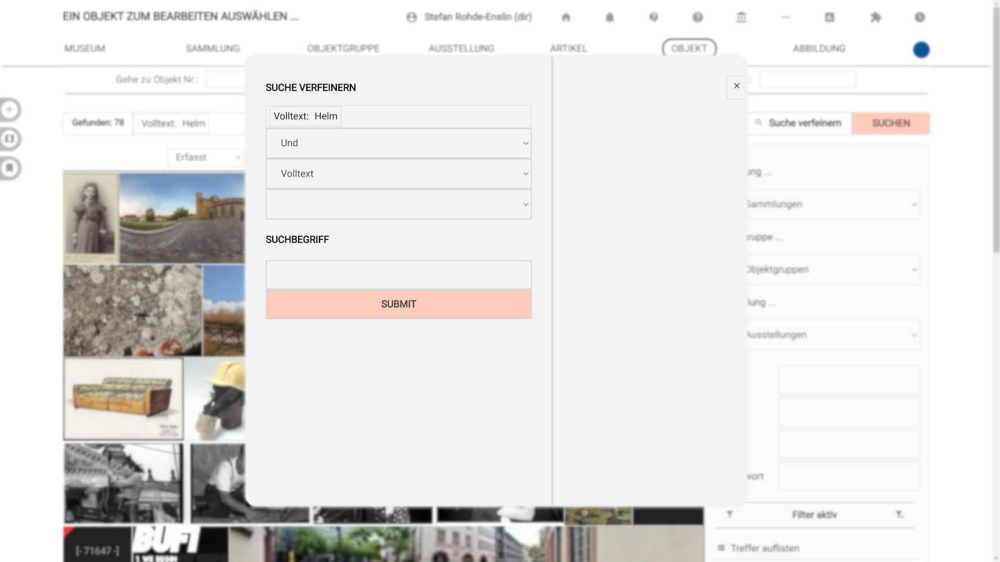
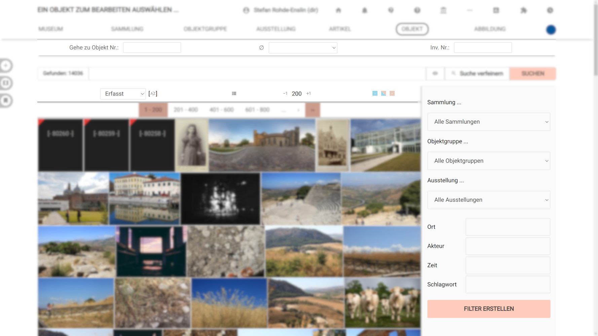
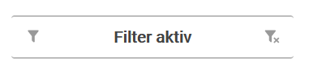
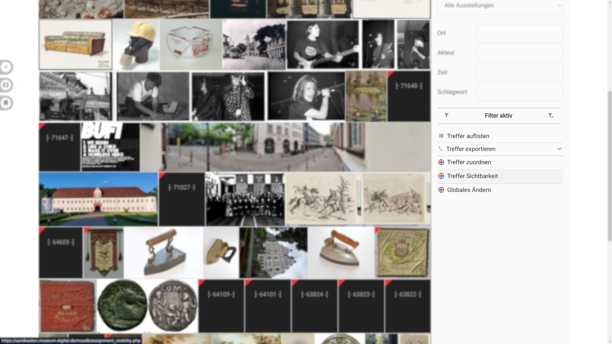
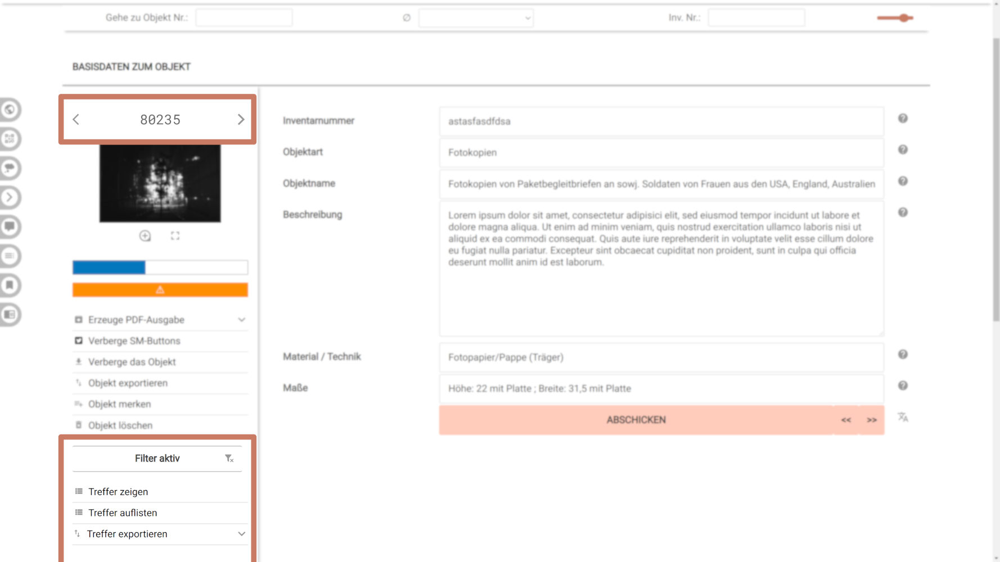

Objekte suchen
====================

Was sind Filter?
----------------

"Filter" sind angewandte Suchbedingungen, genutzt um Objekte zu einer
Treffermenge zusammenzufassen. Beispiele:

- "Alle Objekte deren Inventarnummer 'IV' enthält"
- "Alle Objekte mit Eintrag 'Gemälde' im Feld Objektart"
- "Alle Objekte in Depot 2"

Die Bedingungen lassen sich frei kombinieren, etwa zu

- "Alle Objekte deren Inventarnummer 'IV' enthält UND die sich in Depot 2 befinden" oder
- "Alle Objekte mit Eintrag 'Gemälde' im Feld Objektart UND deren Inventarnummer 'IV' enthält" oder
- "Alle Gemälde mit 'IV' in der Inventarnummer im Depot 2"

Wozu Filter?
------------

Ist ein Filter aktiv, dann beziehen sich einige der Navigations- und
Bearbeitungs-Operationen auf die dem Filter entspechende Treffermenge.
Beispielsweise führt der "Nächstes Objekt"-Schalter bei aktivem Filter
zum nächsten Objekt, welches den Filterbedingungen entspricht und führt
nicht einfach nur zum nächsten folgenden Objekt der Gesamtmenge. Eine
Filter-Treffermenge lässt sich aber auch gruppiert in einer Liste
anzeigen, ausdrucken oder exportieren.

Wie wird ein Filter erstellt?
-----------------------------

Filter werden in musdb primär über die Suchleiste ganz oben in der Objektübersicht gesteuert. Die Leiste besteht aus fünf Bereichen:

- Ganz links wird die Gesamtanzahl der gefundenen Objekte angezeigt.
- Ein großes Feld bietet Platz, um vorhandene Filterbedingungen anzuzeigen. Im linken Abschnitt dieses Feldes findet sich aber auch ein Eingabeschlitz, um schnell Suchbedingungen händisch einzugeben.
- Ein "Auge"-Symbol schaltet die Anzeige der gesetzten Filter um, sodass man die Suchbedingungen in der [zugrundeliegenden Abfragesprache](./Abfragesprache.md) sehen und manipulieren kann. So lassen sich etwa mehrere Bedingungen gleichzeitig hinzufügen oder entfernen - und die Eingabe ist wesentlich schneller, wenn man einmal mit der Abfragesprache vertraut ist.
- Der Button "Suche verfeinern" bietet die Möglichkeit, einen Filter über ein graphisches Menü und mithilfe von Auswahllisten zu setzen.
- Der Button "Suchen" schickt die Eingabe einer neuen Suchbedingung ab.

### Overlay: Eine Suchbedingung einstellen

Klickt man in der Suchleiste auf "Suche verfeinern" öffnet sich ein Overlay, mit dem man eben das tun kann. Standardmäßig sind vier Auswahl- bzw. Eingabefelder zu sehen:

- Mit dem ersten Auswahlfeld wird die **Beziehung der zu erstellenden Suchbedingung zu den schon vorhandenen bestimmt**. Je nach Vorhandensein von schon gesetzten Suchbedingungen sind hier "_und_", "_oder_" und "_nicht_" auswählbar.
- Mit dem zweiten Auswahlfeld wird bestimmt, **wonach gesucht wird**. Ist diese Suche eine Suche nach einer Person, nach der Inventarnummer, oder ist es eine Volltextsuche.
- Mit dem dritten Auswahlfeld lassen sich die **Beziehung des Suchbegriffs zum gesuchten Bestimmen**. Standardmäßig ist dies "_enthält_". Wird also nach "Deutschland" gesucht, werden auch Objekte gefunden, die mit "Berlin" verknüpft sind. Mit der Einstellung "_exakt_" würden nur Objekte gefunden, die direkt mit dem Ortseintrag "Deutschland" verknüpft sind. Die Auswahl "größer als" und "kleiner als" ist besonders bei Suchen nach Maßangaben (etwa, wenn man nach Objekten sucht, die in eine Vitrine passen).
- Das vierte Feld ist der Eingabeschlitz, in den man den Suchbegriff eingibt. Soll gerade in einem Feld gesucht werden, das auf Basis von kontrollierten Listen von Begriffen arbeitet (z.B. Orte, Schlagworte und Personen, aber auch Lizenzangaben), erscheinen entsprechende Vorschläge in einer Seitenspalte rechts. Der Suchbegriff kann dann durch einen Klick auf den entsprechenden Vorschlag ausgewählt werden.

Sind alle diese Felder ausgefüllt, kann die Suchbedingung mit einem Klick auf den "Abschicken"-Button gesetzt werden.

Um eine weitere Suchbedingung hinzuzufügen, wenn man also z.B. nach Objekten sucht, die etwas mit Hamburg zu tun haben UND in der Fotosammlung des Hauses sind, kann man die zweite Suchbedingung auf die gleiche Art und Weise hinzufügen.

### Suchbedingungen ansehen und entfernen

Ist eine Suchbedingung gesetzt, so erscheint diese als Box im großen mittleren Feld. Jede wird mit den folgenden Komponenten angezeigt:

Zuerst wird, so die Art der Suche nicht eine "enthält"-Suche ist, ein Marker, um auszudrücken wie die Suche arbeitet: Ein Minus (-) zeigt eine Suche nach "nicht X" an. Ein Gleich-Zeichen (=) weist auf eine exakte oder exklusive Suche hin. Die Zeichen für "größer als" (>) und "kleiner als" (<) zeigen an, dass nach eben diesen Logiken gefiltert wird.

Der nächste Unterbereich zeigt das Feld an, in dem gesucht wurde (bzw., dass es sich um eine Volltextsuche handelt). Durch einen Klick auf dieses Feld lässt sich die Kategorie der Suchbedingung eingeschränkt umschalten: Ist die Suche bisher eine nach dem Objektnamen, wird einem eine Volltextsuche nach vorgeschlagen. Ist der bisher gesetzte Suchbegriff als Schlagwort bekannt, wird eine Schlagwortsuche ebenso vorgeschlagen. Wichtig ist, dass bei diesen Vorschlägen nur Volltextsuchen und Suchen nach Schlagworten, Orten, Zeiten, und Akteuren vorgeschlagen werden.

Der letzte standardmäßig sichtbare Unterbereich ist eine Anzeige des Suchbegriffs selbst.

Möchte man die Suchbedingung löschen, so muss man zuerst mit der Maus über die jeweilige Kachel fahren. Mit dem Überfahren der Kachel wird ein "X" am rechten Rand der Suchbedingungs-Anzeige sichtbar. Klick man darauf, ist die durch die Kachel repräsentierte Suchbedingung entfernt (möchte man alle Filter entfernen, kann man auf "Filter entfernen" [s.u.] oder ganz einfach oben in der Navigation auf "Objekt" klicken).

Schneller Suchen: Gesonderte Eingabefelder für die Suche in einer Kategorie
---------------------------------------------------------------------------

Für verschiedene, besonders oft benötigte Suchkategorien gibt es eigene Eingabeschlitze auf der Objektübersicht, die einen schnelleren Einstieg in die Suche bieten:

- Direkt unterhalb der Navigation findet sich eine Zeile mit zwei Eingabeschlitzen und einem Auswahlfeld. Über die Eingabeschlitze lassen sich die Objektnummer nach ihrer ID in museum-digital und nach ihrer Inventarnummer durchsuchen (_wichtig: bei Suchen nach der Inventarnummer sind auch Wildcards einsetzbar_). Über das Auswahlfeld können Objekte nach fehlenden Informationen gefiltert werden - etwa, alle Objekte, zu denen noch keine Abbildung hochgeladen wurde.
- Direkt über den gefundenen Objekten findet sich eine Leiste, mit der (von links nach rechts)
  - die Sortierung der Trefferliste einstellt werden kann,
  - die Trefferliste zwischen ihren Listen- und Kachelmodi umgeschaltet werden kann,
  - die Anzahl der Treffer in der Liste eingestellt werden kann,
  - und die Trefferliste auf "nur veröffentlichte" oder "nicht veröffentlichte" Objekte eingegrenzt werden kann.
- Die rechte Seitenspalte der Objektübersicht bietet je nach Berechtigungen des Benutzers Auswahllisten für das Filtern der Objekte nach Museen oder Sammlungen. Sind die Menüpunkte für Objektgruppen und Ausstellungen aktiviert (siehe "[Persönliche Einstellungen](../Benutzerkonto/Einstellungen.md#menüpunkte)"), erscheinen auch für diese Auswahllisten. Unterhalb der Auswahllisten gibt es Suchschlitze für das schnelle Filtern der Objekte nach Schlagworten, Zeiten, Orten und Akteuren.

Zu guter Letzt lässt sich der versteckte Schnell-Suchschlitz der Suchleiste selbst benutzen: Wird hier einfach nur ein Wort eingegeben, wird eine Volltextsuche durchgeführt (bzw. als zusätzliche Suchbedingung hinzugefügt, falls schon ein Suchfilter gesetzt ist). Auch spezifischere Suchabfragen lassen sich so schnell machen, indem man die Suchabfrage direkt in der [Abfragesprache der Objektsuche](Abfragesprache.md) eingibt.

Woran ist erkennbar, ob ein Filter aktiv ist? Und was kann man damit noch machen?
---------------------------------------------------------------------------------

Neben dem Erscheinen von gesetzten Suchbedingungen in der Suchleiste, lässt sich das Vorhandensein
eines Filters in den Seitenspalten der Objektübersicht und der Objekt-Bearbeitungs-Seite sehen. Ist ein
Filter gesetzt, erscheint hier ein fett geschriebener Schriftzug **"Filter aktiv"**. Neben dem Schriftzug
finden sich Schalter zum Entfernen und Bearbeiten des Schriftzugs. Unterhalb des Schriftzugs werden
verschiedene Optionen angeboten, um auf Basis des Filters mit der Trefferliste zu arbeiten:

- **"Treffer zeigen"** (erscheint nur im (Einzel-) Objekt-Bearbeitungsfenster)  und führt zur gefilterten Trefferliste)
- [**"Treffer auflisten"**](./Listendruck.md) ruft die Listendruck-Funktion für die Treffermenge auf (für einen Export der Daten als Excel-Liste und das tabellarische Anzeigen der Treffer)
- [**"Treffer exportieren"**](./Export.md) ruft die Export-Funktion auf Basis der Treffermenge auf
- [**"Treffer zuweisen"** und "**Globales Ändern**"](./Batch/) bieten Funktionen zur Massenbearbeitung auf Basis der Treffermenge.

In der (Einzel-)Objekt-Bearbeitungsansicht haben Sie oben links zusätzlich
zwei Schaltflächen für "Gehe zu davorliegendem
Datensatz" und "Gehe zu folgendem Datensatz" zur Verfügung. Diese
Navigationsmöglichkeiten stehen auch dann zur Verfügung, wenn kein
Filter aktiv ist. Bei aktivem Filter wird hier allerdings zum vorigen
(oder nächsten) Element der gefilterten Treffermenge gesprungen. Um die Bearbeitung
vieler Datensätze (die vorher über einen Filter zu einer Treffermenge
gruppiert wurden) zu erleichtern, erscheinen ähnliche
Navigationsschalter auch links und rechts des Abschicken-Buttons der
Objekt-Basiseingabe. Änderungen dieser Basiseingaben können Sie durch
Klicken auf diese Schalter bestätigen und werden dann gleich zum davor-
oder danach liegenden Datensatz geleitet. (Abb. 4, unten rechts)

