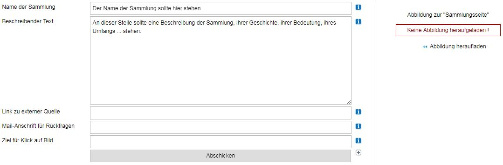
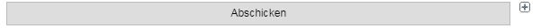
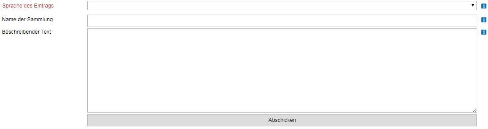
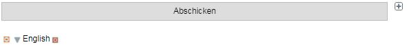

Sammlungen verwalten
====================

Eingabe- und Bearbeitungssseiten für Sammlungen
-----------------------------------------------

### Basisangaben \...

Man muss die Rolle eines \"Museumsdirektors\" innehaben, um eine
Sammlung neu anlegen zu können. Das Erfassen einer Sammlung ist einfach.
In der Navigationsleiste \"Museum-Sammlung-Objekt\" genügt ein Klick auf
den grünen Punkt hinter dem Wort \"Sammlung\". Es öffnet sich das
Dialogfeld \"Sammlung erfassen\":

 

Für \"Name der Sammlung\" gibt es keine Einschränkung, außer, dass die
maximale Länge des Eintrags 255 Zeichen nicht überschreiben sollte und
dass diese Zeile nicht leer bleiben darf - eine Sammlung ohne Namen lässt
sich nur schwer verwalten.

Für die Zeile \"Beschreibender Text\" gilt ebenfalls die Regel, dass
dieses Feld nicht leer bleiben darf. Es muss mindestens 25 Zeichen
enthalten. Selbstverständlich bleibt es den Museen überlassen Sammlungen
auf ihre jeweils eigene Art zu beschreiben. Möglich sind eine
Beschreibung der Zusammensetzung der Sammlung, ihrer Entstehung und
Geschichte, die Erwähnung von herausragenden Objekten, eine Erwähnung
des Umfangs und jede Information, aus der ersichtlich wird, warum es
diese Sammlung im Museum gibt. Einige gute Textmenge sind zwei oder drei
\"ordentliche Absätze\", es darf aber gerne auch mehr sein. Nach oben
gibt es keine Grenze der Textlänge.

Die Zeile \"Link zu externer Quelle\" muss nicht ausgefüllt werden.
Steht dort eine URL eingetragen, so erscheint in der Web-Anzeige von
museum-digital bei Aufruf dieser Sammlung unterhalb der Beschreibung ein
anklickbarer Text: \"\... mehr über diese Sammlung im Internet\".
Anwendungsbeispiel: Das Museum hat auf seiner eigenen Internetseite eine
sehr ausführliche Beschreibung der Sammlung, die auch bei museum-digital
erfasst wird. Wenn an dieser Stelle die URL der Sammlungsbeschreibung
auf der Museumsseite eingetragen wird, so erscheint der gerade genannt
anklickbare Text, der per Klick auf die entsprechende Stelle der
Museumsseite führt.

Die Zeile \"Mail-Anschrift für Rückfragen\" muss gleichfalls nicht
unbedingt ausgefüllt werden. Anwendungsszenario: Wenn ein Museum bei den
Angaben zum Museum selbst eine Mail-Anschrift eingetragen hat, dann
erscheint unter den Objekten in der Ausgabe bei museum-digital die
anklickbare Zeile: \"Ist Ihnen etwas aufgefallen? Womöglich ein Fehler?!
Oder wissen Sie mehr?\". Ein Klick hierauf öffnet das beim Nutzer
installierte Mail-Programm mit vorausgefüllter Betreffzeile und der
angegebenen zentralen Mail-Adresse des Museums als Adressaten. Ist aber
auf der Seite zur Sammlungsverwaltung die Zeile \"Mail-Anschrift für
Rückfragen\" ausgefüllt, so wird bei allen Objekten des Museums, die zu
dieser Sammlung gehören, die Betreffzeile des aufklappenden
Mail-Fensters mit dem hier eingetragenen gefüllt. Museen, die
verschiedene Kustoden für verschiedene Sammlungen haben, können auf
diese Weise das \"Nutzer-Feedback\" direkt in die passende Richtung
leiten.

Sobald diese Angaben eingetragen sind muss auf \"Abschicken\" geklickt
werden um die Eingabe fortzusetzen.

### Abbildung zur Sammlung \...

Das Dialogfeld wird um die Möglichkeit der Anreicherung mit einer
Abbildung erweitert:

Der jetzt in der rechten Spalte erschienene Hinweis \"Keine Abbildung
heraufgeladen !\" kann - sollte aber nicht - ignoriert werden. Für die
öffentliche Anzeige von Sammlungen gilt folgende Regel:

1\. Ist eine Abbildung zur Sammlung heraufgeladen worden, so zeige diese
an.

2\. Ist keine Abbildung zur Sammlung heraufgeladen worden, so zeige bei
weniger als 15 Objekten keine Abbildung an.

3\. Ist keine Abbildung zur Sammlung heraufgeladen worden, es sind
jedoch mehr als 20 Objekte aus dieser Sammlung zur Anzeige im Internet
freigegeben, so zeige eine kleine rotierende Diashow aus Ansichten der
15 zuletzt freigegebenen Objekte aus dieser Sammlung.

Die Abbildung zur Sammlung wird, falls vorhanden, auch in der
öffentlichen Übersicht aller Sammlungen verwendet. Auch wenn man Freund
von Diashows sein mag - ist es ratsam ein Bild zur Sammlung
heraufzuladen. Dieses, die Sammlung illustrierende Bild kann entweder
mehrere Objekte der Sammlung zeigen, es kann - so vorhanden - den
Sammler, der Namensgeber der Sammlung ist, zeigen oder es kann auch
einfach nur ein - vielleicht für diese Sammlung typisches - Objekt aus
der Sammlung zeigen.

Abbildungen zur Sammlung können durch Anklicken von \"Abbildung
heraufladen\" auf den Server geladen werden. Die Bilddateien im
JPEG-Format (andere Formate sind nicht erlaubt) werden beim Import in das
museum-digital-System automatisch vor dem Speichern auf 200 Pixel
Bildbreite heruntergerechnet.

Mit der Möglichkeit ein Bild heraufzuladen (der rechten Spalte, s.o.)
ist jetzt auch ein neues Feld verfügbar (direkt über \"Abschicken\"):
\"Ziel für Klick auf Bild\". An dieser Stelle können Sie eine
Internetadresse eintragen zu welcher der Internetbesucher gelenkt wird,
wenn er in der öffentlichen Anzeige dieser Sammlung auf das Bild klickt.

### Mehrsprachige Sammlungsangaben \...

Weiterhin ist durch das erste Klicken auf \"Abschicken\" (= das
Speichern der Sammlung) ein neues Symbol gleich rechts von
\"Abschicken\" sichtbar geworden.

Bei dem kleinen grauen Kreuz handelt es sich um den Schalter für
mehrsprachige Einträge. Der Schalter taucht immer dort auf, wo
Informationen in mehreren Sprachen veröffentlicht werden können. Ein
Klick auf diesen Schalter öffnet ein neues Eingabefenster:

An dieser Stelle können - analog zur deutschsprachigen Eingabe - einen
fremdsprachigen Sammlungsnamen und eine Beschreibung in der gleichen
Sprache angeben, sofern sie die Sprache in dem oberen Aufklappmenü
gewählt haben. Nach Klick auf Abschicken können Sie dann Name und
Beschreibung in weiteren Sprachen erfassen - in so vielen Sprachen wie
sie mögen.

Nachdem dann auf \"Abschicken\" geklickt wurde erscheint eine weitere
Zeile im Sammlungs-Erfassungs-Dialog:

Für den Eintrag in einer weiteren Sprache war in diesem Falle
\"English\" als Sprache gewählt worden. Durch Klick auf das linke
Kästchen in dieser neuen, direkt unter \"Abschicken\" befindlichen,
Steuerleiste für mehrsprachige Elemente können Sie die mehrsprachigen
Informationen wieder löschen. Durch Klick auf das Dreieck vor der
Sprachangabe (oder die Sprachangabe selbst) können Sie die
mehrsprachigen Angaben ändern. Schließlich können Sie durch Klicken auf
den rechten Schalter dieser Leiste die Informationen in dieser Sprache
für \"unsichtbar\" erklären, d.h. bestimmen, dass die Informationen zwar
gespeichert werden, im Internet jedoch nicht zur öffentlichen Anzeige
kommen.

Sammlungsliste
--------------

### Eine Sammlung einer anderen Unterordnen

### Reihenfolge bearbeiten

Durch einen Klick auf die \"Hoch\" bzw. \"Runter\"-Symbole in der
Sammlungsübersicht kann die Reihenfolge der Sammlungen bestimmt werden.
Ein Klick auf das Hoch-Symbol bewegt die Sammlung (und damit ihre ggfs.
vorhandenen Untersammlungen) vor die vorherige Sammlung auf der selben
Ebene. Analog dazu kann man die Sammlung durch einen Klick auf das
\"Runter\"-Symbol in der Reihenfolge nach hinten bewegen.
