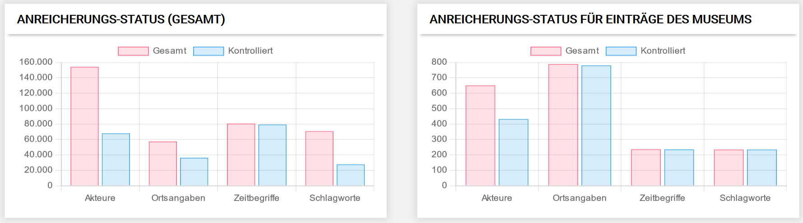
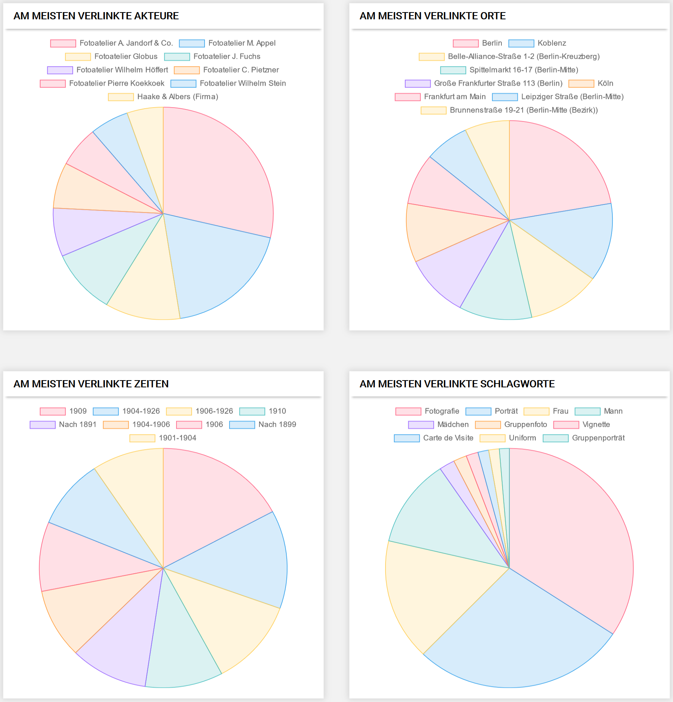
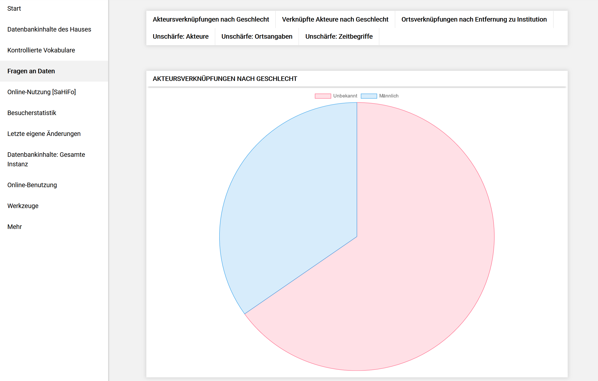

# Dashboard

Es ist möglich, sich im Menu "Persönliche Einstellungen" eine andere Startseite für *musdb* zu wählen. Standardmäßig ist hier das Dashboard gewählt.

Das Dashboard besteht im wesentlichen aus drei Teilen. Die linke Spalte erlaubt statistische Angaben über die eigenen Objekte sowie Angaben über die Objekte der jeweiligen Version von museum-digital, bei der sich der Nutzer angemeldet hat. Auch lassen sich hier allgemeine Tools aufrufen. Die breite Spalte rechts bietet oben Schnellzugänge zu eigenen Objekten, Sammlungen, Ausstellungen, Veranstaltungen, Leihvorgängen und Kontakten. Im Hauptteil bietet diese Spalte Raum für Notizen. Am unteren Rand findet sich zusätzlich ein Verzeichnis der erfassten Links zu Internetseiten, welche die Institution für die jemand angemeldet ist, repräsentieren.

## Datenbankinhalte des Hauses

Eine Möglichkeit sich den Verlauf der Erfassung der Objekte seines Museums in einer Grafik anzeigen zu lassen bietet der erste Punkt des Menus: "Datenbankinhalte des Hauses".

")

Hier können unterhalb der Grafik verschiedene Kriterien ausgewählt und dann in ihrem Verlauf veranschaulicht werden. Beim überfahren der Linien in der Grafik werden exakte Werte angezeigt.

## Kontrollierte Vokabulare

Die Sektion "Kontrollierte Vokabulare" enthält zunächst einen Überblick, der einen Vergleich ermöglicht. Eine Antwort auf die Frage: Wie werden kontrollierte Vokabulare von allen Museen genutzt und wie steht es damit in dem Museum, für das ich angemeldet bin?

Einen weiteren Vergleich ermöglicht der untere Teil dieser Sektion. Hier werden die vier kontrollierten Bereiche: Orte, Akteure, Schlagworte und Zeiten in ihrer Nutzung durch das Museum verglichen. Besondere Häufungen werden erkennbar: Etwa bei der Erfassung von Orten, die mit Objekten des Museums verknüpft sind. Oder Schlagworte, die besonders häufig verwendet werden ... .

## Fragen an Daten

Die Rubrik "Fragen an Daten" bietet Zugang zu grundsätzlichen Fragestellungen. Sie ist dynamisch konzipiert. Wenn ein Museum einen besonderen Einblick in seine Objektinformationen benötigt und die Fragestellung auch für andere Museen (in Bezug auf deren Daten) von Interesse sein könnte, dann wird eine entsprechende Abfrageroutine programmiert. An dieser Stelle wird dann eine aktuelle Grafik zur Fragestellung (in Bezug auf die Daten des Museums, für das man angemeldet ist) abrufbar. Möchte ein Museum beispielsweise erfahren, ob die Personen, die in Beziehung zu seinen Objekten stehen, mehrheitlich weiblich oder männlich waren - dann ist ja nicht ausgeschlossen, dass ein anderes Museum irgendwann die gleiche Frage für seine Objekte beantwortet haben möchte. Die für das zuerst fragende Museum programmierte Abfrageroutine wird an dieser Stelle für alle Museen (mit den jeweils eigenen Daten) nutzbar.

## Online-Nutzung [Museum]

Vier verschiedene Grafiken finden sich in dieser Rubrik - alle zeigen die Aufrufe, welche die Objekte des Museums für das jemand angemeldet ist, in der öffentlichen Ausgabe von museum-digital erfahren haben. Alle Grafiken beziehen sich auf die jeweils letzten 30 Tage. Beim Überfahren erscheinen die entsprechenden Zahlenangaben.

