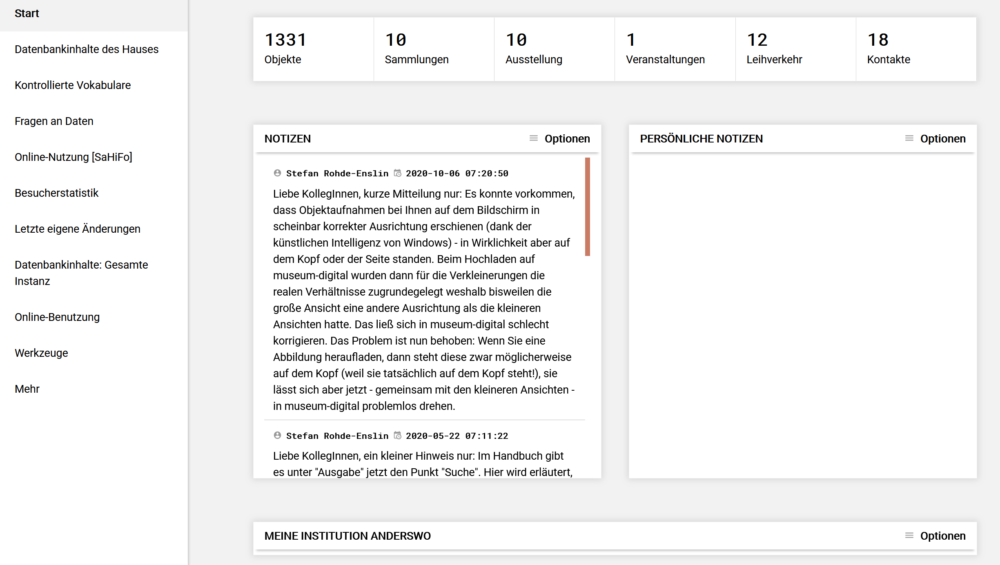

# Dashboard

Es ist möglich, sich im Menu "Persönliche Einstellungen" eine andere Startseite für *musdb* zu wählen. Standardmäßig ist hier das Dashboard gewählt.

Das Dashboard besteht im wesentlichen aus drei Teilen. Die linke Spalte erlaubt statistische Angaben über die eigenen Objekte sowie Angaben über die Objekte der jeweiligen Version von museum-digital, bei der sich der Nutzer angemeldet hat. Auch lassen sich hier allgemeine Tools aufrufen. Die breite Spalte rechts bietet oben Schnellzugänge zu eigenen Objekten, Sammlungen, Ausstellungen, Veranstaltungen, Leihvorgängen und Kontakten. Im Hauptteil bietet diese Spalte Raum für Notizen. Am unteren Rand findet sich zusätzlich ein Verzeichnis der erfassten Links zu Internetseiten, welche die Institution für die jemand angemeldet ist, repräsentieren.

## Die linke Spalte

Eine Möglichkeit sich den Verlauf der Erfassung der Objekte seines Museums in einer Grafik anzeigen zu lassen bietet der erste Punkt des Menus: "Datenbankinhalte des Hauses".
