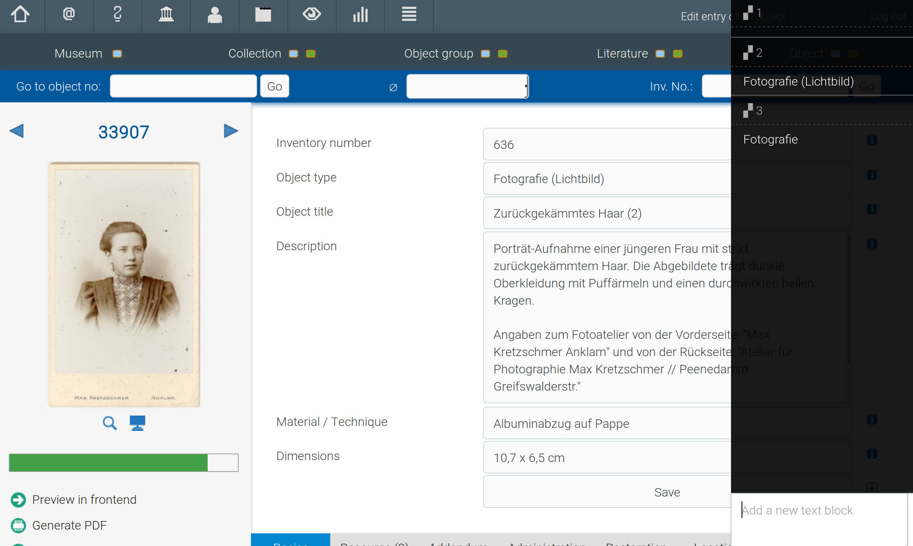
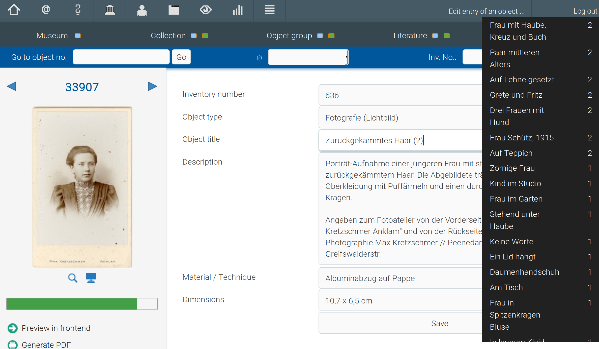
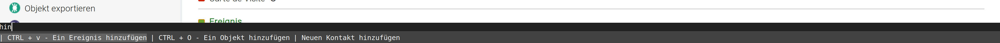
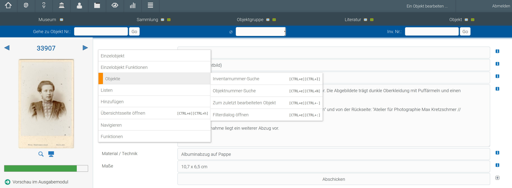

Tastenkürzel
============

Besonders in der Eingabeoberfläche von museum-digital ist eine größere
Anzahl von Funktionen durch Tastenkürzel nutzbar. Die Steuerung per
Tastatur ist dabei in zwei Kategorien geteilt: Einerseits direkt
erreichbare Tastenkombinationen, andererseits solche, die erst nach dem
[Aktivieren eines Menüs erreichbar sind](#2).

Die Mehrzahl der Tastenkürzel ist nur erreichbar, wenn eine bestimmte
Bedingung erfüllt ist. Beispielsweise ist die Navigation zur vorherigen
oder nächsten Seite nur erreichbar, wenn eine solche existiert.

Einfache Tastenkürzel
---------------------

| Tastenkombination     | Funktion                                     | Bedingung                                                                            |
|-----------------------|----------------------------------------------|--------------------------------------------------------------------------------------|
| <kbd>STRG+Links<kbd>  | Zur vorherigen Seite in Übersicht navigieren | Eine vorherige (Übersichts-)Seite existiert                                          |
| <kbd>STRG+Rechts<kbd> | Zur nächsten Seite in Übersicht navigieren   | Eine nächste (Übersichts-)Seite existiert                                            |
| <kbd>STRG+k<kbd>      | Objekt zum vergleichen Vormerken             | Sie befinden sich auf einer Objektseite                                              |
| <kbd>STRG+r<kbd>      | Textbaustein-Menü aktivieren                 | Der Cursor steht in einem Eingabefeld                                                |
| <kbd>STRG+\#</kbd>    | Angaben-aus-gleichem-Feld-Menü aktivieren    | Der Cursor steht in einem Eingabefeld, für welches diese Funktion freigeschaltet ist |

### Objekte vergleichen

 

### Textbausteine

Befindet sich der Cursor in einem Eingabefeld, können Sie das Menü für
Textbausteine durch die Tastenkombination <kbd>STRG+r</kbd> erreichen - es
erscheint am rechten Bildschirmrand. Den oberen Teil des Menüs bildet
eine Auflistung der für dieses Feld verfügbaren Textbausteine. Am
unteren Ende des Menüs haben Sie die Option, einen weiteren Textbaustein
für dieses Feld hinzuzufügen. Verfügbare Textbausteine können über einen
Klick auf die entsprechende Anzeige und durch das Eingeben der vor dem
Text stehenden Zahl dem Feldinhalt angefügt werden.

Hierbei ist auf einige Beschränkungen hinzuweisen:

-   Textbausteine werden immer Feldern gleichen Namens zugeordnet. So
    sind etwa die Textbausteine für den Objekttypen auf der
    Objekteingabe- und der Objektbearbeitungsseite identisch.
    Textbausteine, die für die Beschreibung angelegt wurden, sind jedoch
    bei keinem der beiden Felder verfügbar.
-   Pro Feld / Feldtyp können nur jeweils zehn Textbausteine vorgemerkt
    werden. Werden darüberhinausgehend Textbausteine hinzugefügt,
    entfällt der jeweils älteste.

### Die Angaben-aus-gleichem-Feld-Funktion

Durch drücken von <kbd>[STRG+\#</kbd> in einem Eingabefeld auf Objektseiten
(Eingabe und Bearbeitung) erreicht man das
Angaben-aus-gleichem-Feld-Menü. Wie das Menü für Textbausteine erscheint
es am rechten Bildschirmrand. Im Menü aufgelistet finden Sie (links)
alle Angaben aus Feldern gleichen Typs bei Ihnen zugänglichen Objekten.
Die Angaben sind nach ihrer Häufigkeit sortiert. Durch einen Klick auf
den entsprechenden Eintrag können außerdem nach allen passenden Objekten
suchen.

### Hausinterne Vorgaben

Hausinterne Vorgaben bestehen aus zwei Teilen\
 Text\
 Text-Teil, der beim Einfügen ins Feld vormarkiert\
\
Damit kann ein Variabler Teil der Vorgabe direkt\
angepasst werden

Verschachtelte Tastatursteuerung
--------------------------------

Über die Tastenkombination <kbd>STRG+e</kbd> wird die erweiterte
Tastensteuerung aktiviert. Am unteren Bildschirmrand erscheint eine
Leiste mit verfügbaren Befehlen.

Wie im oben stehenden Screenshot sichtbar, sind zwei Arten von Befehlen
über dieses Menü verfügbar: Einerseits solche, für die es weiterführende
Tastenkombinationen gibt, und andererseits solche, die nur aus dem Menü
heraus angewählt werden können. Falls ein Tastenkürzel verfügbar ist,
steht dieses dem Eintrag voran. Danach folgt eine Beschreibung der
Funktion.

Um die gewünschte Funktion zu aktivieren, wählen Sie diese aus und
drücken sie die <kbd>Eingabetaste</kbd> (die gerade ausgewählte Funktion
ist in hellerem grau unterlegt). Standardmäßig ist die erste Option in
der Liste ausgewählt. Möchten Sie eine andere Auswählen, können Sie
entweder durch ein einfaches Eintippen der Funktionsbezeichnungen die
Liste durchsuchen, und/oder durch ein Drücken der <kbd>Tabulatortaste</kbd>
zur nächsten Funktion gehen.

Für einen besseren Überblick lässt sich das Menü auch ausklappen (erst
Menü aktivieren, dann <kbd>STRG+r</kbd> drücken):

### Kontextmenü

Aus der verschachtelten Tastensteuerung wird gleichzeitig ein
Kontextmenü generiert, das durch <kbd>STRG+Rechtsclick</kbd> erreichbar
ist. Um es wieder zu verlassen, klicken Sie irgendwo außerhalb des
Menüs.

\"Lesezeichen\"
---------------

Über die (verschachtelte) Tastensteuerung und die Toolbar ist eine
Lesezeichen-Funktion erreichbar, bestehend aus den beiden Teilen
\"Lesezeichen setzen\" und \"Lesezeichen aufrufen\". Mit dieser Funktion
kann man sich immer eine Seite merken (\... setzen), zu der man später
einfach zurückkehren kann (aufrufen).

Dies ist insbesondere für die Nachträgliche Bearbeitung von vielen
Objekten aus einer Trefferliste gedacht, sodass man nach der Bearbeitung
einer gegebenen Anzahl von Objekten schnell zurück zur Übersichtsseite
kommen kann.

Zusammenfassung als Video
-------------------------

<b>Anleitung auf Youtube</b> 
Mit einem Klick wird das Video geladen. Damit werden andererseits ihre Daten mit Youtube geteilt.

