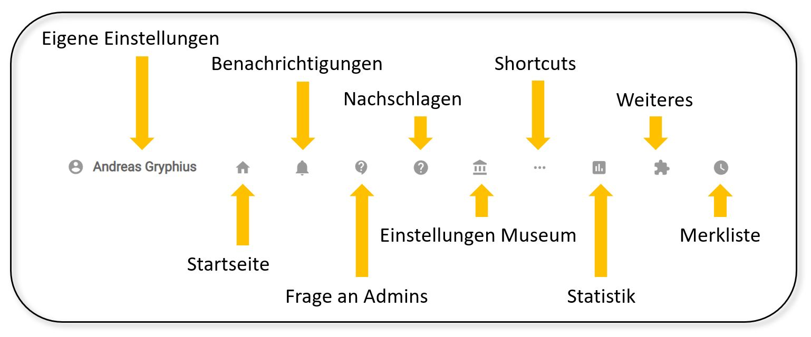

Navigationsleiste
=================

Die Navigationsleiste des Eingabe- und Bearbeitungswerkzeugs von
museum-digital besteht ausschließlich aus Symbolen und dem Namen, unter
dem Sie angemeldet sind. Erläuterungen der dahinter verborgenen
Möglichkeiten erscheinen beim Überfahren der Symbole mit der Maus. Die
erscheinenden Symbole sind an Ihre Nutzerrolle bei museum-digital
angepasst. Manche der Symbole öffnen auf Anklicken ein Menü über welches
Sie weitere Funktionen aufrufen können.

 

Eigene Einstellungen
--------------------

Durch Klicken auf ihren Namen (oder das davor stehende Symbol) gelangen
Sie in das Menü "Persönliche Einstellungen". Hier können Sie das
Eingabe- und Bearbeitungswerkzeug von museum-digital ihren Wünschen und
Aufgaben anpassen und hier finden Sie auch den Logout-Schalter, wenn Sie
das Programm verlassen wollen.

Mehr zu den persönlichen Einstellungen ist im [dazugehörigen Kapitel](../Benutzerkonto/Einstellungen.md) beschrieben.

Startseite
----------

Das Häuschen-Symbol führt zu Ihrer \"Startseite\" des Eingabe- und
Bearbeitungstools. Was dabei als \"Startseite\"-Seite gelten soll, das
können Sie selbst im Menü \"Persönliche Einstellungen\" auswählen. Haben
Sie dort keine Auswahl getroffen, so erscheint das Dashboard.

Benachrichtigungen
------------------

Sobald das Technikteam oder ein Regionaladministrator eine Nachricht an
alle Nutzer schickt erscheint an dieser Glocke ein roter Punkt, der das
Vorliegen neuer Nachrichten symbolisiert. Ein Klicken auf die Glocke
zeigt die letzten Nachrichten an.

Frage an Admins
---------------

Das Sprechblasen-Fragezeichen-Symbol öffnet (sofern auf dem aufrufenden
Rechner implementiert) das email-Programm des Nutzers im Modus \"Neue
email verfassen\". Je nachdem, wo sich der Nutzer gerade befand ist die
Betreffzeile dieser Mail-Nachricht bereits ausgefüllt. Fahren Sie mit
der Maus über das Zeichen so erscheint eine Liste der Administratoren,
denen Sie eine mail mit einer Frage schicken können. Klicken Sie auf den
Namen des Administrators öffnet sich das gerade genannte \"Neue email
verfassen\"-Fenster mit aussagekräftiger Betreffzeile. Diese Funktion
soll den Administratoren helfen zu verstehen, welches Problem Sie in der
jeweiligen mail beschreiben.

Nachschlagen
------------

Das ?-Symbol führt zu einzelnen Punkten in diesem Handbuch, die als
Listen zum Nachschlagen ausgelegt sind. Wenn der Mauszeiger das ?-Symbol
berührt öffnet sich ein Menü, aus welchem Sie den Zugang zu einer Liste
auswählen können.

Einstellungen Museum
--------------------

Das Museumssymbol führt auf eine Seite, auf welcher Sie generelle
Einstellungen, die museumsweit gelten, vornehmen können. Dieses Symbol
erscheint nur bei Museumsdirektoren.

Shortcuts
---------

Statt sich - über Persönliche Einstellungen -\> Menüpunkte (s.o.) -
verschiedene weitere Bereiche in die Menüleiste zuzuschalten (etwa:
Literatur) können Sie diese Menüpunkte auch über das Aufklappmenü
erreichen, welches erscheint, wenn Sie das Shortcut-Symbol mit dem
Mauszeiger berühren.

Statistik
---------

Das Symbol \"Statistik\" führt zu einer Seite auf welcher Sie
verschiedene Zugänge zur Statistik erhalten.

Weiteres
--------

Ein Berühren der Schalterfläche \"Weiteres\" öffnet ein Aufklappmenü mit
Zusatzfunktionen, etwa den Zugang zur in museum-digital integrierten
Video-Konferenz-Software.

Merkliste
---------

Dieses Symbol erscheint nur, wenn Sie sich die Merklistenfunktion im
Menü \"Persönliche Einstellungen\" freigeschaltet haben. Sie können in
diesem Falle über ein Anklicken dieses Schalters die Merkliste am linken
Bildschirmrand ein- oder ausblenden.
