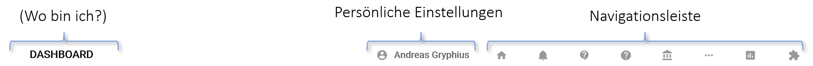

# Benutzeroberfläche

museum-digital soll für Alle leicht nutzbar sein! Dieser Anspruch hat dazu geführt, dass die Benutzeroberfläche dynamisch ist und in weiten Teilen den eigenen Ansprüchen und Absichten angepasst werden kann. Es werden immer nur jene Schalter angezeigt und solche Funktionen angeboten, die der jeweilige Nutzer auch nutzen darf und nutzen können will.

Die Steuerung übernimmt der Nutzer über das Menu [Persönliche Einstellungen](../../musdb/Benutzerkonto/Einstellungen.md). Jemand, der in der Rolle "Museumsdirektor" angemeldet ist, kann zudem [Einstellungen für das Museum](../../musdb/Museum/Einstellungen.md) bestimmen, die dann museumsweit gelten.

