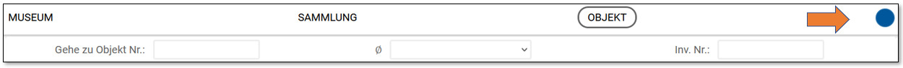
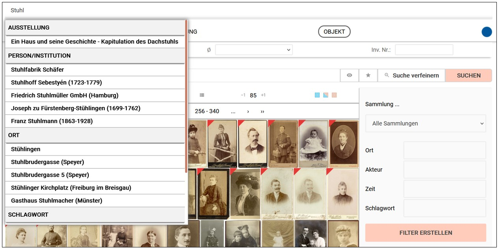

# Übersichts-Suche

Den rechten Rand der Menuleiste kennzeichnet ein farbiger Punkt. Dieser Punkt hat zwei Funktionen. Seine Farbigkeit verrät, zu welchem Bereich die aktuell aufgerufene Seite gehört. So ist zum Beispiel die Objektbearbeitung durch einen blauen Punkt gekennzeichnet, die Bearbeitung von Museumsinformationen durch einen roten Punkt etc.

 

Die zweite Funktion dieses Punktes ist die Übersichts-Suche, d.h. eine Suche über alle Einträge hinweg, also auch über Einträge zu Literatur, Ausstellungen, Objekte etc.

Ein Klick auf den Punkt (egal, in welcher Farbe er sich präsentiert) blendet am oberen Rand eine Suchleiste ein. Sobald dort mehr als zwei Buchstaben eingetippt wurden erscheint eine Vorschlagsliste mit jeweils 5 Vorschlägen aus den einzelnen Bereichen. Diese Vorschläge sind anklickbar und führen direkt zu den entsprechenden Seiten.

 