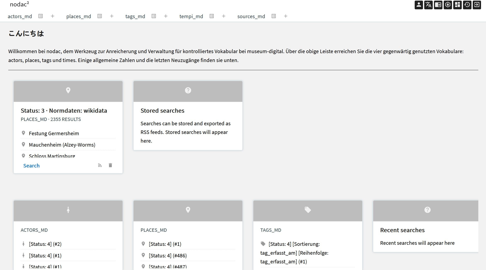

# nodac: Einleitung

## Was ist "nodac"

Um gute Suchresultate in Ein- und Ausgabe zu ermöglichen und korrekte Visualisierungen zu ermöglichen legt museum-digital sehr viel Wert auf kontrolliertes Vokabular, sogenannte Normdaten. Zu diesem Zweck wurde ein mehrsprachiges Normdaten-Verwaltungswerkzeug ("nodac") entwickelt, mit welchem die Normdatenredaktion die Vokabulare von museum-digital kontrolliert, das aber auch unabhängig von museum-digital zur Darstellung und Verwaltung externer Vokabularien eingesetzt werden kann.

Ein Teil der kontrollierten Vokabulare ist eng mit der Ein- und Ausgabe von museum-digital verknüpft. Diese Vokabularien werden gemeinsam mit anderen über nodac zugänglich gemachten Terminologien als Webseite und durch eine API über md:term öffentlich zugänglich gemacht ([s. 6. md:term](../../src/md-term/README.md).)).

Vier verschiedene eigene Vokabulare werden bei museum-digital verwendet. Für die einzelnen Einträge dieser Vokabulare sind dann jeweils mit entsprechenden Einträgen in anderen Normdatenrepositorien gespeichert. Die kontrollierten Begriffe umfassen (in Klammer die Anzahl, Stand Mai 2022):

- Akteure           (163.211)
- Orte              (58.809)
- Schlagworte       (73.458)
- Zeitbegriffe      (82.884)

Hinzu kommt ein Verzeichnis von Quellen für Statements ([s. 4.16.1 Statements](../../src/musdb/background/statements.md)). Die Vokabularien bauen sich auf durch Importe oder Eingaben von Museumsmitarbeitern. Die Normdatenredaktion übernimmt vor allem den Abgleich mit den bei museum-digital geltenden Regeln ([s. 2. Grundkonzepte](../Grundkonzepte/Konzepte.md)), die Korrektur von Schreib- und Tippfehlern, die Hierarchisierung der Begriffe im jeweiligen Vokabular, die Ergänzung mit kurzen Erläuterungen (und Übersetzungen in bis zu 27 Sprachen) sowie die Anreicherung mit Verknüpfungen in viele externe Normdatenrepositorien (wie GND, LCSH, AAT, ...).

## Wer hat Zugang zu "nodac"

Grundsätzlich ist der Zugang zu "nodac" für die Vokabulare bei museum-digital beschränkt auf die Normdatenredaktion. Jedem Nutzer von museum-digital steht jedoch ein eingeschränkter Zugang zur Verfügung. Die Regel dafür ist einfach: Solange ein Eintrag (ein Akteur, ein Ortsname, ...) nur von einem einzigen Museum bei museum-digital verwendet wird, können Mitarbeiter dieses Museums die Angaben in "nodac" ändern. Sobald zwei oder mehr Museen Objekte mit dem gleichen Akteur oder dem gleichen Ort ... verknüpft haben, geht die Verwaltung des Begriffs an die Normdatenredaktion über. Die einzelnen Museen können jedoch jederzeit Anmerkungen zu den Begriffen verfassen, die dann von der Normdatenredaktion berücksichtigt werden können. Externe Vokabulare haben eine eigene Redaktion. 

In diesem Kapitel wird zunächst die Navigation von "nodac" vorgestellt. Danach werden die Regeln für die redaktionelle Arbeit mit dem Werkzeug entlang der vier genannten Vokabularien erläutert. Für den Einsatz von nodac für externe Vokabulare gelten dabei im wesentlichen die Regeln, die hier für die Schlagwort-Verwaltung genannt werden.
