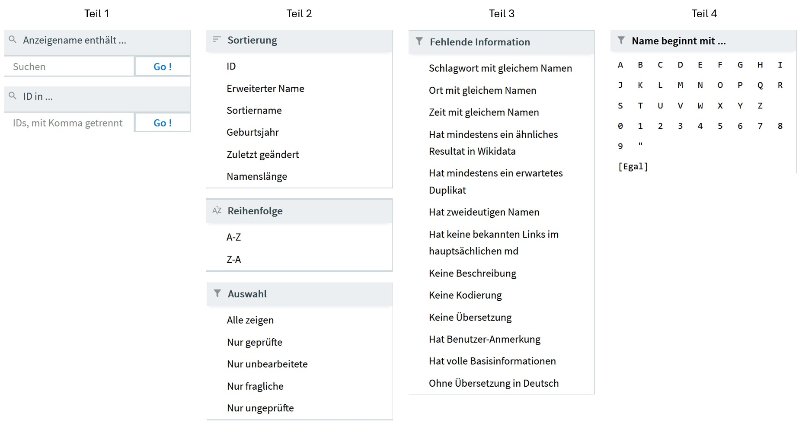
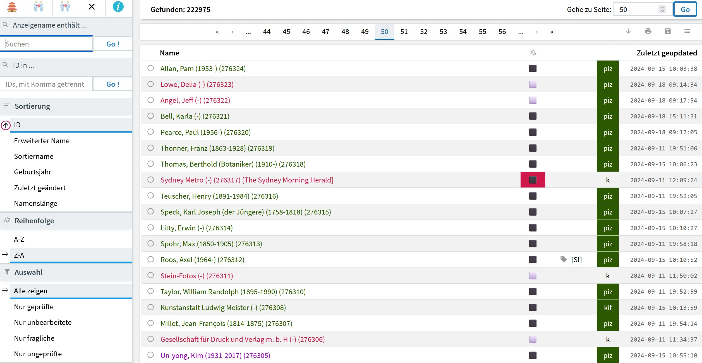

# nodac: Akteure

Auf dieser Seite finden sich Hinweise zur Verwaltung, Bearbeitung und Anreicherung von Informationen zu Akteuren mit dem nodac-Werkzeug. Am unteren Seitenende ist ein entsprechendes Video eingebunden.

Unterhalb des Hauptmenus von nodac findet sich eine Leiste mit der Möglichkeit ein zu bearbeitendes Vokabular auszuwählen. Es erscheinen hier nur die Vokabulare für welche der aktuelle Bearbeiter freigeschaltet ist. Ist ein Vokabular ausgewählt, so wird der entsprechende Bereich farbig hervorgehoben. Hinter dem Namen des Vokabulars erscheinen zwei Symbole. Für jedes Vokabular gibt es damit drei Möglichkeiten des Einstiegs:

- Klick auf den Namen des Vokabulars führt zur Startseite desselben.
- Klick auf das Listensymbol hinter dem Namen des Vokabulars führt zu einer Auflistung aller Einträge.
- Klick auf das Pluszeichen ermöglicht einen Akteur zu erfassen.

## Startseite
Die Startseite von nodac: Akteure ist mehrspaltig konzipiert. In der linken Spalte findet sich die für spezifische Navigation mit Such- und Eingrenzungsmöglichkeiten. Im zentralen Bereich Kacheln die den Stand der Bearbeitung veranschaulichen, aber auch als Schnellzugriff konzipiert sind. Die rechte Spalte zeigt Visualisierungen des Bearbeitungsstandes.

### Akteure: Navigation
Die Navigationsspalte von nodac: Akteure wird auf der Startseite und bei den Trefferlisten angezeigt. Bei der Einzelbearbeitung ist sie ausgeblendet.

Die Symbolmenu, am oberen Rand der Navigationsspalte enthält folgende Schalter:

- Die Pagode führt zur Startseite zurück. Sie hat damit die gleiche Funktion wie ein Anklicken von "Abschicken" im Auswahlmenu für die Vokabulare.
- Der linke der zwei Schalter welche Personen mit rotem Verbindungspfeil führt zu einer Suche nach Dublikaten. Es wird nach gleichen Namen gesucht.
- Der rechte dieser Schalter führt ebenfalls zu einer Dublikat-Suche. Es wird nach gleichen Normdatenbezügen gesucht.
- Das "x" zeigt die Blacklist, eine Liste von Begriffen, welche das System ignoriert. Im Falle von museum-digital sind das vor allem nicht individualisierbare Entitäten. Wird nodac: Akteure für ein externes Akteurverzeichnis verwendet, dann können andere Regeln gelten.

**Such- und Auswahlmöglichkeiten**

Unterhalb des Symbolmenus findet sich ein einfacher Suchschlitz, Sortier- und Auswahlmöglichkeiten sowie - in der Sektion "Fehlende Information" - gespeicherte Abfragen zur fokussierten Bereinigung der Vokabulars. Die Möglichkeiten und Abfragen sind notgedrungen vokabularspezifisch. Im folgenden wird der Einsatz von nodac: Akteure für das Verzeichnis der Akteure bei museum-digital erläutert. Um nodac: Akteure  mit einem externen Verzeichnis, das anders strukturiert ist, zu verwenden, sind gegebenenfalls kleine Anpassungen nötig.

Bei museum-digital werden Bezeichnungen von Akteuren in vier Formen gespeichert (die sich ineinander umrechnen lassen).
- "Erweiterter Name", etwa "Heinrich Heine (1797-1856)", also [Vorname] [Nachname] [(][Geburtsjahr][)][-][(][Sterbejahr][}].
- "Gebräuchlicher Name", etwa "Heinrich Heine", also [Vorname] [Nachname].
- "Sortiername", etwa "Heine, Heinrich", also [Nachname], [Vorname].
- Getrennte Felder für Vorname, Nachname, Geburtsjahr, Sterbejahr, etc.

**Anzeigename enthält**

Die einzelnen Such- und Auswahlmöglichkeiten lassen sich kombinieren. Der Suchschlitz der linken Spalte löst die Suche nach einer Zeichenreihenfolge im Feld "Erweiterter Name" aus. Dies ermöglicht beispielsweise bei einer Suche nach "1874" alle Akteure zu finden, die in diesem Jahr geboren oder gestorben sind.

**ID in ...**

Mit diesem Eingabefeld können beliebige Datensätze des Vokabulars in einer Trefferliste zusammengefasst werden. Die IDs der einzelnen Einträge müssen durch Komma (ohne folgendes Leerzeichen) eingegeben werden. Die Anzahl der auszuwählenden Datensätze ist dabei nicht begrenzt.

**Sortierung**

Die IDs der Datensätze werden fortlaufend vergeben. Eine Sortierung nach IDs entspricht also einer Sortierung nach dem Zugang in das Vokabular. Je neuer der Eintrag, desto höher die ID. Weiter lässt sich nach Erweitertem Namen, nach Sortiernamen, nach Geburtsjahr, dem Datum der letzten Bearbeitung und nach Namenslänge sortieren. Die Sortierung nach Namenslänge ermöglicht sehr kurze und sehr lange Einträge im Feld "Gebräuchlicher Name" an den Anfang oder das Ende der Trefferliste zu bringen und so zu identifizieren. Die Kombination von "Anzeigename enthält ... 1874 mit Sortierung nach Geburtsjahr ermöglicht beispielsweise jene an den Anfang der Trefferliste zu bringen, die 1874 geboren sind. Die Standardsortierung ist "ID".

**Reihenfolge**

Es kann zwischen aufsteigender und absteigender Sortierreihenfolge umgeschaltet werden. Ist ein Sortierkriterium gewählt, so kann die Reihenfolge auch geändert werden, indem das Kriterium ein zweites Mal angeklickt wird. Die Standardreihenfolge ist jeweils "Absteigend".

**Auswahl**

Die Datensätze haben verschiedene Bearbeitungszustände. Sie sind, nach einem Import oder einer Eingabe, zunächst "unbearbeitet". Sie können dann von einem Normdatenredakteur als "geprüft" oder als "fraglich" eingestuft werden. Zur Auswahl steht hier noch "Nur ungeprüfte", was alle unbearbeiteten und alle als "fraglich" markierten Einträge umfasst. Standardauswahl ist: Alle zeigen.

**Fehlende Information**

Museum-digital arbeitet mit vier kontrollierten Vokabularen. Vor allem nach einem Import aus einer anders strukturierten (oder genutzten) Datenbank, die etwa nur ein Feld für "Schlagwort" enthält, sind oft Akteure, Orte, Zeiten und Schlagworte nicht sauber voneinander getrennt. Mit dem Schalter "Schlagwort mit gleichem Namen" können alle Akteure aufgerufen werden, deren "Gebräuchlicher Name" ebenfalls im Schlagwortkatalog von museum-digital enthalten ist. Es erscheint eine Liste, in welcher die einzelnen Einträge aufrufbar sind und von dort aus in das entsprechende Vokabular übertragen werden können (mehr dazu im Kapitel "Einzelbearbeitung").

Ein automatisches Script prüft die Einträge der jeweiligen nodac-Vokabulars auf Vorkommen im Wikidata-Verzeichnis, aus welchem mit dem in nodac integrierten "Wikidata-Fetcher" automatisch Informationen in die nodac-Vokabulare importiert werden können. Der Schalter "Hat mindestens ein ähnliches Resultat in Wikidata" führt zu einer Liste der Akteure im nodac: Akteure-Vokabular, bei denen eine Übereinstimmung festgestellt wurde. Besonders hilfreich ist diese Selektion, wenn sie mit der Auswahl "Nur ungeprüfte" oder "nur unbearbeitete" kombiniert wird.

Der in nodac integrierte Duplikat-Checker vermerkt zu jedem Eintrag, ob es ein mögliches Duplikat gibt, was der Fall ist, wenn etwa zwei Personen den gleichen Namen (in Deutsch oder in einer Übersetzung) haben, oder auch der Fall ist, wenn zu mehreren Personen die gleichen Normdatenbezüge (etwa gleiche GND-ID) eingetragen ist. Mit dem Schalter "Hat mindestens ein erwartetes Duplikat" kann eine Liste der entsprechenden Einträge zur Überprüfung erzeugt werden.

Der Schalter "Hat zweideutigen Namen" arbeitet zusammen mit der Tabelle potentiell zweideutiger Begriffe, die über das Symbolmenu von nodac (oben rechts) erstellt werden kann. In dieser Liste ist z.B. "Kirche" oder "Frankfurt" verzeichnet. Es wird bei einem Klick auf "Hat zweideutigen Namen" jeder Begriff aus dieser Liste gegen die Einträge im nodac: Akteur-Verzeichnis geprüft. Ist jetzt "Kirche" oder "Frankfurt" im Akteurs-Verzeichnis eingetragen, so werden sie in einer Trefferliste gezeigt. Insbesondere direkt nach einem Import ist diese Funktion sehr hilfreich um die Stellen zu finden, an denen gründlich - und meist in Absprache - nachgearbeitet werden muss.

"Hat keine bekannten Links im hauptsächlichen md" führt zu einer Liste nicht mit museum-digital verknüpfter Einträge. Nur diese Einträge können von nodac aus gelöscht werden (sofern sie nicht über Anreicherungen verfügen).

Die nächsten drei Schalter: "Keine Beschreibung", "Keine Kodierung", "Keine Übersetzung" finden die jeweiligen Datensätze, denen entsprechende Informationen fehlen (mehr dazu im Kapitel Einzelbearbeitung).

Innerhalb von museum-digital gilt die Regel, dass ein Eingebender einen Akteur erfassen und die Begleitinformationen zu diesem auch wieder ändern kann - aber nur solange, wie kein Objekt eines anderen Museums mit dem gleichen Akteur verknüpft ist. In diesem Fall, in dem der Eingebende in die Darstellung von Objekten externer Museen eingreifen würde, kann er statt einer Änderung eine Anmerkung beitragen. Diese Anmerkung ist intern an die Normdatenredaktion gerichtet und wird von ihr bearbeitet. Die mit Anmerkungen versehenen Datensätze lassen sich über "Hat Benutzer-Anmerkung" auflisten.

"Name beginnt mit ..." selektiert nach Anfangsbuchstaben und -zeichen. So lassen sich z.B. alle Einträge finden, die mit einer "6" beginnen - wobei hier häufig ein Zuordnungsfehler aus einem Import vorliegt.

Unterhalb des Symbolmenüs findet sich eine Spalte mit Möglichkeiten der Suche und des auswählenden Zugriffs. Diese Spalte bleibt auch in der Trefferliste erhalten und wird im entsprechenden Kapitel vorgestellt. Rechts finden sich Kacheln welche einerseits Statistiken zeigen, aber andererseits - weil die einzelnen Einträge anklickbar sind - auch einen Schnellzugriff ermöglichen. Am rechten Rand erscheinen Visualisierungen der Inhalte der Kacheln. Das Design ist responsive, d.h. auf einem Bildschirm mit geringer Breite erscheinen die Elemente untereinander. Auf einem breiten Bildschirm zeigt sich die Startseite in folgender Weise:

### Zentraler Bereich
Der zentrale Bereich der Startseite zeigt am oberen Rand einen Balken aus drei Farben. Er zeigt in grüner Farbe den Anteil geprüfter Einträge, in roter Farbe jenen ungeprüfter Einträge und in der Farbe Lila den Anteil von als fraglich markierten Einträgen. Darunter finden sich mehrere Kacheln. Die erste Kachel trägt den Titel: 

**Einträge in diesem Vokabular**

Das, was der darüberstehende Balken in farblicher Kodierung (Grün-Rot-Lila) veranschaulicht, der aktuelle Stand der Bearbeitung des Vokabulars ist hier als Liste mit einzeln anklickbaren Einträgen und Zahlenangaben aufgeführt. Ein Anklicken der einzelnen Begriffe wählt entweder alle als Geprüft, als Unbearbeitet, als Fraglich oder als Ungeprüft (entweder unbearbeitete oder fragliche Einträge) aus. In der rechten Spalte der Startseite ist eine weitere Visualisierung des Bearbeitungsstatus in Form einer Balkengrafik zu finden.

**Easy fix**

Die Kachel "Easy fix" erlaubt die Auswahl von Einträgen, die bestimmten Bedingungen entsprechen, aber noch nicht als Geprüft markiert sind. Ist eine GND-ID, oder eine Wikidata-ID oder aber sind Lebensdaten zu einem Akteur bekannt und ist der Akteur zugleich noch nicht als Geprüft markiert, so kann hier entsprechend selektiert werden. Auch zu dieser Kachel gibt es in der rechten Spalte eine Visualisierung.

**Verknüpft mit Normdaten ...**

Verweise einer Einträge des in nodac aufgerufenen Akteur-Vokabulars in andere Vokabulare werden in der dritten Kachel aufgelistet. Wenn beispielsweise alle Akteure gefunden werden sollen, zu denen im aktivierten Vokabular (im Beispiel: Akteursvokabular von museum-digital) die Wikidata-ID gespeichert ist, so kann der grüne Punke in der wikidata-Leiste angeklickt und eine entsprechende Trefferliste aufgerufen werden. Analog lassen sich auch alle Akteure, zu denen keine gnd-ID gespeichert ist, durch anklicken des roten Punktes in der gnd-Leiste auswählen.
Die aktuell berücksichtigten Verknüpfungen:

wikidata // - gnd (Gemeinsame Normdatei) // viaf (Virtual International Authority File) // loc (Library of Congress) // bnf (Bibliothèque nationale de France) // ulan (Union List of Artist Names) // rkd (Rijksbureau voor Kunsthistorische Documentatie) // bne (Biblioteca Nacional de España) // NDB/ADB (Neue Deutsche Biographie/Alte Deutsche Biographie) // ndp-ikmk-persons (Personenverzeichnis des Interaktiven Katalogs des Münzkabinetts) // npg (National Portrait Gallery) // ndl (National Diet Library) // pim (Petőfi Irodalmi Múzeum) // edition humboldt digital // nomisma (Personen zu Münzen) // iconclass (ICONographic CLASSification System) // kl-bb (Künstlerlexikon Berlin-Brandenburg) // orchid (Open Researcher and Contributor ID) // lcsh (Library of Congress Subject Headings)

**Zuletzt geändert von ...**

Die Kachel "Zuletzt geändert von ..." bietet die Möglichkeit nach Herkunft der Einträge zu filtern. Falls ein systematischer Fehler vorliegt kann so eine passende Auswahl getroffen werden. Die Liste ist wesentlich länger als hier gezeigt, es werden alle Bearbeiter/Import-Scripte mit mehr als 100 Einträgen angezeigt.

**Benutzung in md-Instanz ...**

Damit ein Normdatenredakteur in der Lage ist, nur jene Einträge zu bearbeiten, die von Museen einer bestimmten Instand (mit-)genutzt werden, gibt es diese Auswahl. Auch für die Kachel "Benutzung in md-Instanz ..." gilt, dass die Liste wesentlich länger ist, als hier gezeigt, es werden alle regionalen Instanzen aufgelistet.

**Überschneidungen mit anderen Vokabularen**

Die Einträge dieser Kachel geben an, wieviele der in nodac: Akteure erfassten Einträge gleichlautend auch in anderen Vokabularen erscheinen. Ein Klick auf die entsprechende Zeile selektiert die jeweils betroffenen Begriffe in eine Trefferliste.

**Fehlende Informationen**

Diese Kachel ermöglicht zu erkennen, an welcher Stelle besonders häufig Informationen nachbearbeitet werden müssen. Wieder selektiert ein Klick auf die entsprechende Zeile die betreffenden Entitäten.

## Trefferliste
Die Trefferliste von nodac: Akteure ist zunächst in zwei Bereiche eingeteilt. Der linke Bereich zeigt Such- und Auswahlmöglichkeiten. Er ist identisch mit dem linken Bereich der Startseite und dort beschrieben. Der rechte Bereich zeigt die den jeweiligen Auswahlbedingungen entsprechenden Treffer in Listenform an.

**Navigationselemente**

Oberhalb der Tabelle mit den Treffern finden sich zwei Zeilen mit Navigationselementen und Schaltern.

***Gefunden:***

Auch wenn es nicht erkennbar ist: Ein Klicken auf "Gefunden:" zeigt eine Liste der zuletzt durchgeführten Such- oder Sortieranfragen in absteigender Reihenfolge als auswählbare Such- oder Sortierkriterien. Auf diese Weise ist es leicht kürzlich durchgeführte Suchanfragen erneut durchzuführen.

***Gehe zu Seite:***

Die Trefferliste ist paginiert. Eine bestimmte Seite der Paginierung lässt sich hier ansteuern.**

***Navigation und Symbolleiste***

In der folgenden Zeile des Tabellenkopfes findet sich (wie auch am unteren Seitenrand) die übliche schrittweise Navigation, gefolgt von mehreren Symbolen.
- Das "Pfeil-nach-unten"-Symbol löst einen Export der Trefferliste aus.
- Das Drucker-Symbol erlaubt das generieren eines Reportes - mit Visualisierungen der Trefferliste und der Liste selbst - zum Ausdrucken.
- Das Disketten-Symbol führt zum Speichern der aktuellen Such- oder Sortierabfrage auf der Startseite des nodac-Werkzeuges. So kann die Abfrage über mehrere Sitzungen hinweg genutzt werden.
- Das "Einstellungen"-Symbol ist ein Schalter, mit welchem eine dritte Spalte am rechten Rand sichtbar wird, in welcher die Bearbeitungszustände der in der Trefferliste enthaltenen Datensätze visualisiert werden.

**Die Tabelle**

Die eigentliche Trefferliste ist eine Tabelle aus (Sortier-) Name, einer Anzeige des Bearbeitungszustandes in Hinsicht auf Sprache, einem Verweis auf Überschneidungen mit anderen Vokabularen, einer Kodierungsanzeige und dem jeweiligen Datum der letzten Bearbeitung.

***Spalte: Name***

Hier erscheint der "Sortiername", der bei Personen von Lebensdaten gefolgt wird, mit einer Anzeige der ID des jeweiligen Datensatzes. Die Namen sind farblich kodiert: In grüner Schrift erscheinende Angaben verweisen auf Akteure, die als "geprüft" markiert sind, in lila Schrift gehalten sind als "fraglich" markierte Akteure aufgeführt. "Unbearbeitete Akteure" schließlich werden in roter Schrift aufgelistet. Ein Klick auf den Spaltennamen sortiert die Einträge. Ein zweiter Klick auf den Spaltennamen kehrt die Sortierung um. Wird ein Eintrag in dieser Spalte angeklickt, so öffnet die betreffende Einzelbearbeitung.

***Spalte: "XA"***

Auch in dieser Spalte finden sich Hinweise auf den Bearbeitungszustand des jeweiligen Datensatzes. Ein schwarzes Quadrat zeigt an, dass es einen Spracheintrag zu dem jeweiligen Datensatz in der Sprache des aktuellen nodac-Bearbeiters für diesen Datensatz gibt. Ein helles Quadrat verweist auf das fehlen eines entsprechenden Spracheintrages. Die rote Umrandung eines schwarzen Quadrats erscheint, wenn der Default-Name (Gebräuchlicher Name) des jeweiligen Akteurs (Beispiel: "Syndney Metro") von dem Namen abweicht, der als anzuzeigender Name für die Sprache des Bearbeiters (Beispiel für Deutsch: The Sydney Morning Herald) angegeben ist. Mehr zum Umgang mit der Mehrsprachigkeit im Kapitel "Einzelbearbeitung".

***Spalte: Vokabulare***

Diese (titellose) Spalte erscheint nur, wenn es auf der angezeigten Seite Überschneidungen gibt, wenn also einer der aufgelisteten Akteurseinträge auch in einem anderen Vokabular zu finden ist. Hier bedeuten "S", dass im Schlagwortverzeichnis ein gleichlautender Eintrag vorhanden ist. "O" und "Z" zeigen an, dass es gleichlautende Einträge im Orts- respektive Zeitkatalog gibt. Die in eckige Klammern gefassten Indikatoren sind als Link gestaltet. Falls der aktuelle Bearbeiter die Berechtigung zum Bearbeiten des Schlagwortverzeichnises hat, kann er durch Anklicken des Indikators direkt auf die entsprechende Einzelbearbeitung in nodac: Schlagworte gelangen und nach Prüfung entscheiden und festlegen, ob es sich um eine Person (Institution) oder um ein Schlagwort handelt. Mehr zu den Möglichkeiten des Verschiebens von Entitäten zwischen Vokabularen im Kapitel "Einzelbearbeitung".

***Spalte: Kodierung***

In museum-digital werden die Akteure angelehnt an die [GND Entitätencodierung](https://wiki.dnb.de/download/attachments/90411323/entitaetenCodes.pdf) kodiert. Mehr dazu im Kapitel "Einzelbearbeitung". Partiell geschieht die Kodierung bei der Neuerfassung, indem grob zwischen Körperschaften, Personen und anderen Gruppen unterschieden wird. Erst ein Normdatenredakteur führt die vollständige Kodierung durch. Entsprechend lässt sich in dieser Spalte ablesen, ob ein Eintrag aus einem Import kommt (Kein Eintrag in dieser Spalte), ob er aus einer Eingabe in museum-digital resultiert (ein- oder zweibuchstabiger Eintrag) und ob die Kodierung abgeschlossen ist (drei Buchstaben für den Code in einem grünen Feld).

***Spalte: Zuletzt geupdated***

Datum und Uhrzeit der letzten Bearbeitung werden angezeigt. Durch Anklicken des Spaltennamens kann eine Sortierung nach Änderungsdatum durchgeführt werden. Ein zweiter Klick auf den Spaltennamen kehrt die Sortierung um.

## Einzelbearbeitung

## Erfassen

## YouTube-Video zu Akteuren in nodac

<b>Anleitung auf Youtube</b> 
Mit einem Klick wird das Video geladen. Damit werden andererseits ihre Daten mit Youtube geteilt.

