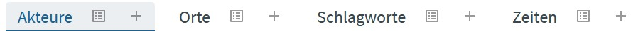
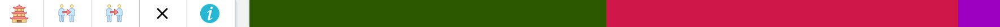
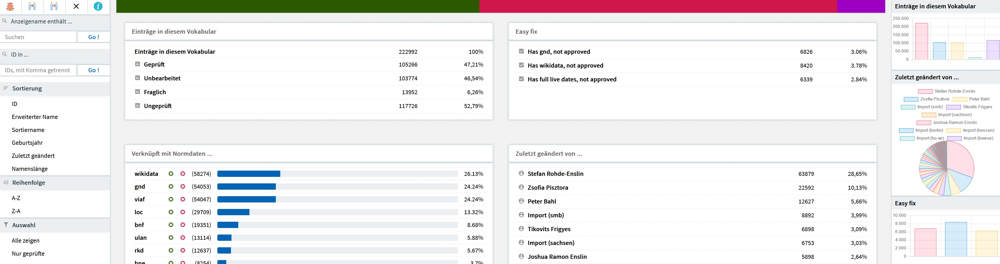
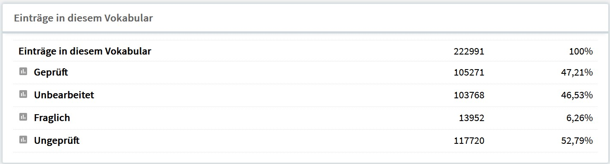
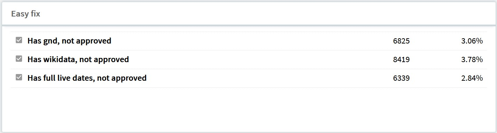
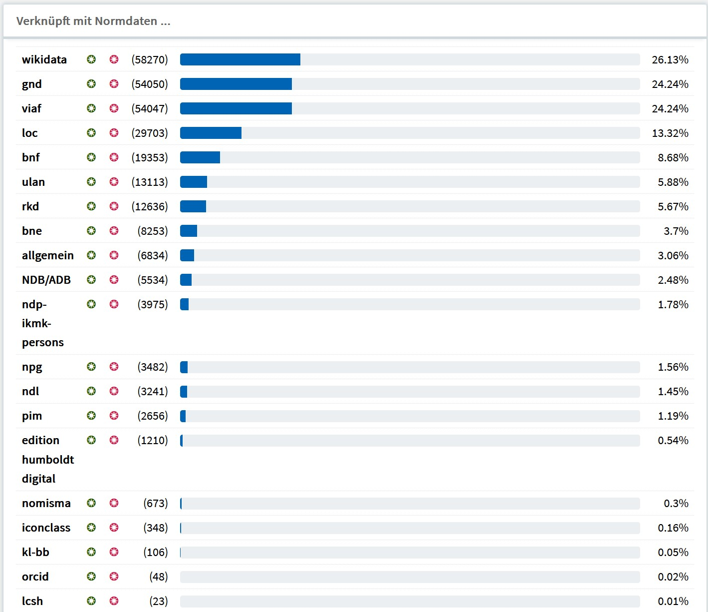
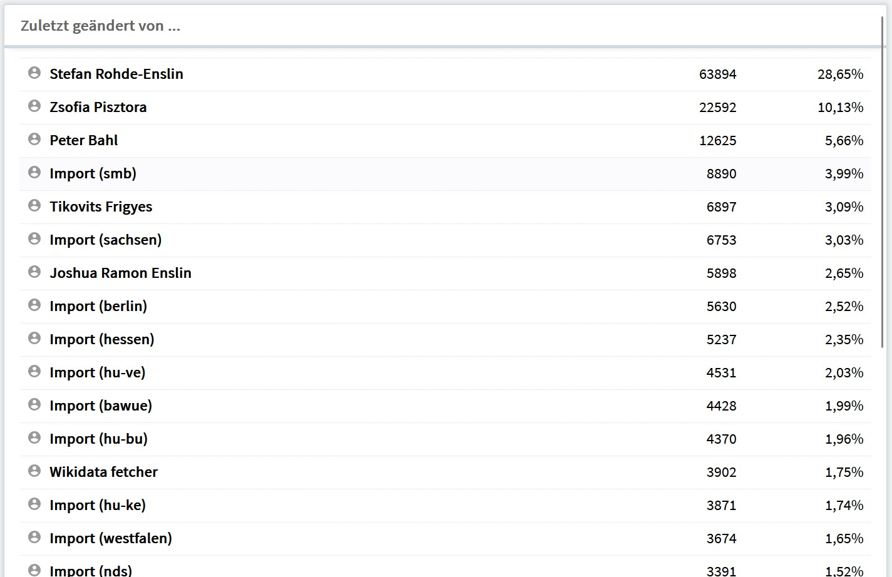
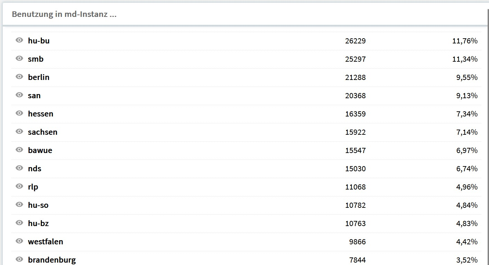
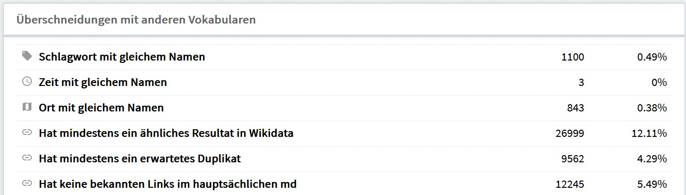
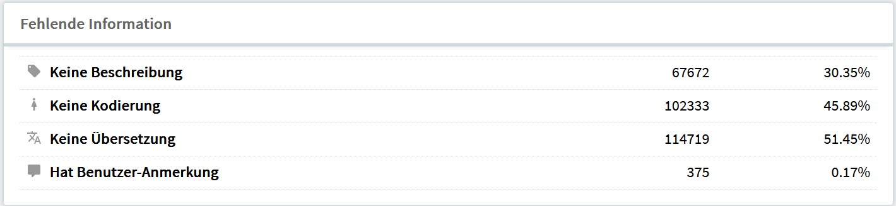

# nodac: Akteure

Auf dieser Seite finden sich Hinweise zur Verwaltung von Akteuren im nodac-Werkzeug. Am unteren Seitenende ist ein entsprechendes Video eingebunden.

Unterhalb des Hauptmenus von nodac findet sich eine Leiste mit der Möglichkeit ein zu bearbeitendes Vokabular auszuwählen. Es erscheinen hier nur die Vokabulare für welche der aktuelle Bearbeiter freigeschaltet ist. Ist ein Vokabular ausgewählt, so wird der entsprechende Bereich farbig hervorgehoben. Hinter dem Namen des Vokabulars erscheinen zwei Symbole. Für jedes Vokabular gibt es damit drei Möglichkeiten des Einstiegs:

- Klick auf den Namen des Vokabulars führt zur Startseite desselben.
- Klick auf das Listensymbol hinter dem Namen des Vokabulars führt zu einer Auflistung aller Einträge.
- Klick auf das Pluszeichen ermöglicht einen Akteur zu erfassen.

## Startseite
Die Startseite von nodac: Akteure zeigt im oberen Bereich zunächst eine Leiste mit Symbolen gefolgt von einer Visualisierung des Fortschreitens der Bearbeitung. Dieser Balken enthält drei Farben und zeigt in grüner Farbe die geprüften Einträge, in roter Farbe die ungeprüften Einträge und in der Farbe Lila die als fraglich markierten Einträge.

Die Schalter des links stehenden Menüs (das auch bei Trefferlisten erscheint):

- Die Pagode führt zur Startseite zurück. Sie hat damit die gleiche Funktion wie ein Anklicken von "Abschicken" im Auswahlmenu für die Vokabulare.
- Der linke der zwei Schalter welche Personen mit rotem Verbindungspfeil führt zu einer Suche nach Dublikaten. Es wird nach gleichen Namen gesucht.
- Der rechte dieser Schalter führt ebenfalls zu einer Dublikat-Suche. Es wird nach gleichen Normdatenbezügen gesucht.
- Das "x" zeigt die Blacklist, eine Liste von Begriffen, welche das System ignoriert. Im Falle von museum-digital sind das vor allem nicht individualisierbare Entitäten. Wird nodac: Akteure für ein externes Akteurverzeichnis verwendet, dann können andere Regeln gelten.

Unterhalb des Symbolmenüs findet sich eine Spalte mit Möglichkeiten der Suche und des auswählenden Zugriffs. Rechts finden sich Kacheln welche einerseits Statistiken zeigen, aber andererseits - weil die einzelnen Einträge anklickbar sind - auch einen Schnellzugriff ermöglichen. Am rechten Rand erscheinen Visualisierungen der Inhalte der Kacheln. Das Design ist responsive, d.h. auf einem Bildschirm mit geringer Breite erscheinen die Elemente untereinander. Auf einem breiten Bildschirm zeigt sich die Startseite in folgender Weise:

Im zentralen Bereich der Startseite finden sich 5 Kacheln. Die erste Kachel trägt den Titel: 

### Einträge in diesem Vokabular

Das, was der darüberstehende Balken in farblicher Kodierung (Grün-Rot-Lila) veranschaulicht, der aktuelle Stand der Bearbeitung des Vokabulars ist hier als Liste mit einzeln anklickbaren Einträgen und Zahlenangaben aufgeführt. Ein Anklicken der einzelnen Begriffe wählt entweder alle als Geprüft, als Unbearbeitet, als Fraglich oder als Ungeprüft (entweder unbearbeitete oder fragliche Einträge) aus. In der rechten Spalte der Startseite ist eine weitere Visualisierung des Bearbeitungsstatus in Form einer Balkengrafik zu finden.

### Easy fix

Die Kachel "Easy fix" erlaubt die Auswahl von Einträgen, die bestimmten Bedingungen entsprechen, aber noch nicht als Geprüft markiert sind. Ist eine GND-ID, oder eine Wikidata-ID oder aber sind Lebensdaten zu einem Akteur bekannt und ist der Akteur zugleich noch nicht als Geprüft markiert, so kann hier entsprechend selektiert werden. Auch zu dieser Kachel gibt es in der rechten Spalte eine Visualisierung.

### Verknüpft mit Normdaten ...

Verweise einer Einträge des in nodac aufgerufenen Akteur-Vokabulars in andere Vokabulare werden in der dritten Kachel aufgelistet. Wenn beispielsweise alle Akteure gefunden werden sollen, zu denen im aktivierten Vokabular (im Beispiel: Akteursvokabular von museum-digital) die Wikidata-ID gespeichert ist, so kann der grüne Punke in der wikidata-Leiste angeklickt und eine entsprechende Trefferliste aufgerufen werden. Analog lassen sich auch alle Akteure, zu denen keine gnd-ID gespeichert ist, durch anklicken des roten Punktes in der gnd-Leiste auswählen.
Die aktuell berücksichtigten Verknüpfungen:

wikidata // - gnd (Gemeinsame Normdatei) // viaf (Virtual International Authority File) // loc (Library of Congress) // bnf (Bibliothèque nationale de France) // ulan (Union List of Artist Names) // rkd (Rijksbureau voor Kunsthistorische Documentatie) // bne (Biblioteca Nacional de España) // NDB/ADB (Neue Deutsche Biographie/Alte Deutsche Biographie) // ndp-ikmk-persons (Personenverzeichnis des Interaktiven Katalogs des Münzkabinetts) // npg (National Portrait Gallery) // ndl (National Diet Library) // pim (Petőfi Irodalmi Múzeum) // edition humboldt digital // nomisma (Personen zu Münzen) // iconclass (ICONographic CLASSification System) // kl-bb (Künstlerlexikon Berlin-Brandenburg) // orchid (Open Researcher and Contributor ID) // lcsh (Library of Congress Subject Headings)

### Zuletzt geändert von ...

Die Kachel "Zuletzt geändert von ..." bietet die Möglichkeit nach Herkunft der Einträge zu filtern. Falls ein systematischer Fehler vorliegt kann so eine passende Auswahl getroffen werden. Die Liste ist wesentlich länger als hier gezeigt, es werden alle Bearbeiter/Import-Scripte mit mehr als 100 Einträgen angezeigt.

### Benutzung in md-Instanz ...

Damit ein Normdatenredakteur in der Lage ist, nur jene Einträge zu bearbeiten, die von Museen einer bestimmten Instand (mit-)genutzt werden, gibt es diese Auswahl. Auch für die Kachel "Benutzung in md-Instanz ..." gilt, dass die Liste wesentlich länger ist, als hier gezeigt, es werden alle regionalen Instanzen aufgelistet.

### Überschneidungen mit anderen Vokabularen

Die Einträge dieser Kachel geben an, wieviele der in nodac: Akteure erfassten Einträge gleichlautend auch in anderen Vokabularen erscheinen. Ein Klick auf die entsprechende Zeile selektiert die jeweils betroffenen Begriffe in eine Trefferliste.

### Fehlende Informationen

Diese Kachel ermöglicht zu erkennen, an welcher Stelle besonders häufig Informationen nachbearbeitet werden müssen. Wieder selektiert ein Klick auf die entsprechende Zeile die betreffenden Entitäten.

## Trefferliste

## Erfassen

Seite wird vervollständigt.

## YouTube-Video zu Akteuren in nodac

<b>Anleitung auf Youtube</b> 
Mit einem Klick wird das Video geladen. Damit werden andererseits ihre Daten mit Youtube geteilt.

