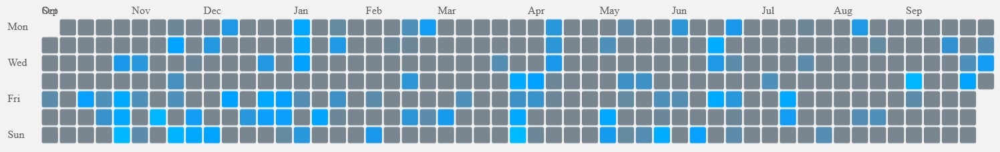

# nodac: Startseite

Die Startseite von nodac beginnt mit einem freundlichen Gruß. Es folgen verschiedene Werkzeuge für einen schnellen Zugriff und Statistiken:

Die erste Zeile ist "Gespeicherten Suchabfragen" vorbehalten. Jedes Vokabular von museum-digital hat seine eigene Suchfunktion. Wenn dort eine Suche durchgeführt wird kann auf der entsprechenden Trefferseite der Schalter "Suche speichern" angeklickt werden. Diese gespeicherte Suche erscheint dann beim nächsten Aufrufen der Startseite in einem Kasten und kann nun direkt von der nodac-Startseite ausgeführt werden - durch Anklicken der Suchbedingung oder über den Schalter "Suchen" (im Kasten unten links). Mit der Suchabfrage erscheinen hier auch die jeweiligen ersten Resultate, die von hier aus direkt aufgerufen werden können. Ein Anklicken der Titelzeile des Kastens vergrößert diesen und es erscheinen mehr Resultate. Jede gespeicherte Suche kann als RSS-Feed abonniert werden. Sie bleibt erhalten, bis sie durch Anklicken des Mülleimer-Symbols, unten rechts im Kasten, gelöscht wird. Es können mehrere Suchen aus dem gleichen Vokabular gespeichert werden.

Die zweite Zeile listet "Kürzlich durchgeführte Suchanfragen" in den verschiedenen Vokabularen auf. Wieder kann durch Anklicken der Kopfzeile des einzelnen Kastens die Anzahl der aufgelisteten Treffer vergrößert werden und ebenso ist wieder der direkte Zugang zur jeweiligen Trefferliste durch Anklicken der einzelnen Suchabfragen möglich. Die jeweiligen Listen der "Kürzlich durchgeführten Suchabfragen" werden automatisch erstellt. Sie werden nicht gespeichert und gehen bei Verlassen von nodac verloren.

Sowohl bei "Gespeicherten Suchanfragen" als auch bei "Kürzlich durchgeführten Suchanfragen" werden einschränkende und ordnende Kriterien gespeichert und ausgegeben. Neben Sortierungskriterium (abhängig vom einzelnen Vokabular), der Reihenfolge, der ausgewählten Seite der Treffermenge (in runden Klammern mit einführendem #-Zeichen) sind dies Status-Angaben. Hierbei bedeutet:

* Status 1: Alle Treffer anzeigen
* Status 2: Nur geprüfte Treffer anzeigen
* Status 3: Nur ungeprüfte Treffer anzeigen
* Status 4: Nur unbearbeitete Treffer anzeigen
* Status 5: Nur als fraglich markierte Treffer anzeigen

Der folgende Block besteht aus zwei Kacheln, er dient der Information über den Stand der Bearbeitung. Zum einen wird die Bearbeitung der einzelnen Vokabulare insgesamt angezeigt, zum anderen die vom angemeldeten Benutzer durchgeführten Bearbeitungen. Die einzelnen Einträge sind als Link gestaltet führen jedoch nur in das jeweilige Vokabular. Beispielsweise führt ein Klick auf "Anzahl Orte in diesem Monat" im Kasten: "Von mir bearbeitet" aktuell zur Anzeige aller erfassten Orte. Dennoch ist es informativ zu sehen, wie gut man vorangekommen ist.

Was folgt ist ein Block mit Suchmöglichkeiten innerhalb von vordefinierten Gruppen. Solche Gruppen werden als Objektgruppen in museum-digital:musdb definiert und dann mit einem Marker ("Group linked vocabulary entries for review in nodac") versehen. Auf diese Weise ist es möglich bei einem größeren Import die enthaltenen Objekte als Teil einer (unsichtbaren) Objektgruppe zu erfassen, diese Objektgruppe dann entsprechend zu markieren und einem ausgewählten Normdatenredakteur die Nachbearbeitung nur jener Begriffe zu übergeben, die mit den Objekten dieses Imports verknüpft sind.

Eine Heatmap zur Visualisierung der eigenen Bearbeitungen des letzten Jahres schließt sich an. Es gilt: Je heller das jeweilige Kästchen, desto mehr Einträge wurden vom aktuell angemeldeten Redakteur bearbeitet.

Den Abschluß der Seite bilden vier Kacheln in denen jeweils die 20 neuesten Einträge pro Vokabular als Links (die direkt zum jeweiligen Eintrag führen) gemeinsam mit dem Erfassungszeitpunkt angezeigt werden.